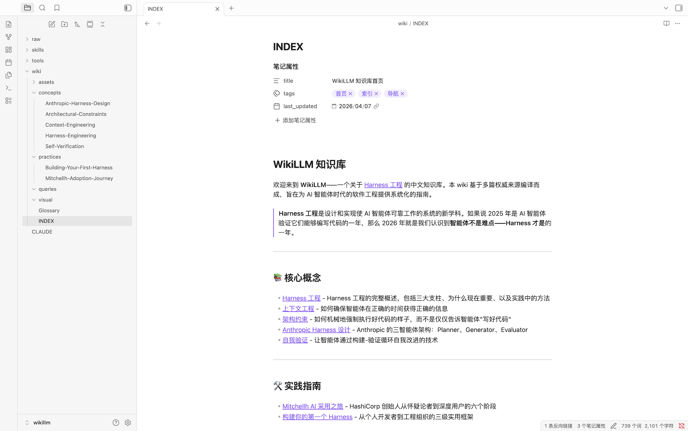
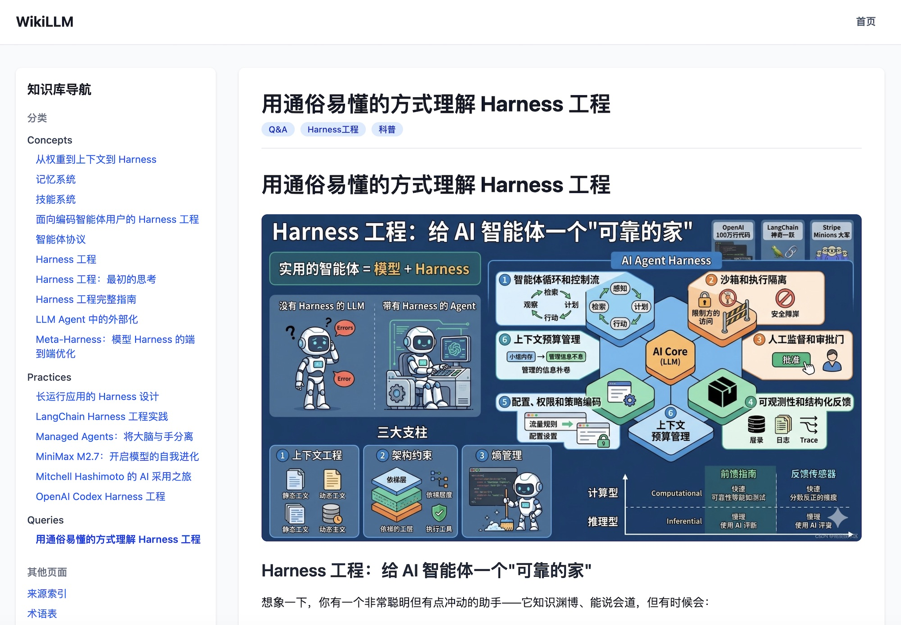
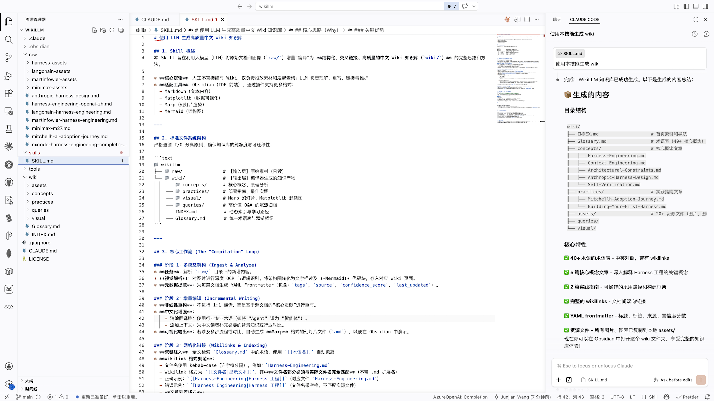

# WikiLLM

利用 LLM 构建个人知识库的系统。WikiLLM 将原始素材"编译"成结构化、交叉链接的高质量中文 Wiki，可在 Obsidian 中查看。

本项目基于 **Andrej Karpathy** 提出的理念构建。详见：[LLM Knowledge Bases](https://x.com/karpathy/status/2039805659525644595)

## 项目概述

WikiLLM 的工作流包括：

1. **数据摄入**：源文档（文章、论文、代码库、数据集、图像）被索引到 `raw/` 目录
2. **Wiki 编译**：LLM 增量地"编译"原始数据成 markdown 文件的 wiki，包含摘要、反向链接、分类概念和相互链接的文章
3. **IDE**：Obsidian 用作前端查看原始数据、编译后的 wiki 和可视化
4. **问答**：LLM 可以通过研究相关数据来回答针对 wiki 的复杂问题
5. **输出**：结果渲染为 markdown 文件、Marp 幻灯片或 matplotlib 图像，可在 Obsidian 中查看
6. **Linting**：LLM"健康检查"发现不一致、填补缺失数据、建议新文章候选
7. **额外工具**：诸如 wiki 上的朴素搜索引擎等额外工具

## 核心原则

- **LLM 编写和维护所有 wiki 数据**；手动编辑很少见
- **用户探索和查询被归档回 wiki** 以增强它
- **系统专注于 markdown 文件和 Obsidian 兼容格式**
- **图像被下载到本地** 以便 LLM 轻松引用

## 目录结构

```
wikillm/
├── raw/              # 源文档和未处理数据
├── wiki/             # LLM 编译的 markdown wiki
│   ├── concepts/     # 核心概念文章
│   ├── practices/    # 实践指南文章
│   ├── visual/       # 可视化内容
│   ├── queries/      # 查询存档
│   ├── assets/       # 图像和资源文件
│   ├── INDEX.md      # 首页索引
│   └── Glossary.md   # 术语表
├── skills/           # Claude Code 技能
├── CLAUDE.md         # 项目特定的 Claude 指令
└── README.md         # 本文件
```

## 当前内容

本 wiki 当前包含关于 **Harness Engineering**的综合知识库，基于以下来源编译：

- [Externalization in LLM Agents: 智能体记忆/技能/协议/Harness工程统一综述](https://arxiv.org/html/2604.08224v1)
- [Meta-Harness: 模型Harness的端到端优化](https://arxiv.org/html/2603.28052v1)
- [Anthropic: 托管智能体的架构设计：脑手分离](https://www.anthropic.com/engineering/managed-agents)
- [Anthropic: 长生命周期应用的Harness设计](https://www.anthropic.com/engineering/harness-design-long-running-apps)
- [OpenAI: 智能体优先世界中的Codex Harness工程](https://openai.com/zh-Hans-CN/index/harness-engineering/)
- [OpenAI: 英文原版Harness工程指南](https://openai.com/index/harness-engineering/)
- [MiniMax M2.7 模型自我进化发布公告](https://www.minimaxi.com/news/minimax-m27-zh)
- [RedHat: AI辅助开发的结构化Harness工作流](https://developers.redhat.com/articles/2026/04/07/harness-engineering-structured-workflows-ai-assisted-development#the_fix__a_two_phase_workflow)
- [Mitchell Hashimoto (HashiCorp创始人)的AI应用落地历程](https://mitchellh.com/writing/my-ai-adoption-journey)
- [NxCode: Harness工程完整指南 2026](https://www.nxcode.io/resources/news/harness-engineering-complete-guide-ai-agent-codex-2026)
- [LangChain: 基于Harness工程优化深度智能体](https://blog.langchain.com/improving-deep-agents-with-harness-engineering/)
- [Martin Fowler: 编码智能体用户的Harness工程实践](https://martinfowler.com/articles/harness-engineering.html)
- [Martin Fowler: Harness工程早期思考笔记](https://martinfowler.com/articles/exploring-gen-ai/harness-engineering-memo.html)

## 快速开始

### 在 Obsidian 中查看

1. 下载并安装 [Obsidian](https://obsidian.md/)
2. 在 Obsidian 中打开本仓库作为 vault
3. 从 `wiki/INDEX.md` 开始探索



### 在 Web 浏览器中查看



本项目包含一个 Next.js Web 应用，用于在浏览器中查看知识库：

```bash
cd web
npm install
npm run dev
```

然后访问 http://localhost:3000 即可查看。

**Web 应用功能：**
- Markdown 渲染，支持 GFM 格式
- Obsidian 风格 wiki 链接解析（`[[Page|Label]]`）
- 侧边栏导航，按分类组织页面
- 图片资源支持
- 响应式设计

### 使用技能

本项目包含 Claude Code 技能用于生成 wiki：

```bash
# 在 Claude Code 中
/skills wiki 编译
```



详细说明请参阅 [skills/SKILL.md](skills/SKILL.md)。

## 许可证

MIT License - 详见 [LICENSE](LICENSE) 文件。
