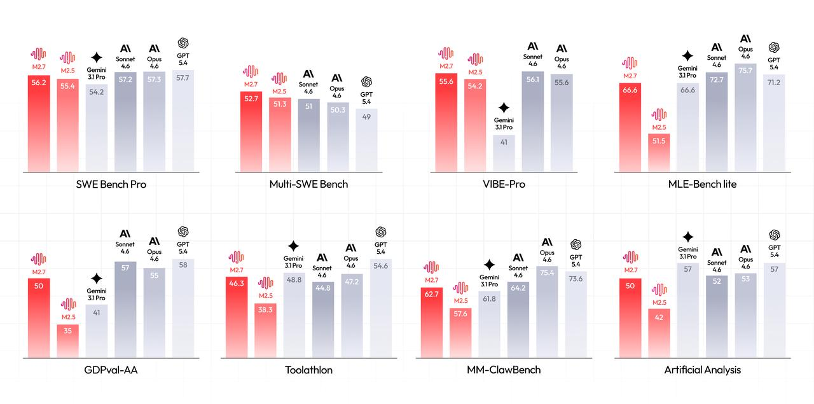
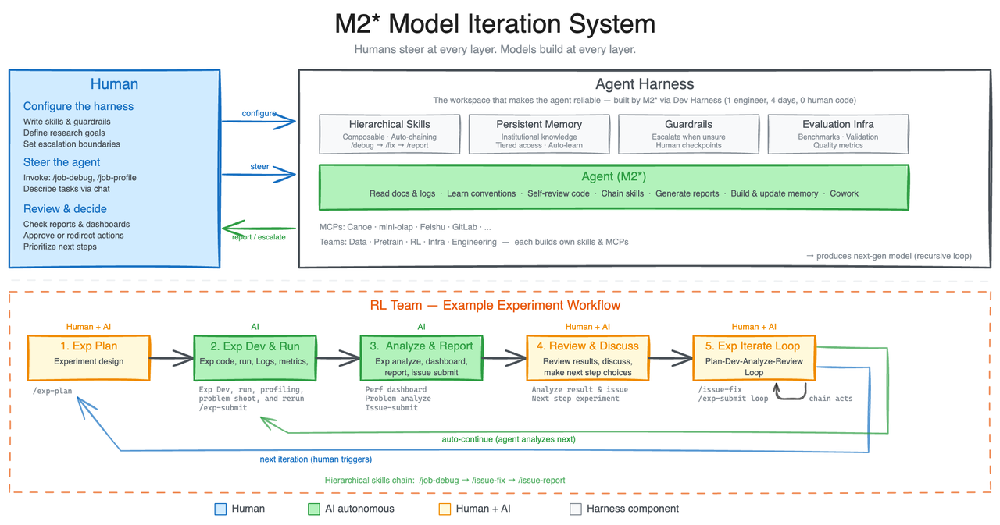
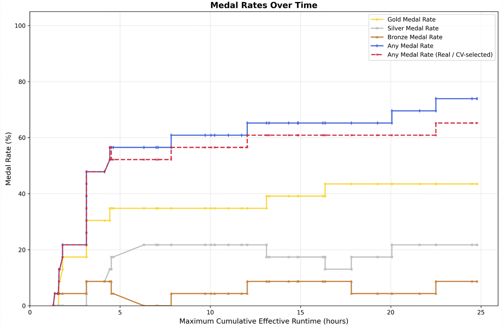
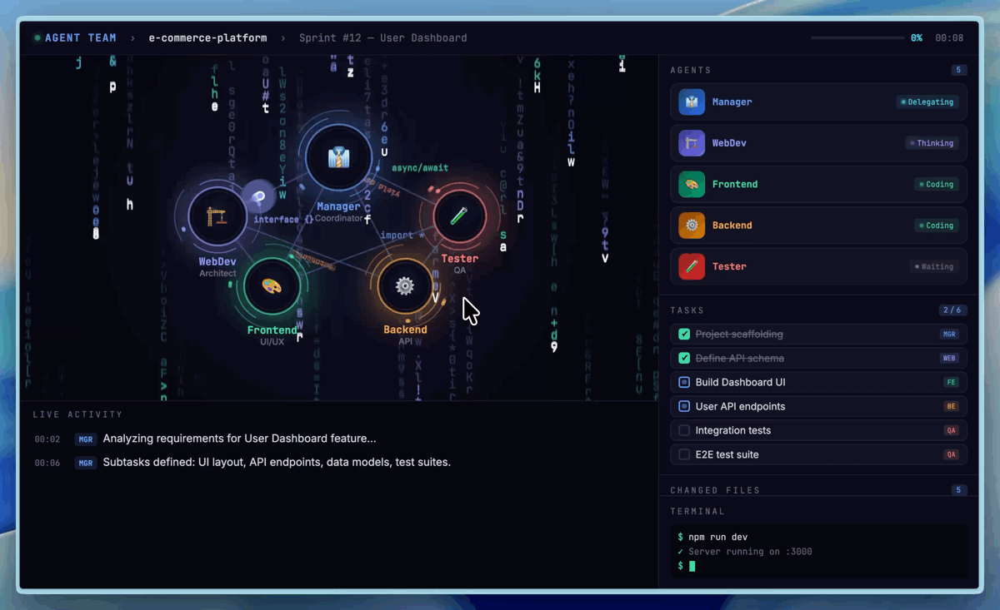

# MiniMax M2.7: Early Echoes of Self-Evolution

In the months following the first release of our M2-series models, we received a large volume of feedback and suggestions from enthusiastic users and developers, which drove us to further accelerate the efficiency of our model iterations. With human productivity already fully unleashed, the natural next step was to initiate self-evolution of both the model and the organization. M2.7 is our first model deeply participating in its own evolution.

M2.7 is capable of building complex agent harnesses and completing highly elaborate productivity tasks, leveraging capabilities such as Agent Teams, complex Skills, and dynamic tool search. For example, when developing M2.7, we let the model update its own memory and build dozens of complex skills in its harness to help with reinforcement learning experiments. We further let the model improve its learning process and harness based on the experiment results. This process initiates a cycle of model self-evolution.

1\. M2.7 delivers outstanding performance in real-world software engineering, including end-to-end full project delivery, log analysis, bug troubleshooting, code security, machine learning, and more. On the SWE-Pro benchmark, M2.7 scored 56.22%, nearly approaching Opus's best level. This capability also extends to end-to-end full project delivery scenarios (VIBE-Pro 55.6%) and deep understanding of complex engineering systems on Terminal Bench 2 (57.0%).

2\. We have also enhanced the model's expertise and task delivery capabilities across various fields in the professional office software domain. Its ELO score on GDPval-AA is 1495, the highest among open-source models. M2.7 shows significantly improved ability for complex editing in the Office suite — Excel, PPT, and Word — and can better handle multi-round revisions and high-fidelity editing. M2.7 is capable of interacting with complex environments: It maintains a 97% skill adherence rate while working with over 40 complex skills, each exceeding 2,000 tokens.

3\. M2.7 exhibits excellent character consistency and emotional intelligence, opening up more room for product innovation.

Based on these capabilities, M2.7 is also significantly accelerating our own evolution into an AI-native organization.

## Building an agent for model self-evolution

We first share an internal workflow that enables the M2-series models to self-evolve. This workflow also serves as an exploration of the boundaries of the model's agentic capabilities.

Modern agent harness utilizes a combination of complex skills, memory, and other external modules to help improve its adaptability to various workspace environments. In MiniMax, our agents are routinely faced with very complex and disparate working environments spanning multiple departments. As such, to improve the robustness of our agents in these heterogeneous environments, we tasked an internal version of M2.7 to build a research agent harness that interacts and collaborates with different research project groups. The harness supports data pipelines, training environments, infrastructure, cross-team collaboration, and persistent memory — enabling researchers to drive it to deliver better models. The research agent harness drives the iteration cycle that produces the next generation of models under the guidance set by researchers.

An exemplary workflow lies in the daily routine of our RL team. A researcher starts by discussing an experimental idea with the agent, who helps with literature review, tracks a pre-set experiment spec, pipelines data and other artifacts, and launches experiments. During the experiments, the agent monitors and profiles the experiment's progress and automatically triggers log reading, debugging, metric analysis, code fixes, merge requests, and smoke tests, identifying and configuring subtle yet key changes. These could have required the collaboration of multiple human researchers from different teams before, but now human researchers only interact for critical decisions and discussions. This accelerates problem discovery and experimentation, delivering models faster. Here, M2.7 is capable of handling 30%-50% of the workflow.

During the iteration process, we realized that the model's ability to recursively evolve its own harness is also critical. Our internal harness autonomously collects feedback, builds evaluation sets for internal tasks, and based on this continuously iterates its own architecture, skills/MCP implementation, and memory mechanisms to complete tasks better and more efficiently.

For example, we had M2.7 optimize a model's programming performance on an internal scaffold. M2.7 ran entirely autonomously, executing an iterative loop of "analyze failure trajectories → plan changes → modify scaffold code → run evaluations → compare results → decide to keep or revert changes" for over 100 rounds. During this process, M2.7 discovered effective optimizations for the model: systematically searching for the optimal combination of sampling parameters such as temperature, frequency penalty, and presence penalty; designing more specific workflow guidelines for the model (e.g., automatically searching for the same bug patterns in other files after a fix); and adding loop detection and other optimizations to the scaffold's agent loop. Ultimately, this achieved a 30% performance improvement on internal evaluation sets.

We believe that future AI self-evolution will gradually transition towards full autonomy, coordinating data construction, model training, inference architecture, evaluation, and other stages without human involvement.

To this end, we conducted preliminary exploratory tests in low-resource scenarios. We had M2.7 participate in 22 machine learning competitions at the MLE Bench Lite level open-sourced by OpenAI. These competitions can be run on a single A30 GPU, yet they cover virtually all stages of machine learning workflow.

We designed and implemented a simple harness to guide the agent in autonomous optimization. The core modules include three components: short-term memory, self-feedback, and self-optimization. Specifically, after each iteration round, the agent generates a short-term memory markdown file and simultaneously performs self-criticism on the current round's results, thereby providing potential optimization directions for the next round. The next round then conducts further self-optimization based on the memory and self-feedback chain from all previous rounds. We ran a total of three trials, each with 24 hours for iterative evolution. From the figure below, one can see that the ML models trained by M2.7 continuously achieved higher medal rates over time. In the end, the best run achieved 9 gold medals, 5 silver medals, and 1 bronze medal. The average medal rate across the three runs was 66.6%, a result second only to Opus-4.6 (75.7%) and GPT-5.4 (71.2%), tying with Gemini-3.1 (66.6%).

## Professional Software Engineering

In software engineering tasks, M2.7 more deeply explores real-world programming abilities, including log analysis for bug hunting, refactoring, code security, machine learning, Android development, and more.

Take a common production scenario as an example: debugging in a live environment. This requires not just code generation, but strong comprehensive reasoning abilities. When faced with alerts in production, M2.7 can correlate monitoring metrics with deployment timelines to perform causal reasoning, conduct statistical analysis on trace sampling and propose precise hypotheses, proactively connect to databases to verify root causes, pinpoint missing index migration files in the code repository, and even have the awareness to use non-blocking index creation to stop the bleeding first before submitting a merge request. From observability analysis and database expertise to SRE-level decision-making — this is not merely a model that can write code, but one that truly understands production systems. Compared to traditional manual troubleshooting processes, using M2.7, we have on multiple occasions reduced the recovery time for live production system incidents to under three minutes.

Your browser does not support video playback. Please switch to a different browser.

Live production environment debugging

In terms of raw programming capabilities, M2.7 has reached the level of SOTA models. On SWE-Pro, which covers multiple programming languages, M2.7 achieved a 56.22% accuracy rate, matching GPT-5.3-Codex. It demonstrates an even more notable advantage on benchmarks closer to real-world engineering scenarios, such as SWE Multilingual (76.5) and Multi SWE Bench (52.7).

This capability also extends to end-to-end full project delivery scenarios. On the repo-level code generation benchmark VIBE-Pro, M2.7 scored 55.6%, nearly on par with Opus 4.6 — meaning that whether the requirement involves Web, Android, iOS, or simulation tasks, they can be handed directly to M2.7 to complete.

What deserves even more attention is its deep understanding of complex engineering systems. On Terminal Bench 2 (57.0%) and NL2Repo (39.8%), both of which demand a high degree of system-level comprehension, M2.7 also performs solidly. This further confirms that it excels not only at code generation but can also deeply understand the operational logic and collaborative dynamics of software systems.

Your browser does not support video playback. Please switch to a different browser.

WildGuard demo webpage generated by M2.7

To improve development efficiency, one particularly important feature is native Agent Teams (multi-agent collaboration). Agent Teams impose paradigm-level demands on the model: role boundaries, adversarial reasoning, protocol adherence, and behavioral differentiation — these cannot be achieved through prompting alone and must be internalized as native capabilities of the model. In Agent Teams scenarios, the model needs to stably anchor its role identity, proactively challenge teammates' logical and ethical blind spots, and make autonomous decisions within complex state machines. Below is an Agent Teams setup we use internally for product prototype development, which contains a minimal organization for building product prototypes.

Agent Teams multi-agent collaboration demo

## Professional Work

Beyond software engineering, agents are becoming increasingly useful in office scenarios. We believe this comes down to two core capabilities:

Domain expertise and task delivery capability. The model needs to possess professional knowledge across various fields and understand user requirements. In the GDPval-AA evaluation, which measures this capability, M2.7 achieved an ELO score of 1495 among 45 models, second only to Opus 4.6, Sonnet 4.6, and GPT5.4, and surpassing GPT5.3. For the most common office document processing tasks, we systematically optimized the model's ability to handle Word, Excel, and PPT. Across various agent harnesses, M2.7 can both generate files directly based on templates and skills, and follow users' interactive instructions to perform multiple rounds of high-fidelity editing on existing files, ultimately producing editable deliverables.

Ability to interact with complex environments. Generalized everyday scenarios mean the model must flexibly adapt to various contexts, invoke diverse skills and tools, and maintain stable instruction adherence throughout extended interactions. M2.7 has made substantial improvements in these areas. On Toolathon, M2.7 achieved an accuracy of 46.3%, reaching the global top tier. Agent harnesses in real-world work scenarios also often require understanding and invoking a large number of complex skills. In MM Claw testing, M2.7 maintained a 97% skill compliance rate across 40 complex skills (each exceeding 2,000 tokens).

We tested the model's professional proficiency in finance, and compared to the previous generation, the improvement in capability is significant. For example, in a scenario involving reading research reports and modeling a company's future revenue, M2.7 can autonomously read a company's annual reports and earnings call minutes, cross-reference multiple research reports, independently design assumptions and build a revenue forecast model, and then produce a PPT and research report based on templates — understanding, making judgments, and producing output like a junior analyst, while self-correcting through multiple rounds of interaction. The feedback from practitioners is that the output can already serve as a first draft and go directly into subsequent workflows. Below is an example for TSMC.

Task: Based on TSMC's annual report and earnings call information, build a revenue model for TSMC. Read multiple research reports, design corresponding assumptions, model TSMC's revenue based on the latest information, then produce a PPT based on a PPT template, and write a Word document research report.

您的浏览器不支持播放此视频，请更换浏览器。

The recent surge in popularity of OpenClaw is representative of a thriving agent ecosystem, and we are pleased that our M2-series models have contributed to the community's flourishing. Based on commonly used tasks in OpenClaw, we built an evaluation set called MM Claw, covering a wide range of real-world needs in both work and life — from personal learning planning, to office document processing and delivery, scheduled professional research and investment advice, and code development and maintenance. M2.7 achieved a level close to Sonnet 4.6 on this test, with an accuracy of 62.7%.

## Entertainment

With OpenClaw and similar personal agents, we noticed that beyond getting work done, many users also want the model to have high emotional intelligence and character consistency. With a persona in place, users start interacting with OpenClaw like a friend. We believe this presents an opportunity to extend the use of agentic models beyond pure productivity into interactive entertainment. To this end, we strengthened character consistency and conversational capabilities in M2.7.

Based on this, we built a preliminary demo: OpenRoom, an interaction system based on an agent harness that liberates AI interaction from plain text streams and places it within a Web GUI space where everything is interactive. Here, character settings are no longer cold chunks of prompts; conversation drives the experience, generating real-time visual feedback and scene interactions, with characters proactively engaging with their environment. We believe this framework is highly extensible and can continue to evolve alongside improvements in agentic capabilities and community development, exploring entirely new ways for humans and agents to interact.

To encourage exploration in this area, we have open-sourced the initial demo (of which most of the code was written by AI):

Your browser does not support video playback. Please switch to a different browser.

MiniMax M2.7 is now fully available on MiniMax Agent and the MiniMax API Platform. We look forward to users and developers exploring even more interesting use cases with M2.7.

MiniMax Agent: [agent.minimax.io](https://agent.minimax.io/)

API: [platform.minimax.io](https://platform.minimax.io/)

Coding Plan: [platform.minimax.io/subscribe/coding-plan](https://platform.minimax.io/subscribe/coding-plan)

Intelligence with Everyone.