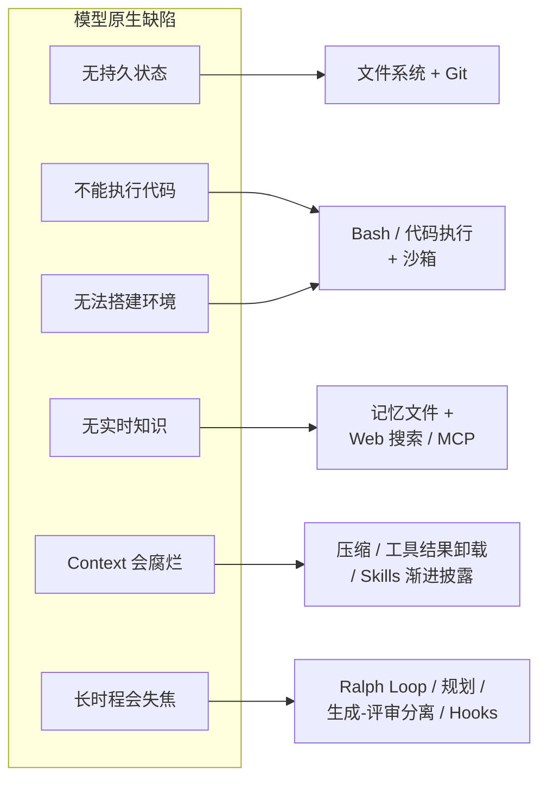

# 智能体 Harness 工程：Addy Osmani 的框架综述

本文编译自 Addy Osmani 的个人博客（2026 年 4 月）。Osmani 现任 Anthropic 技术成员、参与 Claude Code 研发，此前在 Google 主导开发者体验与 AI 工程十四年。文章把 Viv Trivedy 的 [[Anatomy-of-an-Agent-Harness|Harness 解剖学]]、HumanLayer 的 [[Harness-Configuration-Skill-Issue|配置实战]]、Anthropic 的 [[Long-Running-Harness-Design|长时运行 Harness 设计]]等多条线索拧成一股，给出 [[Harness-Engineering|Harness 工程]]作为一门学科的完整图景。

> **核心论点**：像样的模型配上优秀的 Harness，胜过优秀的模型配上糟糕的 Harness。编码智能体 = 模型 + 围绕模型搭建的一切；Harness 工程把这层脚手架当作正式工件对待，并在智能体每次失手时收紧它。

## Harness 到底是什么

Viv Trivedy 的一句话定义完成了大部分工作：

> Agent = Model + Harness。如果你不是模型，你就是 Harness。

Harness 是除模型本身之外的全部代码、配置与执行逻辑。裸模型不是智能体；当 Harness 赋予它状态、工具执行、反馈回路与可强制执行的约束之后，它才成为智能体。

具体而言，Harness 涵盖：

- 系统 Prompt、`CLAUDE.md`、`AGENTS.md`、skill 文件与子智能体 Prompt
- 工具、Skills、MCP 服务器及其描述
- 随包基础设施（文件系统、沙箱、浏览器）
- 编排逻辑（子智能体派生、交接、模型路由）
- 用于确定性执行的 Hooks 与中间件（压缩、续跑、lint 检查）
- 可观测性（日志、追踪、成本与延迟计量）

Simon Willison 把循环部分提炼到极致：智能体是「为实现目标而循环运行工具的系统」——功夫全在工具与循环的设计上。这块表面积归你所有，而非模型供应商。Claude Code、Cursor、Codex、Aider、Cline 都是 Harness：**底层模型有时是同一个，但你体验到的行为由 Harness 主导**。关于公式左侧（模型）的争论声量很大，而真正的杠杆大多坐在右侧。

## 「Skill Issue」重构：失败是可读的

工程师常掉进一个模式：智能体干了蠢事 → 归咎于模型 → 归档为「等下个版本」。Harness 工程的思维方式拒绝这种默认：失败通常是可读的——

- 智能体不知道某个约定 → 写进 `AGENTS.md`
- 智能体跑了破坏性命令 → 加 hook 拦截
- 智能体在 40 步任务里迷失 → 拆成规划者与执行者
- 智能体反复「完成」带病代码 → 在回路里接入类型检查 Back-Pressure 信号

HumanLayer 的说法是「这不是模型问题，是配置问题」。有力的数据点：Terminal Bench 2.0 上，Opus 4.6 在 Claude Code 里的得分远低于同一模型在定制 Harness 里的得分；Viv 团队只改 Harness 就把编码智能体从 Top 30 推到 Top 5（详见 [[LangChain-Harness-Engineering|LangChain 的实验记录]]）。模型在后训练中与训练时所用 Harness 耦合，把它换进一个针对你的代码库配备了更好工具、更紧 Prompt、更锐 Back-Pressure 的 Harness，能释放原 Harness 白白浪费的能力。**今天模型能做的事与你看到它做的事之间的落差，很大程度上是 Harness 落差。**

## 棘轮原则：每次错误都铸成一条规则

Harness 工程最重要的习惯，是把智能体的错误当作永久信号——不是笑过就算的轶事，不是「重跑一次就好」的坏运气。

举例：智能体提交了一个测试被注释掉的 PR，而我不小心合并了——这就是输入。下一版 `AGENTS.md` 写上「绝不注释测试，删掉或修好」；下一版 pre-commit hook 会在 diff 里 grep `.skip(` 和 `xit(`；下一版评审子智能体把注释掉的测试列为阻断项。

只在见过真实失败时才加约束，只在强模型已让约束多余时才删约束。**一份好的 `AGENTS.md`，每一行都应能追溯到某次具体的翻车。**这也是 Harness 工程是「学科」而非「框架」的原因：适配你代码库的 Harness 由你的失败史塑形，无法下载现成品。

## 从期望行为倒推 Harness 组件

设计 Harness 时最有用的框架是从想要的行为出发，倒推出交付该行为的 Harness 部件：**期望的行为（或要修正的行为）→ 帮助模型达成它的 Harness 设计**。每个组件都有明确职责——说不出某个组件为哪种行为服务，它多半就不该存在。

### 文件系统与 Git：持久状态

文件系统是最基础的元语，常因「无聊」而被低估。模型只能直接操作上下文窗口内的内容；没有文件系统，就只剩往聊天窗口里复制粘贴，那不叫工作流。有了文件系统，智能体获得读取数据、代码与文档的工作区，卸下中间成果而非全程扛在 Context 里，多智能体与人类也能经由共享文件协作。叠加 Git 免费获得版本化：跟踪进度、回滚错误、分支实验。其余多数 Harness 元语最终都要落到文件系统上，[[Externalization-in-LLM-Agents|外部化]]概念对此有更深入的分析。

### Bash 与代码执行：通用工具

今天的主循环是 ReAct 循环：模型推理、经工具调用行动、观察结果、重复。Harness 只能执行自己实现了逻辑的工具——要么为每种可能的行动预建工具，要么给智能体 Bash，让它按需自造工具。Willison 的观点是智能体本已擅长 shell 命令，多数任务收敛为几条精选的 CLI 调用。Harness 仍会配备专用工具，但 Bash 加代码执行已成为自主解题的默认通用策略——教人会用一件厨房小电器，与把整座厨房交给他，是两回事。

### 沙箱与默认工具

Bash 得跑在安全的地方才有用：在本机执行智能体生成的代码有风险，单一本地环境也无法支撑大规模并行智能体。沙箱提供隔离的运行环境：运行代码、检查文件、安装依赖、验证成果；可以设命令白名单、强制网络隔离、按需创建环境并在完工后销毁。好沙箱自带好默认：预装语言运行时与常用包、Git 与测试 CLI、无头浏览器。浏览器、日志、截图、测试运行器让智能体能观察自己的工作，闭合自我验证回路。**模型不负责配置自己的执行环境——在哪运行、可用什么、如何验证，都是 Harness 层的决策。**

### 记忆与搜索：持续学习

模型的知识不超出权重与当前 Context；无法改权重时，增添知识的唯一途径是 Context 注入。文件系统再次充当元语：Harness 支持 `AGENTS.md` 之类的记忆文件标准，每次启动注入；智能体编辑该文件后 Harness 重新加载，知识由此跨会话携带——一种粗糙但有效的 [[Harness-Continual-Learning|持续学习]]。对训练截止之后才存在的知识（新库版本、当前文档、今日数据），Web 搜索与 Context7 之类的 MCP 工具负责跨越截止线，这类元语值得直接烘进 Harness，而非留给用户。[[Memory-Systems|记忆系统]]页面有更全面的机制梳理。

### 对抗 Context Rot

Context rot 指上下文窗口被填满时模型推理与完工能力的退化。Context 稀缺，Harness 在很大程度上是良好 Context 工程的投递机制。三种反复出现的技术：

1. **压缩（Compaction）**：窗口接近满载时，Harness 智能地摘要并卸载旧 Context，让智能体继续工作——放任 API 报错不是生产级 Harness 的选项。
2. **工具结果卸载**：大体积工具结果（比如 2000 行日志）只保留头尾，完整内容卸载到文件系统按需读取。
3. **Skills 渐进披露**：启动时把所有工具与 MCP 全载入 Context，智能体还没行动性能先垮；[[Skill-Systems|Skills]] 让 Harness 只在任务真正需要时才揭示指令与工具。

Anthropic 的 Harness 文章为超长任务补了第四种：**全上下文重置**——拆掉会话，凭一份紧凑的交接文件重建。他们明确表示压缩本身不足以应对长任务；有时需要像新人入职一样，带着结构化简报重新开始。

### 长时程执行：Ralph Loop、规划与验证

自主长时程工作是圣杯，也是最难做对的部分。今天的模型会过早收工、分解复杂问题的能力差、跨多个上下文窗口后连贯性崩坏，Harness 必须围绕这一切设计。

- **Ralph Loop**：hook 拦截模型的退出企图，把原始 Prompt 重新注入一个干净的上下文窗口，迫使智能体对照完成目标继续工作。每次迭代以全新 Context 起步，经由文件系统读取上一轮状态——把单会话智能体变成多会话智能体的技巧简单得惊人，也绝不是「换个更聪明的模型」能推导出来的元语。
- **规划与自我验证**：模型把目标分解为步骤序列，通常写入磁盘上的计划文件，Harness 通过 Prompt 与提醒支持计划文件的使用；每完成一步，hooks 运行预定义测试套件并把失败连同错误文本回灌，或让模型对照显式标准自查。
- **规划者 / 生成者 / 评审者分离**：Anthropic 的长时程 Harness 工作明确指出，把生成与评审拆给不同智能体优于自我评审——智能体给自己的作业打分时系统性地偏乐观。相关模式是**冲刺契约（sprint contract）**：写代码之前，生成方与评审方先谈妥「做完」的定义。Osmani 的经验是，动工前写下完成条件所拦下的范围漂移，超过他改过的任何 Prompt。

### Hooks：执行层

Hooks 把「我告诉智能体做 X」与「系统强制执行 X」区分开来。一个 hook 是在特定生命周期点运行的脚本：工具调用前、文件编辑后、提交前、会话启动时。它适合安放智能体永远不该忘却常常忘掉的事：每次编辑后跑类型检查、lint 与测试并暴露失败；拦截破坏性 Bash（`rm -rf`、`git push --force`、`DROP TABLE`）；开 PR 或推送 main 前要求审批；写入时自动格式化免得浪费 Token 在空白符上。

HumanLayer 强调、Osmani 亦认同的原则是：**成功静默，失败啰嗦**。类型检查通过，智能体一无所闻；失败，错误文本注入回路，智能体自我纠正。常态下反馈回路几乎免费，出问题时信号直接可执行。

### AGENTS.md 与工具选择

仓库根目录的扁平 markdown 规则手册仍是杠杆最高的单一配置点，因为它每轮都落在系统 Prompt 里。约定放这里：包管理器、测试框架、格式化、「别碰 `/legacy`」、「统一用我们的 logger」。两条血泪教训：

- **保持简短**：HumanLayer 的 CLAUDE.md 不到 60 行。每一行都在争夺注意力，规则越多每条越不值钱——要做飞行员检查单，别做风格指南。
- **每行都要挣来**：规则必须能追溯到某次具体失败或硬性外部约束，否则就是噪声。靠棘轮收紧，别靠头脑风暴。

工具同理：每个工具的名称、描述与 schema 每次请求都压进 Prompt，十个聚焦的工具胜过五十个互相重叠的——模型能把菜单装进脑子。HumanLayer 还指出真实的安全隐患：工具描述会进入 Prompt，你安装的任何 MCP 服务器都是模型会阅读的可信文本，一个粗制或恶意的 MCP 能在你敲下第一个字之前就完成 Prompt 注入。

## 生产中的样子：Claude Code 架构

关于成熟 Harness 最清晰的公开图景，是 Fareed Khan 对 Claude Code 架构的（推测性）拆解：

前文几乎每个概念都能在图上找到具名组件：Context 注入是知识层；循环状态住在记忆存储与 worktree 隔离器里；破坏性动作 hook 守在权限门之后；子智能体上下文防火墙是整个多智能体层；工具派发注册表是 MCP 服务器与 Bash 共同的接入点。Khan 的论证与 Viv 相同，只是落在了一个正在发货的产品上：**Claude Code 的演进轨迹，至少一半是关于 Harness，而非底层模型。**

## Harness 不会缩小，只会迁移

Anthropic 文章里最精到的观察之一：模型进步时，有趣的 Harness 组合空间并不缩小——它迁移。

朴素叙事是更强的模型让 Harness 过时：模型会规划就不需要规划器，模型长时程连贯就不需要上下文重置。Opus 4.6 确实基本消灭了「上下文焦虑」失败模式（Sonnet 4.5 曾在自以为接近上下文上限时提前草草收尾），Osmani 半年前写的一整类抗焦虑脚手架随之成了死代码。但天花板随模型一起抬升：从前够不着的任务进入射程，而新任务自带新失败模式——抗焦虑脚手架退场，取而代之是多日记忆策略、协调三个专精智能体的 Harness、或生成式 UI 的设计质量评审器。

Anthropic 的表述干净利落：**Harness 中每个组件都编码了一条关于「模型靠自己做不到什么」的假设**。模型在某项能力上变强，对应组件就成了无的放矢，应当拆除；模型解锁新能力，又需要新脚手架去够新天花板。

### 模型-Harness 训练回路

Viv 点名的另一件事是 Harness 设计与模型训练之间的反馈回路：今天的智能体产品把 Harness 放进后训练回路，模型在 Harness 设计者认为它应当原生擅长的事情上专项变强——文件系统操作、Bash、规划、子智能体派发。这解释了 Opus 4.6 在 Claude Code 里与在别人家 Harness 里手感迥异，也解释了改工具逻辑偶尔引发的诡异回退：真正通用的模型不会在意用 `apply_patch` 还是 `str_replace`，协同训练造成了过拟合。

实践含义有二：**Harness 是活系统，不是配置一次就完事的文件**；「最好」的 Harness 未必是模型训练时所在的 Harness，而是为你的任务设计的 Harness——Terminal Bench 从 Top 30 到 Top 5 的跃迁是最清晰的证据点。

## Harness-as-a-Service

Viv 的另一贡献是 **HaaS（Harness-as-a-Service）** 框架：行业正从构建在 LLM API 之上（拿到一次补全）转向构建在 Harness API 之上（拿到一个运行时）。Claude Agent SDK、Codex SDK、OpenAI Agents SDK 指向同一方向：循环、工具、上下文管理、hooks、沙箱元语开箱即用，你在此基础上定制。默认路径从「自建循环、自接工具调用、自管会话状态、自造审批流」变成「选一个 Harness 框架，沿四大支柱（系统 Prompt、工具、Context、子智能体）配置，把余力投入领域特定的 Prompt 与工具设计」。

这正是「skill issue」变得可解的原因：出问题不必从零重建智能体，只需调校一个已经良好分解的配置面。Viv 关于从混乱起步的说法也是最佳辩护：**「构建好智能体是迭代的修行。没有 v0.1 就没有迭代。」**[[Harness-Runtime-Substrate|Harness 运行时基座]]与 [[What-Is-an-AI-Agent-Harness|Databricks 的定义文章]]分别从系统与平台角度展开过同一转向。

## 走向何方

把顶尖编码智能体并排来看（Claude Code、Cursor、Codex、Aider、Cline），**它们彼此之间的相似度超过了底层模型之间的相似度**。模型各不相同，Harness 模式正在收敛——这不是巧合，是行业在缓慢找出把生成模型变成交付机器的承重脚手架。[[State-of-AI-Harness-Engineering-2026|2026 年行业全景]]记录了同样的收敛趋势。

Viv 框定的开放问题最激动人心：编排数百个在共享代码库上并行工作的智能体；智能体分析自己的执行轨迹、定位并修复 Harness 层失败模式（[[Harness-Engineering-Self-Improvement|Harness 自我改进]]与 [[Meta-Harness]] 是这一方向的早期形态）；Harness 按任务即时动态组装恰当的工具与 Context，而非启动时静态预配。最后一条尤其像是一个拐点——**Harness 在那里不再是静态配置，而开始接近一台编译器**。

## 相关研究

- [[Anatomy-of-an-Agent-Harness|智能体 Harness 解剖学]] - Viv Trivedy 的原始推导，本文「从行为倒推」框架的来源
- [[Harness-Configuration-Skill-Issue|编码智能体的 Harness 配置实战]] - HumanLayer 的五大配置面实操，「skill issue」提法的出处
- [[Long-Running-Harness-Design|长时运行 Harness 设计]] - Anthropic 对上下文重置与生成-评审分离的工程论证
- [[Harness-Engineering|Harness 工程]] - 核心概念与术语定义
- [[Harness-Heavy-Lifting|Harness 能扛多少重活]] - 对「Harness 与模型各承担什么」的边界探讨
