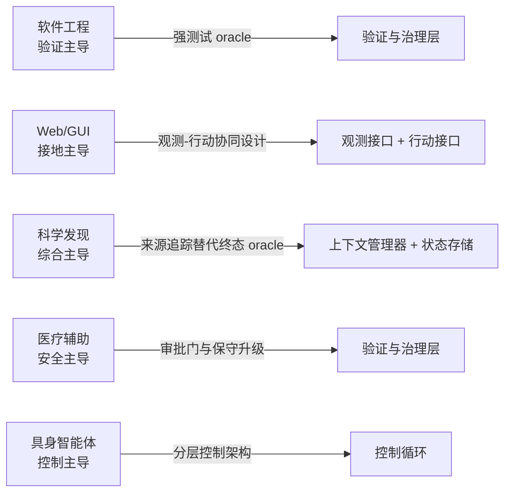

# 从问答到任务完成：智能体系统与 Harness 设计综述

本篇综述（香港城市大学、悉尼大学、北京大学等联合团队，2026 年 6 月）以「模型—Harness 配对」为统一透镜，系统回答了智能体研究的核心问题：**智能体性能的瓶颈究竟在基础模型、执行 Harness，还是二者的耦合？** 综述的核心主张是：智能体质量（成功率、效率、安全性、泛化能力）并非模型能力的孤立属性，而是从模型能力、运行时基础设施、任务结构与评估设计四者的交互中涌现出来的。

与以组件分类学为主线的既有综述不同，本篇综述的三个区分性立场是：**演进优先**（以工程范式转移组织文献，而非静态组件罗列）、**Harness 中心**（将执行 Harness 视为一等设计对象）、**学术证据与工业实践联动**（结合基准数据、开源系统与工程报告检验运行时设计对可靠性、成本与延迟的影响）。

## 从问答到任务完成：瓶颈的迁移

LLM 智能体标志着从被动问答到主动任务完成的转变：感知环境、调用工具、维护状态、在长时程上行动。这一转变改变了性能瓶颈的位置：

- **静态基准趋于饱和**：MMLU、GPQA、HumanEval 等测量单轮能力的基准在前沿已接近天花板，GPT、Claude、Gemini 等新发布模型在 MMLU-Pro 与 GPQA Diamond 上的得分越来越聚集在狭窄的高分区间，微小分差难以解读为真实能力差异。
- **智能体基准远未解决**：SWE-bench、WebArena、OSWorld、TheAgentCompany、Terminal-Bench 均显示前沿模型在交互式多步任务上仍存在显著的可靠性缺口。

静态基准与智能体基准的分化引出一个自然问题：如果模型扩展无法单独弥合差距，什么可以？综述的答案是 **Harness 设计**——决定模型看到什么、能做什么、错误能否被检测与恢复的运行时基础设施。

## 实现观：模型加 Harness

综述区分了智能体的两个抽象层级：

- **功能观**（定义智能体「必须做什么」）：一个目标导向的闭环系统，围绕任务目标组织五种操作——感知、状态维护、推理与决策、行动、反馈适应。闭环属性将智能体与单次模型调用、静态检索系统、固定自动化脚本区分开来。
- **实现观**（定义功能「如何实现」）：LLM 智能体是**基础模型与执行 Harness 耦合的系统**，形式化为：

  ```
  A_LLM = ⟨M, H⟩ = ⟨M, I_obs, C, L, I_act, S, V⟩
  ```

  其中 M 是模型层（单模型或异构多模型集合），H 是执行 Harness，由六个运行时组件构成。

功能操作与 Harness 组件之间是多对多映射，而非一一对应：

| 功能操作 | 主要 Harness 组件 | 典型机制 |
| :--- | :--- | :--- |
| 感知 | 观测接口、上下文管理器 | 日志、DOM、截图、检索、摘要 |
| 状态维护 | 状态与工件存储、上下文管理器 | 记忆、检查点、工件、会话历史 |
| 推理与决策 | 模型、上下文管理器、控制循环 | 提示推理、计划、工具选择上下文 |
| 行动 | 行动接口、验证与治理层 | 函数调用、Shell 命令、API、审批门 |
| 反馈适应 | 验证与治理层、控制循环、状态存储 | 测试、反思、重试、回滚、轨迹更新 |

模型提供语言理解、推理、规划与动作提议能力，但自身并不决定哪些观测可用、哪些动作被允许、长期状态存于何处、执行如何校验、失败如何恢复。模型仍存在幻觉、有限上下文窗口、持久记忆薄弱、提示敏感等局限，因此 [[Harness-Engineering|Harness]] 不是可选的工程包装，而是把模型能力转化为持续、可检查交互的运行时层。这一视角与 [[Externalization-in-LLM-Agents|LLM 智能体的外部化]] 的组织原则一脉相承：记忆、技能、协议等外部结构最终都要由 Harness 承载与编排。

## 模型中心扩展的两重边界

综述精确刻画了基础模型扩展的适用边界：

**资源—性能边界**：扩展仍在改善前沿性能，但收益越来越昂贵且分布不均。LLaMA3.1 从 70B 扩到 405B，训练算力从 700 万增至 3084 万 H100 GPU 小时，仅换来 MMLU +2.6、MBPP EvalPlus +2.6、GSM8K +1.7 的有限提升。对智能体而言，这一权衡被进一步放大：部署中的智能体沿轨迹反复调用模型，单次调用的成本与延迟不断累积，微小误差会在多步执行中复合。

**测量边界**：传统基准是静态、短时程、自包含的——输入固定、环境不响应模型行为；而智能体任务要求长上下文理解、多步推理、环境交互、工具使用与中间错误鲁棒性。近期的时间跨度研究（time-horizon study）以「智能体在固定成功概率下能完成的人类任务时长」取代单发准确率，使长时程可靠性成为核心度量。度量方式的转变解释了为什么智能体工程从「激发孤立模型响应」转向「设计外围执行环境」。

## 四阶段范式演进

综述以瓶颈迁移为主线，将智能体工程划分为四个共存而非替代的阶段：

| 阶段 | 优化对象 | 核心问题 | 根本局限 / 遗留问题 |
| :--- | :--- | :--- | :--- |
| 1. 提示工程 | 单轮指令 | 如何向模型提问（表达问题） | 无法供给缺失知识、管理动态状态、维持长序列连贯 |
| 2. 工作流与上下文工程 | 多步执行的信息生命周期 | 什么信息、何时、以何种形式进入上下文 | 本质是前馈的，缺乏检测漂移、校验中间结果、从错误恢复的结构机制 |
| 3. Harness 工程 | 整个运行时基础设施 | 如何让整个系统保持在轨道上：防漂移、稳定执行、错误恢复 | 早期为手工设计，逐步走向多模型组合与可学习 |
| 4. 智能体原生训练与协同进化 | 模型参数与全栈更新策略 | 哪些行为内化进模型、多少留在运行时、全栈如何随时间安全改进 | 需应对基准过拟合、失败归因错误、不安全运行时修改等风险 |

阶段 3 内部的两个重要动向值得单独强调：

- **多模型 Harness**：运行时不再假定单一模型包办所有步骤，而是为规划、编码、工具使用、验证等角色路由异构模型（如微软 Magentic-One），控制循环从「一个模型迭代到完成」变为「运行时决定下一步由哪个模型、在什么上下文、什么约束下行动」。
- **可学习 Harness**：Harness 本身成为一等可优化工件。NLAH 将 Harness 逻辑形式化为可编辑、可移植的自然语言工件；[[Meta-Harness]] 将 Harness 配置视为可搜索的设计空间，自动搜索出的 Harness 在 Terminal-Bench 上超过手工基线；[[Agentic-Harness-Engineering|AHE（智能体 Harness 工程）]] 则在冻结基座模型的前提下，通过可观测性驱动的反馈进化 Harness 组件。

综述特别澄清了常被混为一谈的三个层次：**多模型 Harness** 定义「谁」执行各运行时角色；**可学习 Harness** 定义运行时策略「如何」优化；**协同进化** 定义模型、Harness 与改进循环「何时以及如何」从部署经验中联合更新。三者互补而非互换。

## Harness 剖析：六大运行时组件

综述将执行 Harness 分解为六个耦合的运行时职责，每个组件都有明确的设计空间与主导权衡：

| 组件 | 职责 | 主导权衡 |
| :--- | :--- | :--- |
| 观测接口 I_obs | 将终端回显、文件 diff、截图、DOM、API 响应等环境信号渲染为模型可用的观测 | 丰富度 vs 可处理性：丰富观测改善接地但抬高上下文成本与干扰 |
| 上下文管理器 C | 决定哪些信息、何时、以何种形式进入当前模型调用（选择、压缩、排序、刷新） | 保真度 vs 可管理性：原始历史保留细节但扩展性差，摘要便宜但可能丢失关键状态 |
| 控制循环 L | 编排「观测—推理—行动—反馈」循环：步进调度、停止准则、重试、委派、多智能体协调 | 适应性 vs 稳定性：自由循环易漂移，强编排可能过度约束探索 |
| 行动接口 I_act | 将模型行为映射为可执行操作：工具粒度、规格形式、路由与互操作、权限治理 | 灵活性 vs 可控性：低层工具通用但难稳健使用，高层工具可靠但可能收窄行为 |
| 状态与工件存储 S | 跨步骤、会话、子任务持久化执行状态与产物：检查点、日志、diff、记忆记录 | 完整性 vs 可用性：更丰富的状态改善连续性，但增加检索负担与陈旧记忆风险 |
| 验证与治理层 V | 在运行时检查、约束、修复执行：测试、断言、验证模型、沙箱、审批门、回滚、预算控制 | 自主性 vs 稳健性：松约束允许探索但增加有害动作风险，严治理拖慢执行 |

跨层耦合是理解 Harness 的关键：观测接口与上下文管理器紧密耦合（更丰富的观测抬高选择压缩成本）；行动接口与验证治理直接交互（更具表达力的动作需要更强的权限控制与审计）；状态存储反哺上下文与验证（持久化的计划与日志决定哪些证据可重表面、哪些可用于判断进展）。因此 Harness 设计是耦合的系统问题，而非六个模块的独立优化。

SWE-agent 的经典实验为此提供了最早证据：在固定基座模型下，仅重新设计智能体—计算机接口（ACI）即可大幅提升 SWE-bench 表现——观测与行动的协同设计是 Harness 杠杆的缩影。

## Harness 感知的任务分类

综述提出：任务不是应用标签，而是施加在六个组件上的**压力剖面（pressure profile）**。三个结构维度刻画任务压力——任务时程、环境类型、自主性水平。

**按时程分级**（最关键的跃迁发生在 L2 到 L3）：

| 级别 | 描述 | 示例 | 主要瓶颈组件 |
| :--- | :--- | :--- | :--- |
| L1 单步 | 单步任务 | 搜索、翻译、计算 | 上下文管理器、验证与治理 |
| L2 多步 | 短多步 | 表单填写、代码生成 | 行动接口、状态存储、验证与治理 |
| L3 长时程 | 长轨迹 | 仓库级编码、深度研究 | 上下文管理器、状态存储、控制循环 |
| L4 开放式 | 持续监控/探索 | 监控、自主探索 | 验证与治理、控制循环 |

**按任务属性映射配置响应**（领域无关的可复用规则）：

| 任务属性 | 失效压力 | Harness 响应 | 关键组件 |
| :--- | :--- | :--- | :--- |
| 长时程 | 状态漂移 | 检查点、摘要、工件 | C、S、L |
| 部分可观测 | 间接状态 | 结构化观测、接地、抽象 | I_obs、C、I_act |
| 强验证 oracle | 结果可机械检验 | 验证器循环、修复循环 | V、L |
| 弱/延迟 oracle | 成功不确定 | 来源追踪、中间审查、审批 | V、C、S |
| 不可逆动作 | 持久副作用 | 沙箱、审批门、回滚 | V、I_act |
| 高自主性/低延迟 | 人工纠正有限 | 日志、预算、控制器 | V、L、I_obs |

**领域瓶颈迁移**是压力剖面视角的具体实例化。同一份 Harness 剖析在五个领域导向截然不同的配置优先级：



- **软件工程（验证主导）**：构建、单测、linter 提供其他领域缺乏的机械反馈，支持「生成—测试—修复」闭环；[[Code-as-Agent-Harness|代码即 Harness]] 路线正是利用了这一强 oracle 特性。
- **Web/GUI（接地主导）**：核心困难是把截图、DOM、会话状态渲染为可用观测，并以安全的动作抽象执行；网页目标缺乏单一机械 oracle，治理层留在瓶颈集合内。
- **科学发现（综合主导）**：瓶颈转向长时程证据的可信整合；缺少闭环验证时，来源追踪、中间审查、以工件为中心的记忆必须替代终态 oracle。
- **医疗（安全主导）**：验证与治理升至 Harness 栈顶，目标是「有界且可检查的辅助」而非最大自主性。
- **具身（控制主导）**：语言推理过慢，Harness 分层——上层审议式规划、下层反应式控制，物理不可逆性使治理层至关重要。

贯穿五个领域的单一分析线索是：**领域标签不足以描述任务，真正决定配置的是哪个组件吸收了失败预算**。

## 实证分析：Harness 效应的基准证据

综述在三种交互形态上检验「基准得分应被解读为模型—Harness 配对的产物」这一命题，核心数据如下。

**SWE-bench Verified**（500 个人工校验的 GitHub issue，隐藏测试套件提供确定性 oracle）：

| 模型 | Harness | 解决率 (%) |
| :--- | :--- | :--- |
| GPT-4o | SWE-agent / AutoCodeRover-v2 / Agentless | 23.2 / 38.4 / 38.8 |
| Claude 3.5 Sonnet | SWE-agent / SWE-agent+tools / Agentless / OpenHands / PatchPilot | 33.6 / 49.0 / 50.8 / 53.0 / 53.6 |
| Claude 3.7 Sonnet | mini-SWE-agent / SWE-agent+tools | 52.8 / 63.2 |
| Claude Sonnet 4 | mini-SWE-agent / OpenHands / SWE-agent+tools | 64.9 / 70.4 / 72.4 |

同一模型在不同 Harness 下差距可达 20 个百分点以上（Claude 3.5 Sonnet 从 33.6 到 53.6），而跨 Harness 的提升幅度常常超过换代的模型提升。

**Terminal-Bench 2.0**（每任务 5 次试验，严格匹配排行榜的 48 条提交、32604 条试验记录）：同一模型在不同 Harness 下分数呈两位数波动，且运行时画像差异显著——GPT-5.3 Codex 在 SageAgent 下达 78.4%（超时率 12.1%），在 Mux 下 74.6%（超时率 8.1%），在 Terminus 2 下仅 64.7%（超时率 20.7%）。Claude Opus 4.6 搭配 [[Meta-Harness]] 达 76.4%，但输入 token 消耗（755K）约为 Mux（238.7K）的三倍——成功率相近的配置在成本与延迟上可能天差地别。

**WebArena**：模型直连基线与浏览器智能体脚手架之间的差距对 GPT-4o 可超过 40 个百分点，凸显接地主导任务中观测—行动协同设计的决定性作用。

跨基准的五条经验结论：

1. **Harness 设计应匹配基准 oracle**：强反馈时投入验证器循环与回滚，弱反馈时依赖来源追踪与保守停止。
2. **自主性与复杂度不是单调的善**：目标狭窄且成功可机械检验时，结构化流水线（定位—修复—校验）可胜过更「智能体式」的自由循环，紧凑脚手架可媲美重型运行时。
3. **模型—Harness 兼容性真实存在**：强模型配错动作空间会表现不佳，轻量脚手架若契合模型偏好的交互模式则相当有效。
4. **得分以运行时配置为条件**：工具权限、上下文策略、重试预算、沙箱限制、完成判据都会塑造测量结果；报告应至少包含模型版本、Harness 标识、工具权限、重试与超时策略、执行环境、token/API 用量与轨迹元数据。
5. **走向价值感知评估**：超越单一成功率，联合测量成本、延迟、超时行为、恢复质量、安全约束与轨迹可审计性。

## 未来方向

**从得分到价值感知优化**：综述将 Harness 工程重新表述为资源分配问题。形式化地，优化目标从最大化成功率转向最大化「任务价值 × 成功概率 × 过程质量」，并以成本预算、延迟分位数（如 P95）、风险上限与重复运行可靠性为约束；互补的「价值密度」目标以成本、延迟、风险的归一化惩罚项调节效用。不同部署场景可实例化为不同效用族：高价值高风险任务容忍更强验证，高频例行任务偏好便宜模型与更严停止策略。

**学会验证、恢复与适应**：执行轨迹不仅是评估记录，还蕴含成本、工具调用、验证信号、恢复尝试与违规事件。综述提出「受约束的自进化循环」抽象：从轨迹提取证据集，由更新算子修改模型参数或 Harness 配置，再经 `VerifyRetain`（留出任务、回归测试、过程检查、安全约束）决定保留或回滚。现有智能体原生训练（WebRL、ComputerRL、Kimi-Dev 等）主要推进模型一侧；[[Agentic-Harness-Engineering|AHE]] 则展示了 Harness 一侧的路径——冻结模型、凭可观测性反馈进化组件，其关键教训是自进化必须**可观测且可证伪**：组件显式可回退、轨迹蒸馏为证据、变更作出可被后续结果检验的预测。[[Harness-Continual-Learning|Harness 持续学习]] 与 [[EvoHarness-RL]] 等工作正沿此线探索。[[Self-Harness|自我改进的 Harness]] 与递归自我改进系统（如 Darwin Gödel Machine）进一步暗示改进机制本身也可能成为可修改对象。长期方向是模型与 Harness 的协同进化：优化过的 Harness 提供更高质量的训练轨迹，内化后的模型又改变最优 Harness 结构。

**泛化 vs 特化**：答案取决于 Harness 的哪一层。追踪、沙箱、权限控制、工件存储、预算管理、模型路由与基础工具协议可构成**可复用底座**；观测整形、动作抽象、记忆策略、验证器设计、恢复策略则更多绑定任务压力剖面。实践方向是分层设计——通用底座负责日志、隔离、持久化与可审计性，领域适配器注入观测、动作、验证与恢复偏置；MCP、A2A 等 [[Agent-Protocols|协议]] 降低连接器碎片化，但协议标准化不等于 Harness 泛化。未来评估应检验 Harness 改进能否跨任务分布、模型家族与适配器选择迁移，而不仅是推高单一基准分数。[[HarnessX]] 等可组合 Harness 铸造平台正是这一分层思想的工程化尝试。

## 结语

综述的最终判断：智能体工程已越过提示技巧阶段，进入全系统研究。智能体性能日益由模型与运行时的交互决定，而非模型能力本身；可靠性在许多真实场景中仍低于部署需求，评估与真实使用仅部分对齐，模型设计与系统设计的边界仍在重新协商。理解「从问答到任务完成」这一范式转移，既是构建更好智能体的前提，也是负责任地评估其进展的前提。

## 相关研究

- [[Harness-Engineering|Harness 工程]] - Harness 作为一等设计对象的核心概念页
- [[Externalization-in-LLM-Agents|LLM Agent 中的外部化]] - 以记忆、技能、协议三维度统摄外部化认知的姊妹综述
- [[Meta-Harness|Meta-Harness：模型 Harness 的端到端优化]] - 将 Harness 配置视为可搜索空间的代表性工作
- [[Agentic-Harness-Engineering|智能体 Harness 工程（AHE）]] - 可观测性驱动的 Harness 自动进化
- [[Harness-Continual-Learning|Harness 持续学习]] - 超越模型参数的部署期适应
- [[Code-as-Agent-Harness|代码即智能体 Harness]] - 以可执行程序为 Harness 基底的视角
