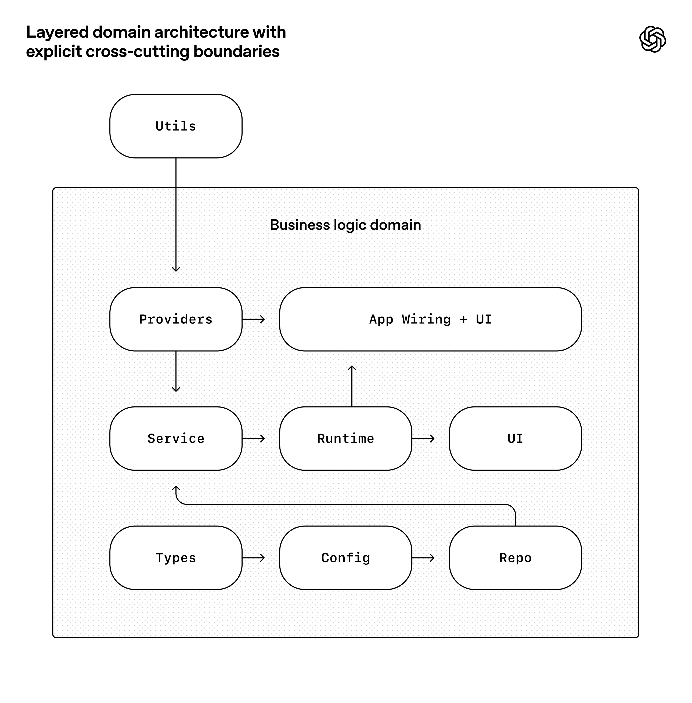

# 架构约束

**架构约束**（Architectural Constraints）是[[Harness-Engineering|Harness 工程]]的三大支柱之一。这是 Harness 工程与传统 AI 提示最显著不同的地方。与其告诉智能体"编写好代码"，不如**机械地强制执行好代码的样子**。

## 核心思想

### 约束反而提升生产力

矛盾的是，约束解决方案空间使智能体**更有生产力**，而不是更少。当智能体可以生成任何东西时，它会浪费 token 探索死胡同。当 Harness 定义清晰的边界时，智能体会更快地收敛到正确的解决方案。

### 为智能体优化代码库可读性

由于代码仓库完全由智能体生成，因此首先针对 Codex 的可读性进行了优化。就像团队会努力提升代码对新入职工程师的可导航性一样，人类工程师的目标也是让智能体能够直接从代码仓库推理出完整的业务领域。

从智能体的角度来看，它在运行时无法在情境中访问的任何内容都是不存在的。存储在 Google Docs、聊天记录或人们头脑中的知识都无法被系统访问。代码仓库本地的、已版本化的工件（例如，代码、Markdown、模式、可执行计划）就是它所能看到的全部。

## 分层领域架构

OpenAI 围绕一个严格的架构模型构建了应用。每个业务领域都划分为一组固定的层，依赖方向经过严格验证，并且仅允许有限的一组边。这些约束是通过自定义的 linter（当然是由 Codex 生成的！）和结构测试机械地强制执行的。



### 依赖分层规则

在每个业务领域内（例如应用设置），代码只能"向前"依赖于一组固定的层：

```
Types → Config → Repo → Service → Runtime → UI
```

横切关注点（认证、连接器、遥测、功能标志）通过一个单一的显式接口进入：Providers。其他任何内容都不被允许，并将通过自动化方式强制执行。

这种架构通常要等到你拥有数百名工程师时才会推迟。对于编码智能体来说，这是一个早期的先决条件：有了约束，速度才不会下降，架构才不会漂移。

## 约束强制执行工具

### 1. 确定性 Linters

自定义规则，自动标记违规。由于这些 lint 是自定义的，编写错误信息时会在智能体情境中注入修复指令。

在以人为本的工作流程中，这些规则可能会让人感到迂腐或束缚。有了智能体，它们就成了倍增器：一旦编码，它们就能立即应用于所有地方。

### 2. 基于 LLM 的审计员

审查其他智能体代码的架构合规性的智能体。

### 3. 结构测试

像 ArchUnit，但专门用于 AI 生成的代码。

### 4. 预提交钩子

在提交任何代码前的自动检查。

## 品味不变式

OpenAI 团队辅以一小组"品味不变式"。例如：

- 通过自定义 lint 静态地强制执行结构化日志记录
- 模式和类型的命名约定
- 文件大小限制
- 特定平台的可靠性要求

## 明确界限

同时，还明确指出了哪些地方需要限制，哪些地方不需要限制。这类似于领导一个大型工程平台组织：在中央层面强制执行边界，在本地层面允许自主权。你非常重视界限、正确性和可重复性。在这些边界内，你允许团队或智能体在解决方案的表达方式上拥有很大的自由。

生成的代码不总是符合人类的风格偏好，这也没关系。只要输出是正确的、可维护的，并且对未来的智能体运行而言清晰易读，就可以算作达标。

## 依赖选择

这一框架明确了许多取舍。倾向于选择那些可以完全内化于在仓库中进行推理的依赖项和抽象。对智能体来说，通常被称为"枯燥"的技术，由于其可组合性、API 稳定性和在训练集里的表现，往往更容易建立模型。

在某些情况下，让智能体重新实现部分功能子集比绕过公共库中不透明的上游行为更便宜。例如，OpenAI 团队没有引入通用的 p-limit 风格包，而是投入使用了他们自己的带并发的 map 辅助函数：它与他们的 OpenTelemetry 仪表紧密集成，具备 100% 的测试覆盖率，并且其行为完全符合他们的运行时预期。

将系统的更多部分转化为智能体可以检查、验证并直接修改的形式，可以直接提高杠杆效应——这不仅适用于 Codex，也适用于其他智能体也在参与代码库的开发。

## 强制执行不变量

仅靠文档本身，是没法保持完全由智能体生成的代码库的连贯性的。通过强制执行不变量，而非对实施过程进行微观管理，令智能体能够快速交付，而且不会削弱基础。例如，要求 Codex 在边界处解析数据形状，但不规定具体实现方式（模型似乎偏好 Zod，但没有指定特定库）。

## 相关概念

- [[Harness-Engineering|Harness 工程]]
- [[Context-Engineering|上下文工程]]
- [[Entropy Management|熵管理]]
- [[Layered Domain Architecture|分层领域架构]]

## 参考来源

1. OpenAI - Harness Engineering：在智能体优先的世界中利用 Codex
2. Martin Fowler - Harness engineering for coding agent users
3. NxCode - Harness Engineering: The Complete Guide

---

*最后更新：2026-04-07*  
*本文档由 [[WikiLLM]] 编译自多个来源*
