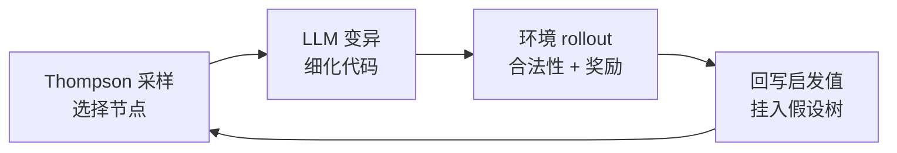

# AutoHarness：自动合成代码 Harness

AutoHarness 是 Google DeepMind 提出的框架：让 LLM 通过迭代代码细化为**自己**合成代码 [[Harness-Engineering|Harness]]，无需人工编写。它把 Harness 生成建模为程序空间上的搜索问题，用 Thompson 采样引导的树搜索驱动，LLM 充当变异算子。

> **核心洞察**：在 Kaggle GameArena 国际象棋比赛中，Gemini-2.5-Flash 的败局有 **78%** 源于非法走子——不是策略失误，而是违反规则。合成的代码 Harness 在 145 个 TextArena 游戏中将非法动作率降为零，使小模型反超更大的模型；进一步把整条策略蒸馏为纯代码后，推理成本趋近于零，平均奖励仍超过 Gemini-2.5-Pro 与 GPT-5.2-High。

与 [[Meta-Harness|Meta-Harness]] 由外环智能体搜索 Harness 不同，AutoHarness 让基础模型直接在环境反馈闭环中重写自己的约束代码，收敛代价小得多（平均 14.5 次迭代）。

---

## 问题与动机

LLM 作为智能体时经常执行环境明确禁止的动作。传统缓解手段各有限价：

- **微调**：成本高，且泛化到新规则时脆弱
- **手写 Harness**：每个环境都要人工投入，无法规模化

AutoHarness 的立场是「代码即 Harness」：Harness 本质上是一个**条件可学习的拒绝采样器**——模型先提议动作，确定性代码负责裁决合法性。合法性判断由此从模型的内部世界模型移交到外部可验证程序，与 [[Harness-Engineering-for-Coding-Agent-Users|面向编码智能体用户的 Harness 工程]] 中「计算型反馈传感器优于推理型」的论点互为印证。

---

## 方法：Thompson 采样树搜索

### 搜索结构

系统维护一棵代码假设树，循环执行：

1. **选择**：用 Thompson 采样挑选下一步要细化的节点，节点启发值为平均合法动作准确率
2. **变异**：基础 LLM 充当变异算子，重写该节点的代码
3. **评估**：环境（critic）在真实 rollout 中反馈动作是否合法及奖励
4. **回写**：新候选挂入树中，更新各节点启发值

### 细化规则

针对验证器模式下的两类失败，系统区分责任归属：

| `is_legal_action()` 判定 | 实际动作 | 细化对象 |
|---|---|---|
| True（误判合法） | 非法 | 同时细化 `propose_action()` 与 `is_legal_action()` |
| False（正确拦截） | 非法 | 仅细化 `propose_action()` |

### 三种 Harness 模式

1. **harness-as-action-filter**：代码先生成合法动作集合，LLM 只在集合内排序（可配合 CoT）
2. **harness-as-action-verifier**（论文重点）：LLM 先提议动作，`is_legal_action()` 裁决；非法动作附带警告消息重试
3. **harness-as-policy**：纯代码（Python + numpy）直接选动作，推理时完全不调用 LLM

三种模式构成一条光谱：从「代码约束模型」到「代码取代模型」。

---

## 实验

### 设置

- **基准**：TextArena 全部单人/双人游戏，剔除 9 个自由文本游戏后剩 **145 个**（Chess、Checkers、Blackjack、Sudoku 等）
- **加难度**：手动删除部分游戏观察中的「Available Moves」提示，迫使 Harness 自己推导合法动作
- **训练**：10 个并行环境，rollout 最多 1000 步，非法动作或代码失败即终止；最多采样 5 个失败步骤交给 critic；基础模型为 Gemini-2.5-Flash

### 收敛速度

平均 **14.5 次**树搜索迭代收敛，19/32 个游戏在 10 次内完成。最难的游戏：

| 游戏 | 收敛迭代数 |
|---|---|
| Chess-v0 | 64 |
| Othello-v0 | 62 |
| Cryptarithm-v0 | 45 |
| GermanWhist-v0 | 43 |

测试（1000 步 × 10 种子）：**145 个游戏全部达到 100% 合法动作率**，附录表中 Legal Action Rate 全为 1.0。

### 端到端对局结果（4.2）

评估 16 个单人 + 16 个双人游戏。双人各跑 40 局（先后手各半），单人跑 20 局。

**双人游戏**（胜率）：

| 对手 | 胜场 | 总胜率 |
|---|---|---|
| vs Gemini-2.5-Pro | 9/16 | **56.3%** vs 38.2% |
| vs 原版 Gemini-2.5-Flash | 12/16 | **64.8%** |

**单人游戏**（平均奖励）：优于 Pro 的有 8/16，持平 5/16。

| 方案 | 平均奖励 |
|---|---|
| **Flash + AutoHarness** | **0.745** |
| Gemini-2.5-Pro | 0.707 |
| Gemini-2.5-Flash | 0.673 |

### Harness-as-Policy：纯代码策略（4.3）

启发值改为含终局奖励：非法动作 H=0，否则 H = 0.5 + 0.5r。最多 256 次迭代，平均 **89.4 次**，启发值达 **0.939**。

| 方案 | 16 个单人游戏平均奖励 |
|---|---|
| **AutoHarness 代码策略** | **0.870** |
| GPT-5.2-High | 0.844 |
| Gemini-2.5-Pro | 0.707 |
| GPT-5.2 | 0.635 |

成本对比悬殊：代码策略推理成本几乎为零，而 GPT-5.2 系列的对照实验花费约 **$640**。

---

## 与相关工作的关系

- **CoT / Tree of Thoughts**：依赖模型内部世界模型，易幻觉；AutoHarness 把状态转移合法性交给外部可验证程序
- **Voyager / Eureka / Code as Policies**：同属「代码即策略」谱系，区别在于 AutoHarness 基于树搜索与环境反馈做迭代细化
- **Reflexion / AlphaCode / AlphaEvolve**：细化与搜索家族；AutoHarness 将 Thompson 采样树搜索用于在线多轮 Harness 生成
- **[[Meta-Harness|Meta-Harness]]**：同样搜索 Harness 代码，但依赖外环编码智能体检查完整历史轨迹；AutoHarness 更轻量，直接由基础模型在环境闭环中自我修正

---

## 局限与展望

- 当前每个环境单独合成 Harness，尚未跨环境复用；论文计划构建**可复用 Harness 库**
- 未来方向：把专家 Harness 蒸馏回基础 LLM，实现[[MiniMax-M27-Self-Evolution|递归自我改进]]；扩展到 Craftax、Terra Nova 等多模态游戏
- 从 [[Externalization-in-LLM-Agents|外部化]] 视角看，AutoHarness 把「合法性知识」从模型权重外部化到可检查、可审计的代码工件中——这正是外部化框架所主张的方向

---

## 相关研究

- [[Meta-Harness|Meta-Harness：模型 Harness 的端到端优化]] - 斯坦福/MIT 的外环 Harness 搜索系统
- [[Harness-Engineering|Harness 工程]] - Harness 的统一分析框架
- [[Harness-Engineering-for-Coding-Agent-Users|面向编码智能体用户的 Harness 工程]] - 指南与传感器框架
