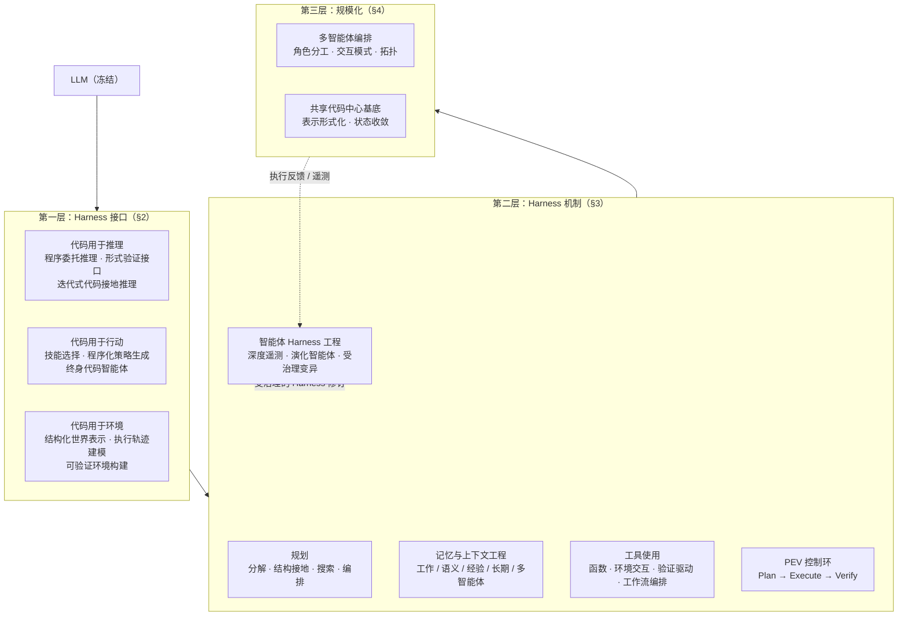

# Code as Agent Harness：迈向可执行、可验证、有状态的智能体系统

《Code as Agent Harness》是 UIUC、Meta、Stanford 等机构联合发表的大型立场性综述（近 500 篇参考文献），提出一个统一视角：**代码不再只是 LLM 的生成目标，而是智能体推理、行动、环境建模与基于执行的验证所依赖的操作基底（operational substrate）**。论文以「智能体 Harness」为系统级透镜，将围绕模型的工具、API、沙箱、记忆、验证器、权限边界、执行循环与反馈通道统称为 Harness，并论证自主性的瓶颈不仅在基础模型的推理能力，更在于连接模型与长期行为、持久状态之间那层系统的可靠性。

> **核心立场**：代码是智能体 Harness 的组织中心。它同时是**可执行的**（模型意图变为形式可验证的操作）、**可检查的**（中间计算暴露为结构化轨迹，可被诊断与反馈）、**有状态的**（演化中的程序以持久、可修改的形式承载任务进度）。研究对象应从「生成正确程序」转向「理解代码如何支撑可靠的闭环智能体行为」。

---

## 三个耦合要素：重新定位代码的角色

论文首先区分长时运行智能体系统中三个耦合的要素，澄清「代码作为 Harness」的确切含义：

| 要素 | 含义 | 研究现状 |
| :--- | :--- | :--- |
| **模型内部能力** | 模型的推理、感知、规划、模拟与评估能力 | 主流研究焦点 |
| **系统提供的 Harness 基础设施** | 预定义的工具、API、沙箱、记忆系统、验证器、权限层、遥测与工作流 | [[Harness-Engineering]] 的主要对象 |
| **智能体发起的代码工件** | 智能体在任务循环内创建、执行、观察、修订、持久化与共享的交互式代码对象：回归测试、临时工具、DSL 程序、可执行工作流、可复用技能、中间程序状态 | **相对欠探索，本文焦点** |

Claude Code、Codex、LangChain 及企业级智能体平台表明，正是第三层工件经由执行反馈帮助智能体推理、行动、验证进度、存储状态并与其他智能体协调。这与 [[Externalization-in-LLM-Agents|LLM 智能体的外部化]] 一脉相承：把易逝的隐式推理外化为可持久、可审计的工件。

**范围边界**：论文对「代码」采取宽泛但不比喻式的定义——程序、脚本、形式规约、证明脚本、API 模式、工具定义、测试、仓库、模拟器、配置文件，以及由可执行系统生成或消费的轨迹与日志。原始感知、物理状态、人类意图与模型内部隐式推理本身不是代码；它们可以经由代码被感知、估计、序列化、验证与作用，但不应与代码接口混为一谈。

---

## 三层组织架构

综述沿「代码如何进入智能体循环」组织为三个相连层次：代码先作为 **Harness 接口**进入（推理、行动、环境表示）；再支撑管理规划、记忆、工具、执行与修复的 **Harness 机制**；最终成为多智能体围绕仓库、测试、轨迹、工作流与执行状态进行协调的**共享工件**。

---

## 第一层：Harness 接口——代码连接模型与任务环境

任何 Harness 最根本的设计问题是：**什么媒介连接模型与任务环境？** 论文的答案是代码，并从三种角色展开。

### 代码用于推理（Code for Reasoning）

纯文本思维链迫使模型在单一隐式过程中既分解问题又执行中间运算，Harness 几乎无法验证中间状态、检查执行行为或跨步骤持久化进度。代码推理将「高层推理」与「低层计算」分离：模型提议过程，Harness 负责执行、观察运行时行为、存储中间状态并把执行结果反馈进后续推理。三种范式：

- **程序委托推理**：以 Program-of-Thoughts（PoT）为代表，把推理显式分解为可执行程序；Chain of Code、CodeI/O 等进一步分析执行正确性对失败模式的改变，CodeAdapt 显示紧耦合可执行推理接口可超越专门的推理模型。
- **形式验证与符号推理接口**：Lean、Isabelle、Coq 等证明助手让每一步推导可被验证器检查（DeepSeek-Prover-V2、Kimina-Prover、Goedel-Prover-V2）；Lean4Agent 进一步用 Lean4 建模并验证智能体工作流与轨迹。从 Harness 视角看，形式语言不只是推理工具，更是**约束、认证与审计智能体行为的可执行契约**。
- **迭代式代码接地推理**：生成—执行—验证—修订的闭环（CodePRM、CYCLE、Self-Edit），以及以单元测试奖励优化功能正确性的强化学习路线（CodeRL、RLTF、RLEF）。

### 代码用于行动（Code for Acting）

代码在此成为把模型意图转换为接地操作的动作接口：工具调用、机器人控制策略、GUI 动作、软件命令。核心挑战是**接地（grounding）**——动作执行发生在部分可观测、动态演化的环境中，失败可能以无效状态转移、延迟反馈或静默执行错误的形式出现（例如机器人试图抓取可达工作空间外的物体而不抛出异常）。值得强调的是：可执行动作代码是感知、可供性估计、运动规划、安全层等组件的**接口而非替代**。[[AutoHarness|AutoHarness]] 将最后一种形态显式化——自动合成介于 LLM 与环境之间的代码 Harness，在执行前过滤无效动作。

### 代码用于环境（Code for Environment）

不把环境当作不透明的外部过程，而是经由模拟器、仓库、测试、执行轨迹、日志与状态转移程序，将环境结构与动力学**物化为可计算工件**。两大优势：其一，可执行环境暴露**可验证的状态转移**，交互结果经由执行而非含混的自然语言判断来评估；其二，代码化环境**持久且可修改**，智能体可在交互中查询、模拟、编辑与精炼。四种范式：结构化世界表示（ViStruct、PoE-World）、执行轨迹世界建模（WorldCoder 合成转移与奖励模型）、代码接地评估环境、可验证环境构建。

---

## 第二层：Harness 机制——让代码智能体可靠地跨越单步生成

机制层解决的核心问题是：代码一旦进入智能体循环，模型、可变任务状态与人造 Harness 基础设施之间如何协同。五类机制相互配合——规划控制执行轨迹，记忆保存状态，工具扩展动作空间，反馈驱动的适配闭合失败与修订之间的环路。

### 规划：作为 Harness 控制

规划不只是模型的内部推理能力，而是一种 **Harness 控制形式**：决定追求哪些中间目标、按什么顺序执行、检查或修改哪些工件、反馈暴露错误时如何修订轨迹。按控制落点分为四类：

| 规划类型 | 机制 | 代表方法 |
| :--- | :--- | :--- |
| 线性分解规划 | 先自然语言大纲、后翻译为代码 | 早期规划系统 |
| 结构接地规划 | 以仓库结构 / 外部知识约束动作空间 | CodePlan（依赖规划图） |
| 搜索式规划 | 显式搜索多条候选轨迹提升鲁棒性 | 树搜索、轨迹采样类方法 |
| 编排式规划 | 跨专门角色与反馈环分布式协调 | MapCoder（map-code-test 阶段化交接） |

### 记忆与上下文工程

覆盖工作记忆、语义记忆、经验记忆、长期记忆、多智能体记忆，以及上下文压缩与状态卸载六个子方向。与 [[Memory-Systems|记忆系统]] 的分类相互印证；与 [[Skill-Systems|技能系统]] 的交叉点在于：可复用技能本身就是一种以代码形态沉淀的经验记忆（如终身代码智能体 Voyager 的技能库）。

### 工具使用

四类受治理的可执行接口：面向函数（API 调用）、面向环境交互（终端、沙箱）、验证驱动（静态分析、测试工具）、工作流编排。相关协议层设计可对照 [[Agent-Protocols|智能体协议]]。

### PEV 控制环：Plan–Execute–Verify

论文将反馈引导的调试**重构为 Harness 级控制过程**，提出 PEV 环作为统一框架——这是全综述最具操作性的贡献之一：

1. **规划即契约形成**：计划不仅分解实现步骤，还显式声明相关文件、预期不变量、验证命令、回滚点与高风险操作。AGENTS.md 式仓库级指令、MCP 服务器注册表、类型化工具模式让可用动作在执行前即可检查。
2. **沙箱化执行与带权限的状态转移**：沙箱提供隔离文件系统、依赖状态、Shell、运行时与资源边界，是 PEV 环的操作基底；多层权限模型区分只读观察层、沙箱编辑层与全访问层，末层动作（网络、凭证、部署、破坏性文件操作、Git 历史改写）必须经人工在环（HITL）门禁。
3. **经由确定性传感器的验证**：Harness 扮演**控制论调节器（cybernetic governor）**，通过 linter、解析器、编译器、类型检查器、单元测试、静态分析器、模糊测试器、运行时监视器与 CI 流水线等确定性传感器观察仓库与执行环境，据信号决定继续、修订、降级权限或升级人工审查。终止同样由验证而非模型置信度治理。

代表性系统的 PEV 角色分布（节选自原论文 Table 7）：

| 系统 | PEV 角色 | 核心机制 | 信号与门禁 |
| :--- | :--- | :--- | :--- |
| OpenHands | 完整 PEV Harness | 有状态编辑-执行工作区 | diff、日志、测试、审批 |
| SWE-agent | 执行（CLI） | 可重放 Shell 接口 | 命令、补丁、测试 |
| Daytona / E2B | 执行（云沙箱） | 隔离开发工作区 / 云端代码沙箱 | 文件、限额、快照 |
| Self-Debugging | 验证（自调试） | 解释引导修复 | 错误、测试 |
| Reflexion | 验证（反思记忆） | 语言反馈记忆 | 结果、批判 |
| AgentCoder | 验证（多智能体修复） | 编码-测试-执行循环 | 测试、失败、批判 |
| AutoSafeCoder | 验证（安全传感器） | 静态检查 + 模糊测试 | 告警、轨迹、测试 |
| LiteLLM | 权限网关 | 网关层策略路由 | 审批、拒绝、成本日志 |

### 智能体 Harness 工程（AHE）：Harness 自身的测量与优化

**Agentic Harness Engineering（AHE）** 将与模型相切的运行环境本身作为分析与优化对象：工具模式、规划工件、记忆策略、检索策略、沙箱配置、验证传感器、权限层、路由规则、多智能体工作流与人工审查门禁。许多被观察到的失败源于仓库上下文缺失、工具接口脆弱、验证器薄弱、重试策略失当或权限边界错配，而非模型生成能力。三条互补路线：

- [[AutoHarness|AutoHarness]]：自动合成代码 Harness；
- [[Meta-Harness|Meta-Harness]]：将 Harness 设计形式化为模型侧基础设施上的优化问题；
- [[Agentic-Harness-Engineering|可观测性驱动的 AHE]]：以富遥测诊断智能体循环的失败点与应修改的 Harness 组件。

**深度遥测（deep telemetry）** 是 AHE 的中心基底：连接模型决策、Harness 动作、环境状态与最终结果的结构化轨迹——Prompt 与检索上下文、Token 用量与成本、模型/工具延迟、工具参数、权限请求、被编辑文件、沙箱快照、测试结果、栈轨迹、被拒绝的备选方案、人工干预与最终任务结局。遥测把 Harness 修订从轶事式调试变为**可回放、可跨版本对比的比较诊断**。

**演化智能体（Evolution Agent）** 是使用深度遥测提议、评估并晋升 Harness 修订的元层智能体：任务智能体编辑目标仓库，演化智能体编辑的是后续任务智能体的工作条件。其循环含五个阶段——观察轨迹、诊断失败模式、提议候选修订、在保留任务或回放轨迹上以确定性传感器评估、仅晋升不回退既有案例的变更。

| 方法 | 类别 | 遥测信号 | 修订目标 |
| :--- | :--- | :--- | :--- |
| AutoHarness | Harness 合成 | 失败、fixture、断言 | Harness 代码与测试 |
| Meta-Harness | Harness 搜索 | 代码、分数、轨迹 | Prompt、工具、脚本 |
| AHE | 遥测驱动优化 | 成本、决策、延迟、失败 | 上下文、工具、验证器 |
| GEPA | 反思式 Prompt 演化 | 分数、反馈、批判 | Prompt 与指令 |
| EvoMAC | 工作流拓扑演化 | 交接、闲置角色、循环 | 智能体角色与图 |
| Live-SWE | 在线智能体演化 | 真实 issue 轨迹 | 策略、工具、记忆 |

**受治理的 Harness 变异**：AHE 不等于无约束自修改。演化智能体改变的是控制后续任务智能体的 Harness，其治理强度必须高于普通代码修复——候选变更在沙箱内评估、对照固定回归套件比对、以可审计理由记录；触及权限边界、网络访问、凭证处理或人工审查要求的变更激活前必须经 HITL 批准。换言之，**演化智能体自身也处于 PEV 环之内**。这一立场与 [[Self-Harness|Self-Harness]]、[[Harness-Continual-Learning|Harness 持续学习]] 的自我改进路线形成治理维度的互补。

---

## 第三层：规模化——多智能体围绕代码的编排

当多个智能体围绕代码工作时，Harness 还需协调角色、共享中间工件、维护公共状态并验证集体进度。

### 立场：共享的代码中心 Harness 基底

论文提出下一代多智能体智能的核心立场：**共享代码中心 Harness 基底（shared code-centric harness substrate）**。动机来自文献中的中心缺口——缺乏对共享代码状态的形式化、持久、可查询、可跨迭代更新的表示。现有系统对共享 Harness 的表示处于四个形式化层级：

| 表示层级 | 共享状态形态 | 代表系统 | 局限 / 优势 |
| :--- | :--- | :--- | :--- |
| 隐式 / 仅文件 | 最新代码文件 + 对话历史，每次调用时临时重建 | ChatDev、MetaGPT、MapCoder、CodeCoR | 状态分歧（智能体内部信念与真实代码状态背离）不可见、不可检测 |
| 仓库级表示 | 可导航仓库：目录结构、依赖图、调用层级、版本历史 | MAGIS（仓库演化记忆）、HyperAgent、Lingma SWE-GPT（AST 骨架） | 支持架构级推理；SyncMind 唯一形式化定义基真状态 S_k 与信念状态 B_k 并度量分歧 |
| 执行级表示 | 状态不是代码长什么样，而是代码做什么：编译、测试通过、模糊测试、性能 | AgentCoder、AutoSafeCoder、QualityFlow、MAGE | 提供不会幻觉的客观 oracle 信号；MAGE 以时钟沿粒度（State Checkpoint 波形快照）实现文献中最细反馈 |
| 黑板 / 共享状态 | 所有智能体可读写的显式全局数据结构 | Self-Collaboration、L2MAC、Cogito（三层记忆） | 最接近形式化 Harness 基底；L2MAC 的持久文件存储 + 控制单元显式管理每次调用所见状态切片 |

**中心缺口**：绝大多数文献停留在隐式/仅文件层级。程序在多智能体各领域中独一无二之处在于它**会执行**——可提供客观的、非语言的信号来锚定形式化共享基底，然而多数系统未在架构层面利用这一性质。

### Harness 状态的六种收敛模式

收敛决定多智能体编码 Harness 何时停止迭代并接受当前程序状态。可执行基底的独特优势在于：收敛可锚定在客观行为信号而非会话共识上。

| 收敛模式 | 判据 | 代表系统 | 备注 |
| :--- | :--- | :--- | :--- |
| 正确性收敛（测试门控） | 全部测试通过 | AgentCoder、L2MAC、SyncMind、CANDOR | FlowGen 用 LLM 自生成测试，存在收敛于「通过自己有偏测试」的风险 |
| 安全收敛 | 静态分析无 CWE 告警且模糊测试无崩溃 | AutoSafeCoder（唯一） | 收敛判据锚定客观程序行为而非智能体意见 |
| 性能收敛 | 运行时 / 内存阈值达标 | MACRO（唯一） | 唯一以性能为主收敛判据的系统 |
| 分数收敛 | 量化质量分数达阈 | MAGE（模拟失配分数收敛至 1.0）、CodeCoR、Trae Agent | 仓库尺度下收敛亦是候选补丁的排序、剪枝与选择问题 |
| 共识收敛 | 多评审智能体聚合判断 | CANDOR（三人多数投票）、QualityFlow | QualityFlow 以质量检查器兼任收敛 oracle 与控制器，75–84% 的问题在首次生成调用后即收敛 |
| 隐式收敛 | 固定阶段数 / 迭代预算 | ChatDev（固定阶段或 10 轮）、MetaGPT（固定 SOP）、EvoMAC（固定 K 轮） | 文献中最普遍，也是最大缺口——缺乏客观表示就没有有原则的收敛判据 |

### 模式与趋势：七条跨系统洞察

1. **隐式 Harness 状态约束**：多数系统依赖智能体从对话历史隐式重建状态。隐式状态表示是系统脆弱性的技术根源，而非可扩展性便利。
2. **代码媒介通道不消除协调瓶颈**：文件、API、diff、测试、日志、模式、黑板都是部分通道，各自在保真度、延迟与范围间权衡。核心设计问题不是代码是否在场，而是哪些工件具有权威性、如何压缩、跨通道冲突如何裁决。
3. **执行反馈是语言推理与形式推理之间的桥梁**：一个耐人寻味的发现是——Self-Collaboration 与 QualityFlow 表明 LLM 模拟执行在预测真实运行结果上可达 **98%+ 的精度与召回**。执行反馈的价值并非均匀分布：它擅长发现语言模拟结构性无法想象的角落案例（运行时崩溃、资源耗尽、边界条件、性能回退），而许多可修复 bug 用模拟推理即可。成熟的 Harness 应走「语言推理为快速路径、执行仅作必要失败模式的验证 oracle」的混合路线。
4. **共享 Harness 的两种互补表示**：仓库视图（结构：调用关系、数据流、依赖）与执行视图（行为：运行时状态演化、涌现失败）。尚无任何被综述系统将两者统一为单一基底——最深的 Harness 应能回答「哪些组件慢」（需要调用图 + 性能剖析）与「这次重构是否破坏外部依赖的 API」（需要静态分析 + 动态测试）。
5. **拓扑复杂度与 Harness 状态形式化程度负相关**：拥有清晰形式化基底的 L2MAC 用简单顺序链即可协调；隐式状态系统（EvoMAC、SEW）则发展出动态 DAG、工作流变异、智能体池扩缩等精巧拓扑作为结构性补偿。**拓扑复杂度在一定程度上是症状**：基底可查询时，简单透明的协议就够；基底隐式时，系统被迫用更丰富的交互模式弥补状态信息缺失。
6. **上下文管理是隐式共享状态的税**：L2MAC 的控制单元、MetaGPT 的发布-订阅池、Cogito 的三层记忆，都是对同一底层问题——代码 Harness 太大、任何单一上下文窗口都装不下——的不同回应。
7. **智能体专门化提升共享状态指标的关键性**：角色越多样（架构师、经理、导航者、执行者、验证者），对统一共享基底的需求越紧迫；EvoMAC 以梯度与更新智能体显式监控失败归因，SyncMind 将问题形式化为信念分歧 |B_k − S_k| 并提出显式同步协议。

---

## 应用领域与开放问题

### 五大应用领域

- **编码助手**：从内联补全走向自主 SWE 智能体与软件生命周期参与；仓库中心工作区、可执行开发 Harness、执行反馈作为接地验证、仓库尺度记忆管理；Harness 亦可作为蒸馏面（distillation surface）。
- **GUI/OS 智能体**：界面是部分可观测的程序世界；代码充当用户界面与 GUI 智能体之间的桥梁（DOM 树、无障碍 API、可执行检查器）；UI 模拟器与沙箱作为可执行动力学。
- **自主具身智能体**：代码是连接智能体与物理世界的控制边界；分层 Harness 支撑接地且可验证的具身动作；可复用技能作为具身记忆。
- **科学发现智能体**：将构想、实验、分析与交流统一为可执行流水线；模拟器作为可执行动力学；自驾实验室（self-driving labs）作为可执行反馈环。
- **个性化智能体**：偏好状态作为可编辑工件；反馈驱动策略适配；可控且遵循指令的个性化。

### 七个开放问题

1. **Harness 级评估与 oracle 充分性**：最终任务成功率混淆了基础模型能力、Harness 质量、工具可靠性、反馈信息量与环境难度。需要评估操作基底本身的指标——轨迹效率、验证强度（覆盖率、oracle 多样性、误接受率）、恢复能力、状态一致性、安全合规、可重放性；核心瓶颈是 oracle 充分性：评估器是否捕获了意图任务而非狭隘的可执行代用指标。
2. **超越可执行反馈的语义验证**：可执行反馈会制造虚假的正确感——绿灯测试不等于完整规约。需要带显式作用域的验证栈：每种验证工件声明它能验证什么、不能验证什么、置信度几何；每个被接受动作携带证据包（已运行检查、被保留假设、未测区域、残余风险）。验证不是终点门禁，而是智能体、Harness 与环境之间持续演化、可检查的契约。
3. **无回退的自演化 Harness**：自动化 Harness 演化本身不是开放问题（AutoHarness、Meta-Harness、AHE 已在路上）；难的是**Harness 能否在不过拟合、不削弱安全、不抬高成本、不隐藏失败、不在罕见但重要任务上回退的前提下自我改进**。每次 Harness 变异应携带变更契约（修改哪个组件、针对哪种失败模式、预测何种改进、必须保持哪些不变量、何种评估可否证、如何回滚），目标不是频繁变更的 Harness，而是**只在能正当化变更时才变更的 Harness**。
4. **事务式共享程序状态与语义冲突解决**：同步机制同步的是工件而非假设。缺失的抽象是事务式共享程序状态——每个动作声明读集、写集、假设、版本依赖、验证义务与冲突策略；冲突检测不止于文件 diff，还要覆盖计划、测试、检索证据、权限、记忆条目与潜在用户需求。
5. **作为 Harness 状态的人在环安全与问责**：安全不能委托给基础模型，也不能仅编码为自然语言指令。多层权限模型应按风险分级、上下文敏感（同一命令在一次性沙箱中安全、在生产仓库中危险）；每次批准、拒绝、策略例外都应沉淀为持久的 Harness 状态——可执行问责（executable accountability）。
6. **多模态代码-Harness 系统**：视觉观测巨大、冗余且仅部分相关，需要保留任务相关视觉证据的多级记忆；动作须携带接地引用（边界框、UI 元素、帧索引、位姿）而非仅有自然语言理由；多模态反馈应作为经校准的证据而非二元成功信号。
7. **走向 Harness 工程科学**：研究对象不再是模型或生成程序，而是完整的闭环系统——上下文、记忆、工具、执行、反馈、安全、协调与评估。最重要的未来系统将同时具备四个性质：**可执行、可检查、有状态、受治理**。

---

## 评述

这篇综述的价值在于把散落在程序合成、具身智能、GUI 自动化、多智能体系统与 MLOps 中的工作收敛到一个统一的系统词汇之下，并给出两个可直接指导工程的框架：PEV 控制环（规划即契约、执行即带权限的状态转移、验证即确定性传感器阵列）与 AHE 五阶段演化循环。其对多智能体文献的诊断尤为锋利——「隐式共享状态是脆弱性的技术根源」「拓扑复杂度是症状」——为评估现有多智能体框架提供了清晰的判据。与 [[Meta-Harness|Meta-Harness]] 的定量证据（同一基准上 Harness 差异可达 6 倍性能差距）相互印证，代码中心 Harness 已从工程经验上升为可测量的科学研究对象。在 WikiLLM 收录的文献谱系中，本文扮演着「总地图」的角色：[[Agent-System-Harness-Design-Survey|智能体系统与 Harness 设计综述]] 覆盖任务完成视角的对应图景，[[What-Is-Harness-Engineering|什么是 Harness 工程]] 提供概念入门，而 [[From-Weights-to-Context-to-Harness|从权重到上下文到 Harness]] 勾勒出同一条范式迁移主线。

---

## 相关研究

- [[Harness-Engineering|Harness 工程]] - Harness 作为系统学科的总论，本文的「系统提供的 Harness 基础设施」与之对应
- [[Meta-Harness|Meta-Harness：模型 Harness 的端到端优化]] - AHE 三条路线之一，以智能体提议者在代码空间搜索 Harness
- [[AutoHarness|AutoHarness：自动合成代码 Harness]] - 本文在「代码用于行动」与 AHE 两处引用的代表性工作
- [[Agentic-Harness-Engineering|智能体 Harness 工程]] - 可观测性驱动的 Harness 自动演化，与本文 §3.5 直接对应
- [[Self-Harness|Self-Harness：自我改进的 Harness]] - 「无回退自演化」开放问题的另一条探索路线
- [[Externalization-in-LLM-Agents|LLM 智能体中的外部化]] - 智能体发起的代码工件是外部化思想的代码形态
- [[Memory-Systems|记忆系统]] 与 [[Skill-Systems|技能系统]] - 本文 §3.2 记忆分类与具身技能库的对应页面
- [[Agent-System-Harness-Design-Survey|从问答到任务完成：智能体系统与 Harness 设计综述]] - 同期综述，可对照阅读
