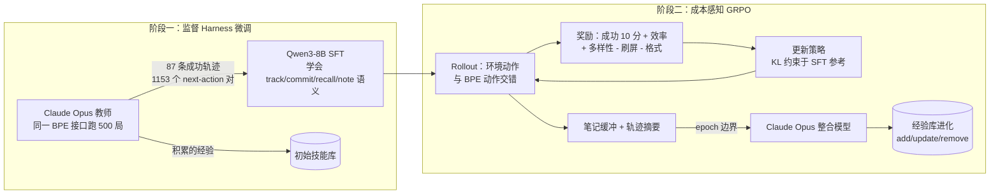

# EvoHarness-RL：用强化学习训练可自我进化的运行时 Harness

EvoHarness-RL 是 UIUC 与 Meta AI 联合提出的框架：把长程智能体对运行时 [[Harness-Engineering|Harness]] 的使用本身建模为**可学习的策略决策**，而非人工编写的 Prompt 约定。它将异构 Harness 组件统一抽象为 **BPE（Belief / Progress / Experience）** 三元外部状态，先用监督微调教会基础模型 Harness 动作语义，再用成本感知 GRPO 训练智能体「何时读、何时写、何时整合」外部状态。

> **核心结果**：在 ALFWorld 上以 Qwen3-8B 为骨干，EvoHarness-RL 在 seen 集达到 **96.9%** 成功率（较 ReAct 基线 **+49.0** 个绝对百分点），追平 Claude Opus 4.5 级别的前沿模型；unseen 集达 **86.6%**。分析揭示两条共进化动力学：**Harness 退火**（annealing）——训练把高频脚手架调用内化进策略权重，Harness 调用稳定在每回合约 1 次；**Harness 进化**（evolution）——经验库经检索、整合与遗忘被精炼为紧凑的任务自适应状态基座。

与 [[Meta-Harness|Meta-Harness]]、[[HarnessX|HarnessX]] 用离线搜索发现 Harness 配置、或 [[AutoHarness|AutoHarness]] 用树搜索合成代码 Harness 不同，EvoHarness-RL 把 Harness 访问提升为策略空间中的**一等动作**，由 RL 直接优化「调用与否」的权衡。

---

## 问题与动机

长程智能体（具身交互、网页导航、软件工程、工作流自动化）越来越依赖外部执行支持：记忆、工具、状态追踪器、验证器、执行日志。但现有做法存在一对耦合难题：

- **状态成形**：如何从噪声交互轨迹中构建有用的外部状态
- **运行时控制**：何时访问、更新、整合外部状态

两者通常靠 Prompt、启发式或领域惯例解决，外部工作区及其使用策略都停留在人工工程阶段。智能体即便被有用组件环绕，也从未被训练去**自主决定**何时成形、访问、更新、整合这些支持。EvoHarness-RL 将其形式化为 **Harness 策略学习**（harness policy learning）：离线学习 Harness 策略，在线运行时构建并更新外部 Harness 状态。

---

## 方法

### BPE 统一抽象

Harness 每步渲染三元组状态 $\mathcal{H}_t = (B_t, P_t, E_t)$，对应长程交互的三类复发失败模式：

| 组件 | 职责 | 解决的失败模式 |
|---|---|---|
| **Belief** $B_t$ | 持久的环境估计：物体状态、位置、空间关系 | 丢失「环境中当前为真」的事实 |
| **Progress** $P_t$ | 子目标-状态记录 $(g_i, \sigma_i)$，外部化已尝试/待办/受阻 | 忘记已完成步骤与下一步方向 |
| **Experience** $E_t$ | 跨回合知识：技能、失败模式、搜索先验、高层策略 | 重复重新发现可复用的过程与错误 |

### 智能体-Harness 动作协议

策略在统一动作空间 $\mathcal{A} = \mathcal{A}_{\text{env}} \cup \mathcal{A}_{\text{bpe}}$ 中采样，Harness 元动作仅四个：

- `track[object|world]`：从 $B_t$ 读取信念（单物体检查或全局摘要）
- `commit[subgoal]`：向 $P_t$ 写入子目标/执行更新
- `recall[query]`：从 $E_t$ 检索可复用知识（同时更新条目使用计数）
- `note[insight]`：写入临时笔记缓冲，留待经验整合

关键设计：Harness 动作与环境动作**消耗同一交互预算**，因此「何时访问外部状态值得其成本」本身就是需要优化的策略决策——这与 [[Long-Running-Harness-Design|长时运行 Harness 设计]] 中预算约束的论点一致。

### 环境适配器（ALFWorld 实例化）

BPE 是功能接口而非固定内部 schema。ALFWorld 适配器将三元组落地为：

- **Belief** → 规则解析器驱动的世界状态追踪器（无 LLM 调用，边容量 48）
- **Progress** → 有界已提交子目标列表（上限 8 条）
- **Experience** → 跨回合技能库，分通用技能 / 任务专属技能 / 常见错误 / 物体位置搜索先验四类；关键词重叠检索，每类容量 80，LFU 按使用计数淘汰

经验在双时间尺度上演化：回合内 `recall`/`note` 在线读写；回合间在每个 epoch 边界由**整合模型**（Claude Opus）将笔记缓冲与轨迹摘要合并进技能库（add / update / remove），批量 rollout 期间主库保持冻结。

### 两阶段训练

GRPO 的轨迹级奖励由五项组成：

$$R(\tau) = R_{\text{succ}} + \lambda_{\text{eff}} R_{\text{eff}} + \lambda_{\text{div}}(u) R_{\text{div}} - \lambda_{\text{spam}} R_{\text{spam}} - \lambda_{\text{inv}} R_{\text{inv}}$$

- $R_{\text{succ}} = 10 \cdot \mathbf{1}[\text{solved}]$：稀疏成功信号充当严格门控
- $R_{\text{eff}} = \max(0, 1 - |\tau|/T_{\max})$：仅在成功时授予，天然惩罚冗余 Harness 查询
- $R_{\text{div}} = |\{\text{verb}(a_t)\}| / |\tau|$：随 epoch 余弦退火的动作多样性奖励（$\lambda_{\text{div}}^{\max}=0.5$），早期鼓励广探索、后期强制专精，防止策略塌缩为「完全不用 Harness」或「无限重复调用」
- $R_{\text{spam}}$、$R_{\text{inv}}$：退化重复与格式错误的固定惩罚（各 0.1）

**超参数**（附录 Table 4）：组大小 G=8，每步 16 个 Prompt × 128 条轨迹，共 150 epoch（退火视界 U=150），AdamW 学习率 1e-6，KL 系数 β=0.01，$T_{\max}=70$，vLLM TP=4，8 张 H200。

---

## 实验

### 设置

- **基准**：ALFWorld 六个任务族（Pick、Look、Clean、Heat、Cool、Pick2），seen 验证集 140 任务，另报 unseen 集
- **SFT 数据**：教师 Claude Opus 跑 500 局训练游戏，保留 87 条成功轨迹、1,153 个 next-action 对（平均每回合 26.5 轮）；教师共 405 次 Harness 调用（约占 18% 轮次）：commit 202、recall 114、note 55、track 34
- **基线**：前沿模型（Claude Opus 4.5、GPT-4.1、GPT-5）；冻结记忆方法（ReAct、ExpeL、ReasoningBank、MemP、Dynamic Cheatsheet、ACE、SkillOS-base）；可训练方法（标准 GRPO、SkillOS、SkillRL）

### 主结果（seen 集，SR %）

| 方法 | 骨干 | Avg. | Δ vs ReAct |
|---|---|---|---|
| ReAct | Claude Opus 4.5 | 96.4 | – |
| + EvoHarness-Base | Claude Opus 4.5 | 98.5 | +2.1 |
| ReAct | GPT-4.1 | 47.9 | – |
| + EvoHarness-Base | GPT-4.1 | 70.0 | +22.1 |
| ReAct | GPT-5 | 60.7 | – |
| + EvoHarness-Base | GPT-5 | 85.0 | +25.7 |
| ReAct | Qwen3-8B | 47.9 | – |
| ExpeL / ReasoningBank / Dynamic Cheatsheet 等 | Qwen3-8B | 49.3 – 55.7 | +1.4 – +7.8 |
| GRPO | Qwen3-8B | 65.6 | +17.7 |
| SkillOS | Qwen3-8B | 80.2 | +32.3 |
| SkillRL | Qwen2.5-7B | 89.9 | +42.0 |
| EvoHarness-Base（推理时） | Qwen3-8B | 56.4 | +8.5 |
| EvoHarness-SFT | Qwen3-8B | 68.6 | +20.7 |
| **EvoHarness-RL** | Qwen3-8B | **96.9** | **+49.0** |

EvoHarness-RL 逐项成绩：Pick 100.0、Look 92.9、Clean 95.5、Heat 100.0、Cool 92.6、Pick2 100.0。8B 模型由此追平前沿模型，且训练管线的递进（56.4 → 68.6 → 96.9）清晰验证两阶段设计：优化把 Harness 从静态工具转变为高效决策接口。推理时 BPE 对各规模模型普遍有益——即使接近性能天花板的 Claude Opus 4.5 也被推至 98.5%。

### BPE 消融（冻结 Qwen3-8B 推理时）

| 变体 | Avg. | 主要受损任务 |
|---|---|---|
| 完整 BPE | 56.4 | – |
| w/o Belief | 50.0 | Clean（63.0→40.7）、Cool（48.0→20.0） |
| w/o Progress | 50.7 | Pick2（41.7→37.5）等子目标依赖任务 |
| w/o Experience | 48.6 | Heat（50.0→62.5→40.7 类状态变化任务），平均最低 |

三者协同而非孤立的记忆技巧：缺少任一组件都显著伤害执行。

### 泛化（unseen 集，Avg. SR %）

| 方法 | Avg. |
|---|---|
| ReAct (Qwen3-8B) | 50.0 |
| EvoHarness-Base（Prompt 时） | 77.6 |
| EvoHarness-SFT | 69.4 |
| **EvoHarness-RL** | **86.6** |

SFT 在 unseen 上反而低于 Prompt 时 Harness（69.4 vs 77.6）——监督模仿记住了 seen 轨迹中教师的调用模式，却未优化新环境中「何时访问值得」；成本感知 GRPO 重新校准访问策略，学到的是可迁移的协调策略而非背诵训练环境。

---

## 两条共进化动力学

### Harness 退火（Annealing）：策略侧内化

GRPO 期间 Harness 调用频率从 SFT 初期的高频脚手架式调用快速下降，稳定在**每回合约 1 次**。奖励曲线全程高于标准 GRPO 且更快到达更高平台，证明调用减少并非策略塌缩，而是**选择性使用**：例行脚手架行为被内化进策略权重，仅在预期收益超过步数成本时才访问外部状态。按动作分解：

- **recall** 最持久——跨回合经验在行为内化后仍提供搜索先验
- **commit / note** 迅速衰减至近零——稳定策略成形后无需外部化每个中间计划
- **track** 居中——早期消歧有用，随直接交互模式习得而渐减

该模式环境相关：ALFWorld 重经验先验；视觉具身环境可能更依赖 Belief；软件工程环境则更依赖 Progress。

### Harness 进化（Evolution）：经验库精炼

技能库在探索早期快速膨胀（通用策略、任务专属过程、常见错误、搜索优先级），随后增长转为选择性：冗余条目合并、少用技能淘汰、高频检索知识保留，最终库保持紧凑而多样。Harness 由此成为**任务自适应状态基座**而非被动追加式日志。附录案例研究展示了 commit → recall → act → note 的自然循环：智能体召回「水壶在台面」的先验，多次搜索失败后不盲从，转而在炉灶找到水壶并记录修正证据——经验是**可修订**的复用源而非固定神谕。

---

## 与相关工作的关系

- **[[Harness-Engineering|Harness 工程]] 谱系**（Meta-Harness、HarnessX、AutoHarness）：把 Harness 当作环境侧构件或离线搜索对象；EvoHarness-RL 把 Harness 访问当作可学习的运行时策略决策
- **记忆与自进化智能体**（Reflexion、Voyager、ExpeL、ReasoningBank、SkillOS、SkillRL）：聚焦跨回合知识积累与策展，却把回合内状态追踪（Belief、Progress）与跨回合经验分离；EvoHarness-RL 用统一 BPE 接口让两者同步进化
- 从 [[Externalization-in-LLM-Agents|外部化]] 视角看，EvoHarness-RL 与 [[Code-as-Agent-Harness|代码即 Harness]]（同一作者团队的前期工作）互补：前者外部化状态与经验并训练访问策略，后者把控制逻辑外部化为可执行代码

---

## 局限与展望

- 仅在 ALFWorld 单环境验证；动作级退火模式提示不同环境的 BPE 权重分布差异显著，跨环境迁移仍待检验
- 教师与整合模型依赖 Claude Opus，整合质量受外部强模型约束；更贴近 [[Self-Harness|Self-Harness]] 全自我改进的路线是后续方向
- 经验检索为关键词重叠 + LFU，对语义相近但表述不同的技能可能召回不足
- 与 [[Harness-Continual-Learning|Harness 持续学习]] 的结合（跨任务持续积累而非单基准训练）是自然延伸

---

## 相关研究

- [[Meta-Harness|Meta-Harness：模型 Harness 的端到端优化]] - 离线搜索 Harness 配置的外环方法
- [[HarnessX|HarnessX：可组合、自适应、可进化的 Harness 铸造厂]] - 轨迹驱动的 Harness 适配
- [[AutoHarness|AutoHarness：自动合成代码 Harness]] - 树搜索合成代码约束的替代路线
- [[Long-Running-Harness-Design|长时运行 Harness 设计]] - 长程智能体的 Harness 工程实践
- [[MiniMax-M27-Self-Evolution|MiniMax M2.7 自我进化]] - 递归自我改进的另一实例
