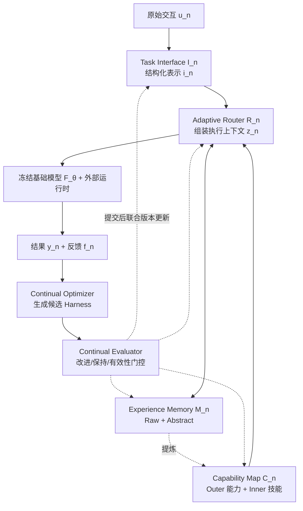

# Harness Continual Learning：围绕冻结模型的 Harness 持续进化

Harness Continual Learning（HCL）是南京大学与伍伦贡大学提出的持续学习新范式：基础模型参数全程冻结，学习对象从模型权重转移到外围的 [[Harness-Engineering|Harness]] 状态——Prompt、记忆、技能与路由规则在序列化经验中持续演化。论文将「更新新任务却破坏旧任务已可靠行为」的现象命名为 **Harness 级遗忘（harness-level forgetting）**，把经典的稳定性-可塑性权衡（stability–plasticity trade-off）从模型状态推广到 Harness 状态。

> **核心洞察**：智能体的适应能力不再局限于模型内部。即使模型冻结，一次记忆更新可能改变旧查询检索到的证据，一次技能修订可能改变工具调用方式，一次路由编辑可能破坏先前成功的工作流——Harness 组件在执行中相互耦合，因此必须把整个可变 Harness 当作统一的持续学习状态，而非一组可独立编辑的工件。

---

## 问题设定

传统 [[Harness-Engineering|Harness 工程]]（如 [[AutoHarness|AutoHarness]]、[[Meta-Harness|Meta-Harness]]）优化的是单个目标下的下一个配置；HCL 研究的是**一串已部署 Harness 的序列**。在第 n 步交互中，原始交互 `u_n` 经 Task Interface 结构化为 `i_n`，Adaptive Router 结合记忆与能力组装执行上下文 `z_n`，冻结模型与外部运行时执行后得到结果 `y_n` 与反馈 `f_n`。

持续学习的形式化核心是一个提交决策门 `G_n ∈ {0,1}`：

- **Continual Optimizer** 依据反馈生成候选 Harness `H̃_{n+1} = O(H_n, e_n)`
- 仅当 `G_n = 1` 时候选才被提交为 `H_{n+1}`，否则维持 `H_n` 不变

已可靠行为（正确回答、合法工具调用、满足环境目标的动作轨迹）必须在后续更新后、相同输入与执行条件下依然成功——这是 HCL 区别于常规 Harness 优化的保持性（retention）要求。

---

## Harness 状态：四个联合版本化组件

HCL 将可变 Harness 状态定义为 `H_n = (I_n, M_n, C_n, R_n)`，四个组件联合版本化、整体提交：

| 组件 | 执行期职能 | HCL 中可更新的内容 |
|---|---|---|
| Task Interface `I_n` | 把原始交互转化为结构化表示（输入、目标、约束） | Prompt、任务模板、解析与归一化规则 |
| Experience Memory `M_n` | 提供可复用的具体交互与抽象指导 | Raw Memory 交互记录与 LLM 生成的 Abstract Memory 条目 |
| Capability Map `C_n` | 提供外部操作与可复用的内部技能 | 从 Abstract Memory 提炼的 Inner Skill |
| Adaptive Router `R_n` | 选择并组织记忆与能力，组装执行上下文 | 路由 Prompt、选择准则、工作流模板 |

### Experience Memory 的双层结构

- **Raw Memory** `M_n^raw`：按到达顺序保留每个任务的固定数量交互记录（原始输入、响应或动作轨迹、环境/验证器反馈），用于回放与行为恢复
- **Abstract Memory** `M_n^abs`：由 LLM 将 Raw Memory 中的复现模式固化为作用域明确的指导——格式约定、可靠推理模式、常见错误

双层设计与 [[Memory-Systems|记忆系统]] 的情景记忆/语义记忆划分一脉相承：Raw Memory 支撑复用，Abstract Memory 支撑跨任务迁移。

### Capability Map 的动态扩张

- **Outer Capability**：外部运行时提供的 API、检索服务、感知模型、计算器与环境动作，含调用协议与已知限制
- **Inner Capability**：从 Abstract Memory 进一步固化的可执行技能，具备显式输入、执行步骤与适用域

这一「经验 → 抽象记忆 → 内部技能」的固化链条，使冻结模型智能体能持续获取、精炼并迁移技能，是 [[Externalization-in-LLM-Agents|外部化]] 视角下知识沉淀到 Harness 工件的典型路径。

---

## Guarded Harness Evolution：提议-评估-提交

HCL 把更新生成与状态提交分离，Continual Evaluator 从三个互补维度审查候选：

1. **当前改进（Current Improvement）**：`Δ_n = P(H̃, V_n) − P(H_n, V_n) ≥ δ_n`，候选须在当前任务验证集上有最低幅度提升
2. **历史保持（Historical Retention）**：维护紧凑的锚点集 `A_n`（含先前案例的原始输入与成功判据，仅评估可见），统计历史损失 `D_n`——`H_n` 能解决而 `H̃` 失败的锚点数；提交条件 `D_n ≤ B_n`
3. **有效性（Validity）**：工件语法、格式合规（实验中要求 ≥ 90%）、合法工具使用、任务约束与环境一致性

三项构成硬性准入门槛；多个候选过门时按综合得分排序提交，无候选过门则 `H_n` 保持部署。容差 `B_n` 即稳定性-可塑性的调节旋钮：

- **Stability-HCL**：`B_n = 0`，拒绝任何使已解决锚点失败的候选
- **Plasticity-HCL**：`B_n = ∞`，历史损失不阻塞提交

多组件修订采用顺序策略：按预定义顺序逐组件生成至多 K 个备选，每次只替换一个组件评估，最优可采纳备选成为下一组件修订的基础；无备选过门则该组件不变。

与 [[Self-Harness|Self-Harness]] 的「Harness 自我改进」相比，HCL 的关键增量是把**保持性设为提交的显式前置条件**；与 [[Agentic-Harness-Engineering|智能体 Harness 工程]] 的观测驱动演化相比，HCL 给出了 Harness 级遗忘的度量与预算化控制。

---

## 实验

实验刻意使用不同模型家族与规模验证泛化：ALFWorld 用 Qwen3.5-9B，Minecraft 与多模态主流用 Qwen3.6-27B，文本推理用 DeepSeek-V4-Flash，组件消融用 Qwen3.5-4B。同一设定内模型全程冻结，一切适应均来自 Harness 更新。评估协议在每阶段结束后用当前 Harness 回测全部已见任务，报告最终平均性能（Avg）与平均旧任务遗忘（Fgt）。

### ALFWorld：开放世界能力积累

六类任务按 Pick → Look → Clean → Heat → Cool → Two-object 顺序到达，每类 10 个训练 episode，最终在 134 个官方评估 episode 上报告。

| 方法 | Pick | Look | Clean | Heat | Cool | Two-object | Final Avg. ↑ | Avg. Fgt. ↓ |
|---|---|---|---|---|---|---|---|---|
| Static Harness | 95.80 | 66.70 | 25.80 | 26.10 | 9.50 | 58.80 | 47.12 | – |
| RAG Baseline | 95.80 | 83.30 | 41.90 | 39.10 | 14.30 | 58.80 | 55.56 | 1.74 |
| MemP | 95.80 | 83.30 | 48.40 | 34.80 | 9.50 | 47.10 | 53.15 | 5.18 |
| MemRL | 87.50 | 66.70 | 29.00 | 60.90 | 23.80 | 41.20 | 51.51 | 5.64 |
| **Stability-HCL** | **100.00** | 83.30 | **51.60** | 30.40 | **28.60** | 76.50 | 61.74 | **2.64** |
| **Plasticity-HCL** | **100.00** | 77.80 | 41.90 | 39.10 | 19.00 | **100.00** | **62.98** | 10.94 |

解读：纯检索（RAG）能复用经验却无法修订可执行流程与路由规则；记忆类基线（MemP、MemRL）逐类波动剧烈。Plasticity-HCL 拿下最高的 62.98% 并全解 Two-object，但遗忘达 10.94；Stability-HCL 以 61.74% 紧随其后、六类中四类最优且遗忘仅 2.64。两个配置只差 `B_n` 一个超参，证明 Evaluator 能显式控制权衡点。

### Minecraft：长程课程与失败恢复

50 任务课程（采集、合成、挖矿、工具、放置、冶炼及多步依赖），冻结 Qwen3.6-27B，采用保持取向配置（`B_n = 0`，锚点为已通过的技能测试）：

- Static Harness 推进到第 15 个任务后停滞；**HCL 完成全部 50 个任务**
- 累计环境动作数：HCL **83** < MemRL 88 < MemP 91——后期多步任务中 HCL 避免了重复诊断、合成与恢复动作，经验复用效率更高

### 文本推理：受控任务流

任务序 MuSiQue → ProofWriter → GSM8K → HotpotQA，每任务 250 适应 / 50 验证 / 500 测试，冻结 DeepSeek-V4-Flash。

| 方法 | MuSiQue | ProofWriter | GSM8K | HotpotQA | Final Avg. ↑ | Avg. Fgt. ↓ |
|---|---|---|---|---|---|---|
| Zero-shot | 35.00 | 42.80 | 49.40 | 54.80 | 45.50 | – |
| Stability-HCL | 27.60 | 73.00 | 50.40 | 57.80 | 52.20 | **0.00** |
| **Plasticity-HCL** | 29.00 | 77.00 | **92.00** | 60.80 | **64.70** | 0.07 |

Stability-HCL 把平均遗忘压到 0，代价是适应性受限（52.20%）；Plasticity-HCL 以仅 0.07 的遗忘换取 GSM8K 92.00% 与 64.70% 的最终平均，相对 Zero-shot 提升超过 40%。

### 多模态感知：异构任务流

任务序 COCO 检测 → COCO 描述 → RefCOCO 定位 → VQAv2，冻结 Qwen3.6-27B，对比顺序多任务持续学习方法 DGG。

| 方法 | Detection | Caption | Grounding | VQAv2 | Final Avg. ↑ | Avg. Fgt. ↓ |
|---|---|---|---|---|---|---|
| Zero-shot | 4.27 | 25.47 | 43.00 | 84.87 | 39.40 | – |
| DGG | 29.58 | 29.77 | 48.96 | 62.60 | 42.73 | 0.26 |
| Plasticity-HCL | 64.14 | 37.31 | 90.60 | 79.80 | 67.96 | 0.81 |
| **Stability-HCL** | **65.34** | **39.41** | **91.60** | 79.33 | **68.92** | **0.22** |

增益集中在检测与定位——Harness 必须把空间信息组织为任务特定格式；VQAv2 是唯一 Zero-shot 更强的任务（模型本身已擅长直接图文问答），但 HCL 的 VQAv2 保持显著优于 DGG。Stability-HCL 同时取得最高平均与最低遗忘。

### 稳定性-可塑性扫描

固定其他条件，只变 `B_n ≡ b`（文本流，每任务 300 适应 / 80 验证 / 600 测试 / 80 锚点）：

| b | MuSiQue | ProofWriter | GSM8K | HotpotQA | Final Avg. ↑ | Avg. Fgt. ↓ |
|---|---|---|---|---|---|---|
| 0 | 27.83 | 73.33 | 84.33 | 59.50 | 61.25 | **0.39** |
| **1** | 24.83 | 77.50 | **92.33** | 59.17 | **63.46** | 1.22 |
| 3 | 26.83 | 79.83 | 83.00 | 58.50 | 62.04 | 2.00 |
| ∞ | 28.33 | 71.00 | 82.00 | 59.17 | 60.13 | 3.45 |

关键发现：遗忘随 b 单调上升（0.39 → 3.45），但最终性能**不**随 b 单调上升——峰值出现在 b=1（63.46%）。无约束更新会让局部有益的改动覆盖可复用的 Harness 内容，同时削弱保持性与后续任务可用的经验与技能。**更宽松的更新并不必然带来更强的最终 Harness。** b=0 仍有残余遗忘，因为锚点集有限，无法覆盖全部历史案例。

### 组件消融

多模态流 + Qwen3.5-4B，每次禁用一个组件的更新：

| 变体 | Final Avg. ↑ | Avg. Fgt. ↓ |
|---|---|---|
| Zero-shot | 34.84 | – |
| w/o Interface 更新 | 62.37 | 0.11 |
| w/o Memory 更新 | 62.28 | 0.83 |
| w/o Capability 更新 | 63.12 | **0.06** |
| w/o Router 更新 | 62.77 | 0.14 |
| **Full HCL** | **63.41** | 0.45 |

Full HCL 最终平均最高，四组件贡献互补。禁用 Memory 或 Interface 损伤最大；禁用 Memory 同时把遗忘推高到 0.83，印证经验记忆的演化对**获取与保持**双重重要。注意部分消融遗忘更低仅因可编辑面收窄，不能单独作为更优判据。

---

## 与模型中心持续学习的谱系对应

HCL 将经典持续学习的五个方法家族在 Harness 层面统一复现：

- **回放（Replay）** → Experience Memory 存储具体交互供复用
- **表示（Representation）** → Capability Map 把经验固化为可迁移技能
- **架构（Architecture）** → Adaptive Router 选择并组合可调用能力，降低干扰
- **优化与正则化** → Continual Optimizer 与 Evaluator 用历史信息约束更新轨迹

传统方法把这些家族视为参数适应的独立方案；HCL 在同一「获取-保持」目标下将其协调进单个演化中的 Harness，把持续学习从参数适应扩展为智能体基础设施的协同演化。

## 局限与展望

- 历史评估成本随任务数增长，高效保持性评估仍是开放问题
- Harness 内容固化（consolidation）策略——何时把 Abstract Memory 提炼为 Inner Skill——目前依赖启发式
- 更长交互流上的评估尚缺；与 [[EvoHarness-RL|EvoHarness-RL]] 的强化学习式 Harness 演化、[[HarnessX|HarnessX]] 的组合式 Harness 铸造厂结合，是自然的后续方向
- MuSiQue 上 HCL 反而低于 Zero-shot（27-29 vs 35.00），提示多跳问答中 Harness 演化方向与任务错位时，门控只能止损、不能保证逐任务全胜

---

## 相关研究

- [[Harness-Engineering|Harness 工程]] - Harness 概念的统一分析框架
- [[Agentic-Harness-Engineering|智能体 Harness 工程]] - 观测驱动的编码智能体 Harness 自动演化
- [[Self-Harness|Self-Harness]] - 自我改进的 Harness
- [[Memory-Systems|记忆系统]] - 智能体记忆的组织与复用
- [[Externalization-in-LLM-Agents|LLM 智能体中的外部化]] - 知识从权重到工件的迁移框架
