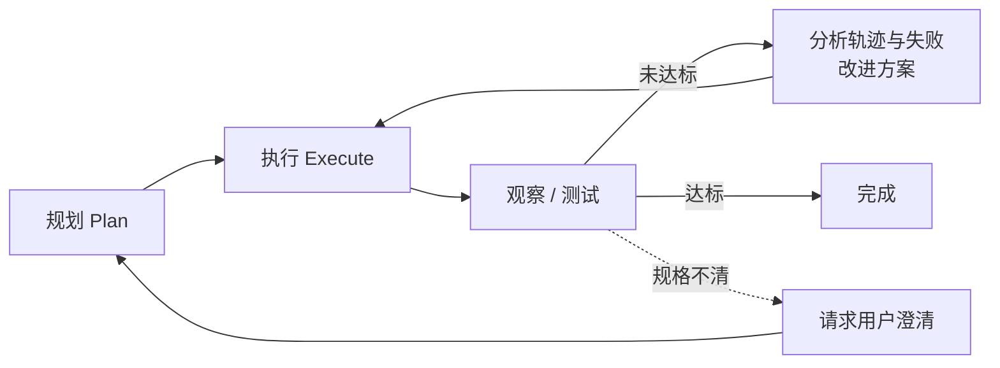
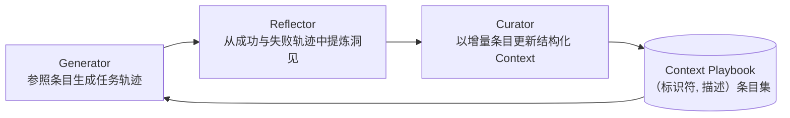
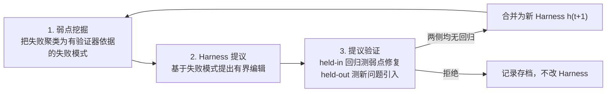
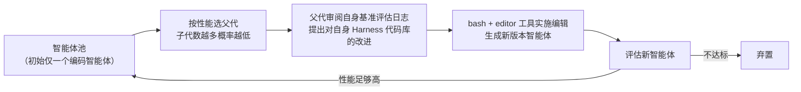

# Harness 工程与自我改进：Lilian Weng 的框架

Lilian Weng 于 2026 年 7 月发表的长文《Harness Engineering for Self-Improvement》把 Harness 从"部署工程的周边设施"提升为**递归自我改进（Recursive Self-Improvement, RSI）** 的核心研究对象。文章系统梳理了 Harness 的设计模式、优化方法与通往 RSI 的瓶颈，是理解 2026 年 Harness 研究版图的关键文献。

## 从递归自我改进谈起

RSI 的概念可追溯至 I. J. Good（1965）对"超智能机器"的定义——能在一切智力活动上超越人类、并设计更好机器来改进自身的系统；Yudkowsky（2008）则用"递归自我改进"特指一个反馈回路：AI 用当前智能去改进孕育其智能的认知机制。

在现代 AI 语境下，这一回路未必意味着模型直接改写自己的权重；更现实的路径是模型改进**训练管道**与**部署系统**，从而孕育出在经济价值任务上更强的后继模型。前沿实验室的研究开发速度已显著加速（Anthropic、OpenAI 均有公开论述）。Weng 特意强调"部署系统"，因为**原始模型与真实世界之间的那一层，其重要性不亚于模型的原始智能**（即预训练后立刻测得的 eval 表现）。Claude Code 与 Codex 等编码智能体产品的成功即为明证。她给出的定义是：

> **Harness 是围绕基础模型的系统，负责编排执行，决定模型如何思考与规划、如何调用工具与行动、如何感知与管理 Context、如何存储工件、如何评估结果。**

自我博弈、合成数据、测试时训练与持续学习等方向同样符合 RSI 愿景（Yuan et al. 2024、Chen et al. 2024、Zhao et al. 2025、Choi et al. 2026），但不在本文射程之内。

## Harness 设计模式

与早期智能体框架的公式"Agent = LLM + 记忆 + 工具 + 规划 + 行动"相比，Harness 工程额外纳入了**工作流设计（如循环工程）、评估、权限控制与持久状态管理**。它不再只是 Prompt 模板，而更接近运行时与软件系统设计：模型如何观察、行动、记忆、自检并改进。设计应刻意保持简单与通用以换取泛化能力，并尽量借用现有软件工程实践以受益于预训练知识。Harness 与操作系统之间存在强类比：像 OS 一样封装复杂逻辑、保持接口简洁；配置、工具接口与协议将随行业演进逐步标准化（参见 [[Harness-Runtime-Substrate|Harness 运行时基座]]）。

### 模式一：工作流自动化

为模型定义一个可运行、可测试、可迭代的工作流，是自动化的关键设计。Karpathy 的 autoresearch 仓库是简洁范例。常见工作流是一个目标导向的循环：规划 → 执行 → 观察/测试 → 改进 → 再执行，直至目标达成；过程中可主动向用户请求澄清任务规格或执行偏好。

工作流图强调模型在"智能体运行时"中分析自身轨迹与失败案例并迭代，而非依赖静态 Prompt 模板。OpenAI 对 Codex 智能体循环的拆解（工具调用结果影响模型下一轮生成）是同一模式的工业实例（详见 [[OpenAI-Codex-Harness-Engineering|OpenAI Codex 的 Harness 工程]]）。

### 模式二：文件系统即持久记忆

长程智能体系统中反复出现的模式是：**用简单的控制驾驭丰富的状态与工件**。Harness 不应把整个工作流和全部日志扛在 Context 里，而应把耐久状态留在文件中。长程运行积累的工件——实验日志、代码 diff、论文摘要、错误栈、历史轨迹——很快超出模型的训练 Context 窗口。学会用 `bash` 读写编辑文件系统是 LLM 的基础技能，因此以文件形式管理持久记忆能自然搭乘模型核心能力进步的便车。更多讨论见 [[Memory-Systems|记忆系统]]。

### 模式三：子智能体与后台作业

Harness 可以并行孵化多个子智能体并监控后台作业：搜索多个假设、并发跑实验、或把隔离子任务委派出去而不污染主 Context。父智能体因此需要一个轻量进程管理器：启动作业、查看日志、取消失败运行、把结果合并回主线程。关键设计抉择是**让并行显式且可检查**：子智能体成果若只活在转瞬即逝的聊天 Context 中，会迅速过时且不可见；若以文件、日志与状态记录落盘，模型便能在中断后恢复，并对自身执行历史进行推理。

### 案例研究：编码智能体 Harness

主流编码智能体（Claude Code、Codex、OpenCode、Cursor 式智能体）的核心接口已经稳定收敛：配备一组工具的编码智能体得以在给定仓库中开发与调试，如同人类开发者配备 IDE。这一收敛形态正是 [[Harness-Engineering-Coding-Agents-Guide|编码智能体 Harness 工程]] 与 [[Anatomy-of-an-Agent-Harness|智能体 Harness 解剖]] 的共同主题。

### Harness 层与核心智能的关系

RSI 的未来在多大程度上依赖 Harness 工程难以预判，但近期路径几乎不会从"模型直接改写权重"开始。Weng 的预测分两步：

1. Harness 工程将向**元方法论**演进——改进"得到更好答案的机器"，而不只是改进答案本身。Harness 系统自身成为优化目标，启发式规则更少，通用机制更多。
2. 成熟的 Harness 反过来支撑模型自我改进的自动研究循环；更聪明的模型则防止 Harness 过度工程化，维持系统的可持续性。

最终，许多 Harness 改进可能被**内化**为核心模型行为，但与外部 Context 和工具的接口会保留下来。Prompt 工程已上演过这一模式的温和版本：随着指令微调与推理能力进步，手工 Prompt 技巧不再处于中心，但**指明目标、约束、Context 与评估的需求从未消失**。

## Harness 优化

Harness 系统中被优化对象的演进顺序大致是：**指令 Prompt → 结构化 Context → 工作流 → Harness 代码 → 优化器代码**。模型越强大，优化目标越复杂、方法越通用。

### Context 工程

把全部工具响应与模型生成直接追加进 Context，会随任务时长迅速失控。Context 管理层的职责是为 LLM 构建更结构化、更精炼的 Context 并管理持久状态；长 Context 研究仍在进步，但目前长 Context 智能与 Context 工程相互交织。

**Agentic Context Engineering（ACE，Zhang et al. 2025）** 把 Context 视为不断演化的 playbook，而非越堆越长的 Prompt。它用三个组件维护一本由带标识符与描述的条目组成的 Context 手册：

为防止迭代重写中的 Context 坍缩与简略偏置，ACE 的关键设计是 Curator 不重写整段 Prompt，而是生成结构化的（标识符， 描述）条目，由确定性逻辑合并进 Context 日志簿，并周期性精炼去重。

ACE 能从运行轨迹中学习洞见，向自管理记忆迈进一步，但更新规则与整体工作流仍是手工设计。**Meta Context Engineering（MCE，Ye et al. 2026）** 进一步把**机制**（如何管理 Context）与**工件内容**（Context 里放什么）分离，在元优化层做技能进化、在基础层做 Context 优化。MCE 的技能 $s$ 定义一个 Context 函数 $c_s=(\rho_s, F_s)$：静态组件 $\rho_s$（Prompt、知识库、代码库）加动态算子 $F_s$（搜索、选择、过滤、格式化）。优化是双层的：内层在给定技能下于训练数据上寻找最优 Context，外层在验证集上搜索最优技能。技能数据库记录历史技能、Context 函数与评估指标，元层智能体对先前技能做智能体式**交叉（crossover）** 生成新技能，再由基础层 Context 工程师执行技能并从运行反馈中学出 Context 函数。实现上，一个 Context 函数被实例化为专用目录下的一组文件（静态的 `skill.md` 与动态的 Context/数据轨迹），两层优化都在标准工具集（Read/Write/Edit/Bash/Glob/Grep/TodoWrite）的智能体编码环境中执行。这与 [[Skill-Systems|技能系统]] 的演进路线直接相通。

**Meta-Harness（Lee et al. 2026）** 再深入一层：被优化的对象是**决定"存什么、取什么、给模型看什么"的代码**本身——"Meta"意为它是优化 Harness 的 Harness。提议新 Harness 的提议者本身就是编码智能体，最终交付 Pareto 前沿上的一组 Harness 候选。全部执行历史经文件系统可达，提议者用 `grep`、`cat` 翻阅而非塞进单个 Prompt；每个候选 Harness 是文件系统中的一个目录，内含自身源码、分数、运行轨迹与状态更新；循环不断创建新 Harness，仅保留合格者。在 TerminalBench-2 上，搜索从 Terminus-KIRA 与 Terminus-2 两个已很强的 Harness 出发仍能继续提升。核心启示是：**一旦 Harness 设计变成可执行的搜索空间，强编码智能体就能利用人类工程师所用的同一设计空间**。完整剖析见 [[Meta-Harness|Meta-Harness：模型 Harness 的端到端优化]]。

### 工作流设计

工作流设计可由领域专家手工打造。以自动研究为例：

- **AI Scientist（Lu et al. 2026，Nature）**：构建从提出研究想法、写代码、跑实验、分析结果、撰写手稿到同行评审的完整管道。
- **ScientistOne（Meng et al. 2026）**：把可验证性作为中心设计约束——每个论断（引用、数值、方法、结论）必须追溯到证据源，由"证据链"（Chain-of-Evidence）检查审计。
- **Autodata（Kulikov et al. 2026）**：扮演数据科学家生成训练与评估数据。主智能体管理一个提出问题的 *challenger*、一个 *weak solver*、一个 *strong solver* 与一个 *verifier/judge*，目标是合成难度"恰到好处"的数据——强 solver 能解而弱 solver 不能解。challenger 的 Prompt 依 solver 与 verifier 反馈迭代更新。局限在于合成任务只用于微调弱 solver 而非强 solver：若循环无法迭代改进强模型，更像是对生成 Prompt 分布的间接蒸馏，RSI 成色不足。

工作流的设计空间极为庞大，自然可视为搜索问题，用算法而非纯手工寻找优良方案：

- **ADAS（Automated Design of Agentic Systems，Hu et al. 2025）** 把智能体设计本身形式化为优化问题，即"元智能体搜索"：以 CoT、self-refine 等简单智能体初始化档案库；元智能体受档案启发以**代码**编程新智能体（先写高层描述再实现，经两轮 self-refine 检查新颖性）；评估候选并把成功者加回档案；循环至迭代上限。
- **AFlow（Zhang et al. 2025）** 把智能体工作流表示为图——节点是调用 LLM 的动作，边是代码实现的逻辑运算——并用蒙特卡洛树搜索（MCTS）优化：模板初始化工作流树；按分数与均匀探索的软混合选择节点；让 LLM 基于评估表现修改工作流进行扩展；执行评估，有改进则入树；直至 top-k 平均分平台化或预算耗尽。在问答、代码与数学任务上，AFlow 稳定优于手工工作流与 ADAS。

### 自我改进的 Harness

Context 工程与工作流设计各只是 Harness 的一部分，真正的目标是搜索整个设计空间，把 Context 管理逻辑、工作流、权限与其他组件一起优化。Meta-Harness、ADAS、AFlow 等工作的共同前提是：**代码是定义程序与系统的通用语言**——Harness 就是把 Prompt、工具调用、子智能体、控制流、记忆与工作流逻辑编织起来的代码。LLM 若能优化执行智能体的代码，触达的设计空间远大于手写 Prompt（参见 [[Code-as-Agent-Harness|代码即智能体 Harness]]）。

**Self-Taught Optimizer（STOP，Zelikman et al. 2023）** 是递归脚手架改进的早期范例。种子改进器 $I_0$ 接受初始解 $s$、效用函数 $u$ 与黑盒语言模型 $M$，返回改进解 $s'=I(u,s;M)$；STOP 的目标不是改进 $s$，而是**改进改进器 $I$ 本身**。元效用定义为改进器在下游任务集合上的平均效用，随后通过自我改进更新递归得到新版本：$I_t = I_{t-1}(\hat{u}, I_{t-1}; M)$。实验中，进化后的改进器自行发现了遗传算法、分解改进、多臂 Prompt 老虎机、模拟退火、温度调节与束/树搜索等策略——恰如把 Harness 工作流当作可优化对象。

STOP 中一个警示性结果是：递归改进在 GPT-4 上逐轮提升下游表现，在 GPT-3.5 与 Mixtral 等较弱模型上反而退化。**递归结构本身不够，基础模型必须足够强才能改进机制**——Harness 改进让模型部署得更好，但智能仍是核心。

**Lin et al.（2026）** 更细致地拆解了 Harness 进化对模型能力的依赖，区分两个轴线：**harness-updating**（写出有用 Harness 编辑的能力）与 **harness-benefit**（利用更新后 Harness 更好地解题的能力）。从 Qwen3.5-9B 到 Claude Opus 4.6 的一系列模型展现出相近的 harness-updating 能力——9B 的 Harness 提议者能写出与 Opus 过程同构的 skill；而 harness-benefit 呈非单调分布，**中等档位模型受益最大**。要充分利用 Harness，模型需要正确且及时地调用技能/工具，并擅长长程指令遵循。

**Self-Harness（Zhang et al. 2026）** 让 LLM 智能体通过"提议—评估—接受"循环改进自己的 Harness：

三个阶段的要点：弱点挖掘阶段需注意两次运行可能表面错误相同（超时、缺工件）而因果机制不同，因此失败记录要包含验证器层面的终末原因、相关智能体行为的因果状态与轨迹暴露的抽象机制；提议阶段模型拿到有界 Context（当前 Harness 的可编辑面、失败模式、必须保留的通过行为记录、先前尝试过的编辑摘要），编辑应偏好可处理且能用窄改动解决的复发性错误模式，候选间保持多样；验证阶段只有在 held-in 与 held-out 上均无回归才接受合并。在 Terminal-Bench-2 上，Self-Harness 为 MiniMax M2.5、Qwen3.5-35B-A3B、GLM-5 学到了**模型各自专属的 Harness 指令**，针对不同基础模型的不同弱点提升 held-out 通过率。详见 [[Self-Harness|Self-Harness 专页]]。

Weng 对此类工作表达了担忧：若程序可以编辑操作系统，抽象边界就被打破了。可编辑面需要精心设计，权限控制与安全层必须活在循环之外，奖励黑客（reward hacking）的全部挑战依然存在。

**Agentic Harness Engineering（AHE，Lin et al. 2026）** 认为 Harness 进化的瓶颈在**可观测性**：一次运行失败时必须知道哪个组件负责，每次编辑都要有证据支撑。框架围绕三根可观测性支柱闭环：

1. **组件可观测性**：每个可编辑 Harness 组件在文件系统中都有表示，动作空间显式可追溯。Harness 含 7 个组件——系统提示词、工具描述、工具实现、中间件、技能、子智能体配置、长期记忆；每个失败模式映射到一个组件，编辑更有的放矢。
2. **经验可观测性**：把海量原始轨迹分析归纳为证据与失败模式的层级结构。每个 Harness 生成 k 条轨迹；由"Agent debugger"逐轨迹分析并给出逐任务的成败根因报告；报告再聚合为基准总览，需要时可下钻原始轨迹——分层访问更省 Token。
3. **决策可观测性**：每次编辑都附带对下一轮的可证伪预测。"Evolve agent"读仓库、选定组件、给出编辑与理由；两条约束保证归因干净——(1) 编辑只能落在 Harness 工作区，runs 目录、tracer、验证器与 LLM 配置只读，杜绝一类奖励黑客（禁用验证器、偷换模型、抬高推理预算），每项收益都可归因于 Harness 编辑；(2) 编辑必须证据驱动，附清单条目：失败证据名、推断的根因、目标修复与预期影响（含预期修复与可能回归）。

在 Terminal-Bench-2 上，AHE 超过人工设计的 Harness（OpenCode、Terminus-2、Codex）及若干自进化基线（ACE、TF-GRPO），仅在 Hard 档例外；冻结后的 Harness 不经再进化即可迁移到 SWE-bench-verified，说明进化出的 Harness 编码的是**工程经验**而非基准特定过拟合。详见 [[Agentic-Harness-Engineering|Agentic Harness Engineering 专页]]。

### 进化搜索

进化搜索受自然选择启发：变异解的种群，只保留"适应度"高者。当 (1) 搜索空间庞大或形状怪异，(2) 难以用梯度直接优化但容易评估解时，进化搜索恰逢其用——Harness 搜索正好两者兼具。

- **Promptbreeder（Fernando et al. 2023）**：用丰富的变异算子进化任务 Prompt，且变异 Prompt 本身也随进化改进。
- **GEPA（Agrawal et al. 2025）**：结合反思式 Prompting 与进化搜索，用对试错轨迹的自然语言反思提出 Prompt 更新。
- **AlphaEvolve（Novikov et al. 2025）**：编码智能体式进化系统，维护候选程序池，提示冻结 LLM 生成 diff 改进；反复评估子程序并保留成功者。设计细节值得注意：Prompt 包含父代程序、结果、指令乃至元信息；编码智能体可见完整仓库，但可改进代码区以 `# EVOLVE-BLOCK-START/END` 显式标记；元 Prompt 随指令与 Context 协同进化。消融证实了进化流程、Prompt 上下文、元 Prompt、全文件进化与更强 LLM 各自的价值。
- 后续变体：**ThetaEvolve（Wang et al. 2025）** 结合进化搜索、RL 与上下文学习；**DemoEvolve（Che et al. 2026）** 用人类专家演示增强自我运行档案，作为 Harness 级诊断与编辑的参考经验；**ShinkaEvolve（Lange et al. 2025）** 引入三件套提升采样效率——平衡性能排名与子代数的父代采样、基于嵌入余弦相似度的代码新颖性拒绝采样、以及在元草稿板中提炼成功模式引导后续变异。

与上述聚焦"解的改进"的方法不同，**Darwin Gödel Machine（DGM，Zhang et al. 2025）** 显式以可编辑的 Harness 代码仓库为进化对象——智能体被允许修改自己的 Harness：

后续工作 Hyperagents（Zhang et al. 2026）引入元智能体控制如何改造现有任务智能体。DGM 是**固定模型下的 Harness 进化**：以 Claude 3.5 Sonnet 为基础模型、简单初始配置出发，进化所得智能体在 SWE-bench Verified 上从 20% 升至 50%、在 Polyglot 上从 14.2% 升至 30.7%，追平或超过手工打造智能体。这类方法在候选可自动评估、适应度易量化的领域（矩阵乘法、GPU kernel 优化、算法竞赛、数据中心调度）表现出色；在评估缓慢、模糊或依赖启发式的领域则举步维艰，计算效率与有效性也是隐忧。相关进展另见 [[EvoHarness-RL|EvoHarness]]、[[Harness-Evolution-Loop|Harness 进化循环]]、[[HarnessForge|HarnessForge]] 与 [[Harness-R1|Harness-R1]]。

### 与模型权重的联合优化

Harness 进化改变的是模型外围的非参数系统；要实现完整自我改进，模型可同时更新自身权重——经训练管道改进或测试时持续学习实现。**SIA（Hebbar et al. 2026）** 是把 Harness 改进与参数更新放进同一优化循环的早期尝试，含三个角色：Meta-Agent 提议初始 Harness，Task-Specific Agent 执行任务，Feedback-Agent 根据近期轨迹决定下一步更新 Harness 还是模型权重。Weng 指出 SIA 实验存在混淆因素（任务智能体 `gpt-oss-120b` 远弱于 Meta/Feedback 智能体所用的 Claude Sonnet 4.6，基线也偏弱），方向有趣但证据暂定；训练稳定性与 Goodhart 效应仍是开放问题。**Continual Harness（Karten et al. 2026）** 在长程游戏环境中试验 Harness 更新，同时用强教师模型对低奖励轨迹的标注蒸馏共学策略模型（参见 [[Harness-Continual-Learning|Harness 持续学习]]）。

## 未来挑战

AI Scientist 一脉的工作证明专家设计的 Harness 能协调自动研究循环的很大部分（以写论文的形式检验），但**论文成稿不等于科学发现**：系统可以写出貌似合理的手稿，同时携带虚构引用、实现漂移或薄弱的实验结果。Trehan & Chopra（2026）测试了 LLM 在极简脚手架与基础工具（`read_file`、`write_file`、`llm_search`、`list_files`）下从想法走到论文的能力：三个领域（世界模型、多智能体 RL、AI 安全）各配 45–50 篇高质量种子文档，仅四个想法被人类专家选中跑完管道，最终只有一篇完整成文。实验中观察到六种复发性失败模式：

| 失败模式 | 表现 |
| :--- | :--- |
| 偏向训练数据默认 | 使用过时库、陈旧命令、标准格式，假设不扎根于真实仓库或数据集 |
| 执行压力下的实现漂移 | 实现变复杂时滑向常见的更简单方案，偏离所提议的方法 |
| 记忆与 Context 退化 | 长程项目丢失关键细节，除非日志以持久工件落盘 |
| 过度乐观 | 实验噪声或失败仍宣布成功；Bubeck et al. (2025) 同样观察到"p-hacking 与 eureka-ing"——信号仍是噪声时就打"数值创可贴"宣告胜利 |
| 领域智能不足 | 缺少隐性技艺知识：预判实现复杂度、判断实验结果是否合理、知道哪些基线重要 |
| 科学品味薄弱 | 实验可执行，却没有回答正确的问题 |

通往完整 RSI 的路上，研究者已取得实质进展，但仍有七个瓶颈：

1. **评估器薄弱而模糊**：许多研究论断与真实任务没有快速精确的验证器。当前自我改进循环最适配指标可测、客观的任务，与 RL 的适用条件相同；研究品味、新颖性与长期科学价值则难量化。
2. **Context 与记忆的生命周期**：智能体越自治，记忆越增长。Harness 要管理 Context 与记忆以弥补长 Context 生成的现有局限，同时最大化长程任务成功率。人类能终生维持记忆，Weng 由此类比：**Context 工程应当成为智能的核心组成部分，而非停留在软件系统层**。
3. **负结果**：研究者有动机发表成功结果，文献偏向成功案例；在不均衡数据上训练的 LLM 可能不擅长决定何时放弃假设、报告负结果乃至承认失败。研究型 Harness 应让失败尝试易于保存——从失败中学习是削减任务搜索空间的最佳途径。
4. **多样性坍缩**：进化与 RL 循环倾向剥削已知高奖励模式，需要机制防止种群坍缩为同一解的变体；开放式研究中，最佳路径在现任评估器下可能起初看起来更差。
5. **奖励黑客**：自我改进循环优化任何给定的信号——奖励来自单测则过拟合测试，来自裁判模型则学会针对该裁判的黑客技巧，来自基准分数则利用基准工件。评估器与权限控制应置于 Harness 进化循环之外，配合 held-out 测试、轨迹审计与关键决策点的人工评审；监督能多大程度规模化与自动化，仍是开放研究问题。
6. **长期成功**：外在优化循环处理的是单次运行之外、可在训练沙箱中模拟的奖励。以编码智能体为例：它们已提升日常工程生产力，但许多优化目标过于短视——能完成手头任务，却不知如何维护数百上千工程师共建仓库的长期健康。标准沙箱式 RLVR 训练很少覆盖可维护性、所有权边界、迁移成本、向后兼容与未来调试负担。
7. **人的角色**：人类应沿栈上移，而非被移出循环——在正确的时机、正确的抽象层级提供监督，系统设计要认真考虑触点何时设置、如何设置。上述挑战多半需要人类反馈与引导。毕竟我们构建技术是为了人类更好的未来，而非相反。

## 附录：有用的基准

| 基准 | 评测对象 | 关键事实 |
| :--- | :--- | :--- |
| **PaperBench** | 从零复现 20 篇 ICML 2024 Spotlight/Oral 论文 | 8316 条与原作者共建的评分细则；当时最佳模型（Claude 3.5 Sonnet，约 21%）不及 ML 博士 |
| **CORE-Bench** | 已发表研究的计算可复现性 | 270 个任务、覆盖 90 篇论文；当时最佳智能体（GPT-4o 系列）最难档仅 21% |
| **ScienceAgentBench** | 数据驱动科学发现 | 从 44 篇同行评审论文抽取 102 个任务，覆盖数理化生四个学科 |
| **RE-Bench** | 前沿智能体 vs 人类专家的 ML 研发 | 7 个开放式环境；智能体在 2 小时预算下得分 4 倍于人类，但人类在 8/32 小时预算反超 |
| **MLE-bench** | Kaggle 式 ML 工程 | 75 个比赛；最佳配置（o1-preview + AIDE 脚手架）在 16.9% 的比赛中至少达铜牌线 |
| **KernelBench** | 生成 GPU kernel 的正确性与速度 | 250 个 PyTorch 任务；指标 fast_p = 正确且快于基线的 kernel 占比 |

## 小结

Weng 的文章为 Harness 研究建立了统一坐标系：设计层面，工作流自动化、文件系统持久记忆与子智能体管理是三大稳定模式；优化层面，被优化对象沿"Prompt → Context → 工作流 → Harness 代码 → 优化器代码"的阶梯逐级上移，代码成为通用优化语言；愿景层面，Harness 工程是 RSI 最现实的近期路径——先让 Harness 成为优化目标，再让成熟 Harness 反哺模型自我改进。她对过度乐观的提醒同样重要：递归结构不能弥补基础智能的不足，评估器、记忆生命周期、负结果、多样性、奖励黑客、长期主义与人的位置，都是尚未拆除的天花板。

## 相关研究

- [[Meta-Harness|Meta-Harness：模型 Harness 的端到端优化]]——文中"Harness 代码作为优化对象"的标志性工作
- [[Self-Harness|Self-Harness]]——"提议—评估—接受"自我改进循环的专页详解
- [[Agentic-Harness-Engineering|Agentic Harness Engineering]]——以三支柱可观测性驱动 Harness 自动进化
- [[Harness-Continual-Learning|Harness 持续学习]]——Harness 更新与模型权重联合优化的延伸路线
- [[From-Weights-to-Context-to-Harness|从权重到 Context 再到 Harness]]——优化对象阶梯的历史脉络
- [[Importance-of-Agent-Harness|Harness 的重要性：Philipp Schmid 的 2026 年观察]]——"Harness 即数据集"与训练-推理环境融合的产业侧呼应
