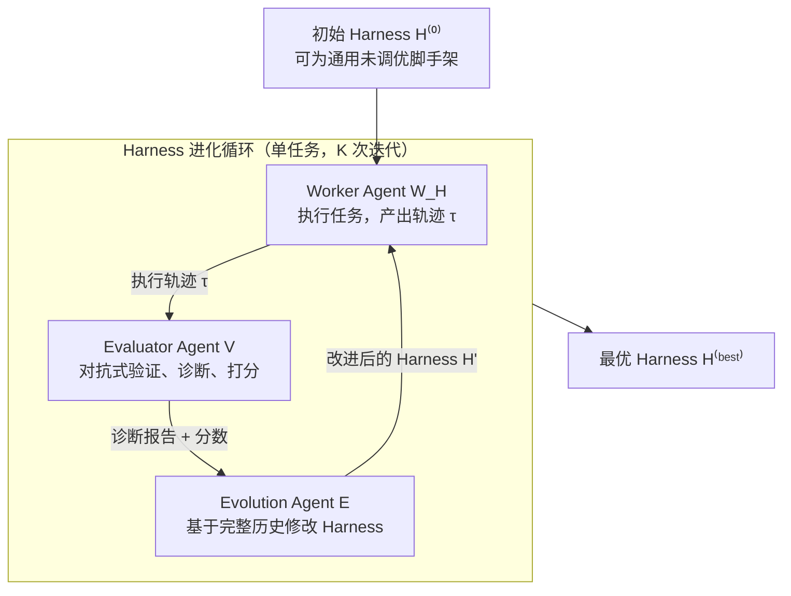
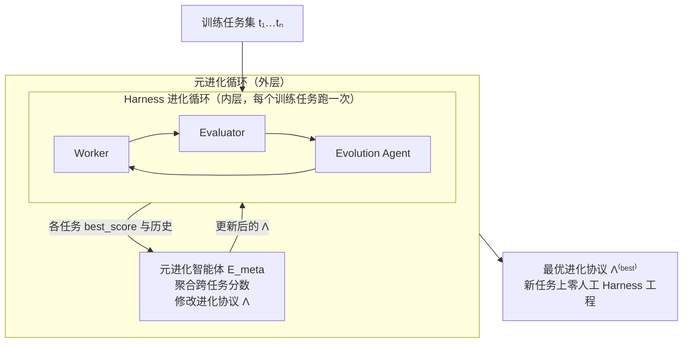

# Harness 进化循环：你最后需要构建的 Harness

这篇来自 Sylph.AI（Haebin Seong、Li Yin、Haoran Zhang）的论文提出了一个两级框架，把 [[Harness-Engineering|Harness 工程]] 从手工技艺变成自动化优化问题：第一级 **Harness 进化循环**在单个任务上自动优化 Worker 智能体的 Harness；第二级 **元进化循环（Meta-Evolution Loop）**跨任务优化"进化协议"本身，学会*如何进化 Harness*。标题的野心正在于此——学会进化协议之后，人类再也不需要亲手构建下一个 Harness。

> **核心论点**：精心设计的脚手架能极大放大智能体能力，但脚手架本身是高度密集的人类工程产物。框架把"人工 Harness 工程"转化为"自动化 Harness 工程"，再进一步——**把自动化本身的设计也自动化**。

---

## 问题与动机

每进入一个新任务域——需要几十次点击的企业 Web 应用、跨搜索/抽取/合成的多步研究流水线、陌生仓库的代码评审、需要领域知识的客服升级处理——都需要专家手工设计 Prompt、工具、编排逻辑与评估标准。论文援引两个工业案例说明这种劳动的强度：OpenAI 的 Codex Harness 工程（定制 linter、仓库本地可观测栈、Chrome DevTools 集成、结构化文档层级）与 Anthropic 的长时运行应用 Harness 设计（多轮评估器 Prompt 校准、四条主观质量评分标准、三智能体规划-生成-评估架构）。两者都要求深厚的领域专长与大量迭代。

LLM-AutoDiff 等自动 Prompt 优化方法能调单个组件，但无法处理完整 Harness——工具、编排逻辑、基础设施及其相互作用。本文要自动化的正是这整个改进循环。

---

## 基本定义：Agent = Model + Harness

论文沿用 [[Anatomy-of-an-Agent-Harness|LangChain 对智能体 Harness 的剖析]]中的公式：

$$\mathbf{Agent = Model + Harness}$$

Harness 是除模型本身之外的一切代码、配置与执行逻辑——让模型的智能变得可用的系统。常见组件类别：

| 组件类别 | 内容 |
|---------|------|
| 系统与任务 Prompt | 定义智能体身份与约束的系统级指令；指定目标、成功标准与上下文示例的任务级 Prompt |
| 工具、技能及其描述 | 智能体可调用以作用于环境的能力（文件编辑、Shell、UI 交互、Web 搜索、MCP 服务器） |
| 捆绑基础设施 | 提供给智能体的执行环境（文件系统、沙箱、浏览器、可观测栈） |
| 编排逻辑 | 结构化智能体交互循环的控制流（子智能体派生、交接、模型路由、反馈循环、Ralph Loop 式续跑模式） |
| 钩子与中间件 | 注入模型周围的确定性执行保证（压缩、续跑、lint 检查、验证循环） |
| 模型配置 | 底层模型选择、推理参数（temperature、采样策略、Token 上限）、模型路由规则 |

AdaL、Claude Code、Codex 都是通用软件工程 Harness；OpAgent 是面向自主 Web 导航的多智能体 Harness（Planner、Grounder、Reflector、Summarizer 流水线，在 WebArena 上取得 SOTA）。在每种情形里，决定智能体能感知什么、如何行动、工作如何被编排与验证的都是 Harness 而非模型。

**任务定义**：任务 $t=(I,S)$ 由指令 $I$（具体目标）与成功标准 $S=\{s_1,\dots,s_m\}$（评估者用来判定完成的可验证条件清单）组成。

---

## 第一级：Harness 进化循环

闭环由三个智能体组成，围绕一个被优化的 Worker 智能体运转：

- **Worker Agent $W_{\mathcal{H}}$**：被优化的智能体，由其 Harness $\mathcal{H}$ 参数化。暴露单一接口 $W_{\mathcal{H}}.\text{execute}(t)$：接收指令、经工具接口与目标环境交互，产出含环境观察、动作日志与每步计时信息的执行轨迹 $\tau$。
- **Evaluator Agent $V$**：独立的**对抗式**审查者，接口为 $V.\text{evaluate}(\tau,t)\rightarrow(\text{report},\text{score})$，履行四项职能：
  1. **状态验证**——把 Worker 在轨迹中的观察与真实环境状态交叉核对，检测幻觉或误读的状态；
  2. **标准核对**——对每条成功标准 $s_i$ 给出 pass/fail 判定；
  3. **性能审计**——把总执行时间分解为 *LLM 时间*（推理延迟）与 *工具时间*（环境交互延迟），识别瓶颈是计算性的还是行为性的；
  4. **打分**——双层指标：先按 pass/fail，再以执行时间作平局裁决。
- **Evolution Agent $E$**：进化驱动者，接口为 $E.\text{evolve}(\text{history},\mathcal{H}^{(\text{best})})\rightarrow\mathcal{H}'$。它扮演资深工程师：聚合全部进化历史（试过哪些 Harness 变体、评估报告、分数、每次改动是改进还是回归），把失败归类为复发模式（工具误用、推理循环、误读环境状态、延迟过高），然后编辑 Harness 中除模型参数外的一切——工具实现、系统 Prompt、编排逻辑、观察结构、模型配置——以消除根因。

**算法要点**（论文 Algorithm 1）：从 $\mathcal{H}^{(0)}$ 出发迭代 $K$ 步；每步重建 Worker、重置环境到干净状态、执行任务、评估打分；按分数更新 $\mathcal{H}^{(\text{best})}$ 并标记 improved/regressed；历史记录追加 $(\mathcal{H}^{(k-1)}, \text{report}, \text{score}, \text{verdict})$；关键设计是 **进化始终从当前最优 Harness 出发**（$E.\text{evolve}(\text{history},\mathcal{H}^{(\text{best})})$），而非从最近一次尝试出发——这避免在回归方向上叠加改动。

---

## 第二级：元进化循环

论文的关键观察：Harness 进化循环本身——评估器 Prompt、进化智能体的诊断策略、打分函数、观察结构、编排逻辑——**也是一个 Harness**，记为进化协议：

$$\Lambda=(W_{\mathcal{H}},\;\mathcal{H}^{(0)},\;V,\;E)$$

$\Lambda$ 具备与其他 Harness 完全相同的结构：Prompt（评估器与进化智能体指令）、工具（打分函数、版本控制操作、代码编辑能力）、观察（从 Worker/评估器/进化智能体浮现哪些遥测与轨迹）、编排逻辑（迭代次数、何时提交或回滚、任务如何选择与排序）。因此优化 $\Lambda$ 就是在更高抽象层级上做 Harness 优化。

**元进化智能体可修改的 $\Lambda$ 组件**：

- 评估器 Prompt——关注哪些失败模式、如何评分、要求什么证据；
- 进化智能体 Prompt——如何诊断失败模式、优先哪些代码改动、改动激进程度；
- Worker 观察结构——浮现哪些遥测、轨迹与中间状态；
- 评估器与进化智能体的观察——智能体之间每步流动什么信息；
- 打分函数设计——指标结构（双层 vs 多维）、阈值、平局裁决；
- 循环超参数——迭代数、并行度、回滚阈值、停止准则。

### 与元学习的对应

两级优化直接映射到 [[Meta-Harness|meta-learning]] 框架（Thrun & Pratt, 1998）：

| 元学习 | 元进化 |
|--------|--------|
| 被适配的参数 $\theta$ | 被进化的 Harness $\mathcal{H}$ |
| 适配过程（$\theta^{(0)}$、优化器、损失） | 进化协议 $\Lambda=(W_{\mathcal{H}},\mathcal{H}^{(0)},V,E)$ |
| 内循环：任务 $t_i$ 上的梯度更新 | 内循环：$\textsc{HarnessEvolutionLoop}(t_i,\Lambda,K)$ |
| 外循环：元梯度更新 | 外循环：$E_{\text{meta}}.\text{evolve}(\text{meta\_history},\Lambda^{(\text{best})})$ |
| 元训练任务 | 训练任务 $\mathcal{T}_{\text{train}}$ |
| 元测试任务 | 留出任务 $\mathcal{T}_{\text{test}}$ |
| 目标：快速适配新任务 | 目标：新任务上 Harness 快速收敛 |

外循环目标是在训练任务上最大化内循环最终成绩的期望：

$$\Lambda^{(\text{best})}=\arg\max_{\Lambda}\;\mathbb{E}_{t_i\sim\mathcal{T}_{\text{train}}}\big[\text{best\_score}\big(\textsc{HarnessEvolutionLoop}(t_i,\Lambda,K)\big)\big]$$

注意评估口径：进化协议 $\Lambda$ 只按各任务上**最终最优分数**被评判，而非中间进展——这迫使元进化优化收敛的终点质量。元分数取所有任务的均值；与外循环同构地，$\Lambda$ 的进化也始终从当前最优协议出发。

### 评估协议

泛化在留出任务集 $\mathcal{T}_{\text{test}}$ 上度量，三个关键指标：

- **收敛速度**——达到目标性能阈值所需的内循环迭代数；
- **最终性能**——固定迭代数后的任务通过率；
- **鲁棒性**——不同元测试任务间收敛速度的方差。

一个优化良好的 $\Lambda^{(\text{best})}$ 应让内循环用比手工设计循环更少的迭代与算力，在新任务上收敛出高效 Worker Harness。

---

## 讨论与局限

这是一篇**框架论文**：两个算法（Algorithm 1/2）给出了完整伪代码与形式化，但论文**未报告任何实证结果**——没有收敛曲线、没有消融、没有任务套件上的数字。作者在结论中明确承诺后续将在"即便用最先进智能体与 Harness 也难以自动化的多样工作流"上给出实验，并计划基于学到的 $\Lambda^{(\text{best})}$ 发布产品。因此所有收益主张目前停留在论证层面，置信度相应调低。

框架层面还有几点值得追问：其一，Evaluator 的对抗式验证依赖"真实环境状态"可获取，在无法访问 ground truth 的域中如何落地未展开；其二，双层循环的嵌套评估成本极高（外循环每步要在 $n$ 个任务上各跑 $K$ 次内循环），论文未讨论预算控制；其三，与 [[Harness-R1|Harness-R1]] 这类"训练一个专职 Harness 工程师模型"的路线相比，本框架的进化智能体始终是 Prompt 驱动的通用模型，编辑能力本身不被训练——两条路线的取舍（搜索 vs 学习）正是当前 [[Harness-Engineering-Self-Improvement|Harness 自我改进]] 研究的核心分野。

愿景层面，论文把终点描述为：任意用户把通用智能体指向新任务域，它自动进化为专用的智能体——不需要任何 Harness 工程专长。这与 [[AutoHarness|AutoHarness]]、[[Agentic-Harness-Engineering|智能体式 Harness 工程]] 的自动化目标一致，但本文的独特贡献在于把"自动化过程本身"显式列为第二级优化对象。

---

## 相关研究

- [[Harness-Engineering|Harness 工程]]——本框架要自动化的对象
- [[Meta-Harness|Meta-Harness：模型 Harness 的端到端优化]]——同样是外环搜索 Harness，但以文件系统暴露完整历史，已有实证结果
- [[Harness-R1|Harness-R1：从失败轨迹学习编辑可执行运行时 Harness]]——把"进化智能体"换成可训练的编辑策略，用在线 RL 更新编辑者权重
- [[HarnessForge|HarnessForge：Harness 与策略的联合进化]]——Harness 与策略共同进化的并行探索
- [[Harness-Continual-Learning|Harness 持续学习]]——部署后持续适配的相关路线
