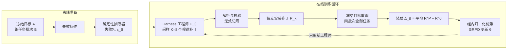

# Harness-R1：从智能体失败轨迹学习编辑可执行运行时 Harness

Harness-R1（上海交通大学与小红书联合团队）是第一个把"基于失败轨迹、覆盖全生命周期的可执行运行时编辑"做成**可学习能力**的方法：用一个独立的 9B "Harness 工程师"模型读取冻结目标智能体的失败批次，生成可执行补丁，补丁装回运行时后重跑同一批任务，**用真实任务收益作为奖励做在线强化学习**——训练只更新工程师，目标智能体全程冻结。

> **核心论点**：让前沿模型"看着失败写补丁"不可靠（Self-Refine 在三个基准上全部降分，前沿编辑器的增益不稳定甚至为负）；补丁好不好，文本形态判断不了，只有补丁装回后目标智能体重跑的结果说了算。因此编辑 Harness 应当是一个用结果奖励训练出来的能力，而非一次性 Prompt 出来的产物。

**主要数字**：在 WebShop、ALFWorld、DBBench 三个交互基准上，Harness-R1 把原始 Qwen3.5-9B 目标的平均成功率从 **44.3% 提升到 53.6%（+9.3 个百分点）**；目标智能体经过直接 SFT 后，为其重新训练的工程师再提升 **59.2% → 64.2%（+5.0 点）**——证明工程师可以与目标智能体**协同进化**。代码与模型已开源（GitHub: DeepExperience/Harness-R1）。

---

## 问题与动机

部署中的智能体持续累积交互轨迹，其中既有成功经验，也暴露系统性失败：工具误用、状态丢失、协议违反、重复尝试、恢复失败。智能体系统有两个互补的改进位置：一是更新模型权重（SFT、RL、在线学习），二是保持模型不动、优化其周围的 **Harness**——Context 构建、记忆与技能、工具中介、动作校验、控制与恢复逻辑。相同权重在不同 Harness 下可以呈现截然不同的智能体能力，这正是 [[Harness-Engineering|Harness 工程]] 与 [[From-Weights-to-Context-to-Harness|从权重到 Context 再到 Harness]] 一脉的核心观察。

但现有路线有一个共同缺口：**提议者本身是固定的**。Meta-Harness、Agentic Harness Engineering、AutoHarness 用智能体提议者联合编辑 Prompt、工具、记忆、中间件或控制逻辑；HarnessX 把可编辑面扩展到生命周期干预与类型化组件——但结果只用于选择或迭代补丁，从不直接更新提议者参数；Prompt/演示/记忆/技能优化方法（APE、OPRO、TextGrad、GEPA、DSPy 等）同样不后训练提议者。Harness-R1 把学习目标从"得到的 Harness"移到**编辑策略本身**：用补丁在冻结目标上的真实效用作在线 RL，后训练一个专职 Harness 工程师。

直接训练工程师有两个难点：其一，可编辑运行时横跨相互依赖的执行阶段，不受约束的代码编辑会破坏接口、做出不可执行的行为、或引入与任务成功无关的改动；其二，补丁质量无法由文本形式或静态规则判定，只有目标智能体应用补丁后的行为能判定。因此训练需要一条有依据的反馈路径：**从目标智能体失败 → 受约束的可执行编辑 → 性能增益 → 更新工程师**。

---

## 方法

### 问题设定

设冻结目标智能体为 $A$（模型连同其基础运行时），$B=\{x_i\}_{i=1}^n$ 是环境 $E$ 中的一批 $n$ 个任务。智能体以环境的原生接口动作（WebShop 的搜索与点击、ALFWorld 的导航与物体操作、DBBench 的 SQL 查询）。被适配的组件是**基础运行时**：组装模型所见 Context、把每个动作转发给环境、把反馈传回智能体的代码。

未修改的智能体跑完批次得到基线轨迹 $\tau_i^0$ 与奖励 $R_i^0$；一个确定性抽取器只保留失败 episode，把任务约束、选摘的动作-观察片段、结局与必要环境状态压缩为**失败包 $s_B$**。工程师 $H_\theta$ 读一次失败包，生成批次条件的**可执行覆盖层 $P$**——它既不回答任务，也不参与任务回滚。

### 四个生命周期钩子

覆盖层 $P$ 以可执行钩子挂在智能体生命周期的四个位置，全程不动模型权重：

| 钩子 | 调用时机与效应 |
|------|--------------|
| `on_init` | 首次目标决策之前；添加可复用的任务引导或工具提示（episode 初始化） |
| `make_pre_hint` | 目标决策之前；注入一条状态条件的消息，不执行动作（决策前引导） |
| `on_before_action` | 目标提议动作之后、环境执行之前；可阻断并要求重选（`block_and_prompt`），在支持处改写（`rewrite_action`）或强制（`force_action`）待定动作（**动作前护栏**） |
| `on_post_step` | 环境反馈之后；注入恢复引导（`inject_hint`），在支持处调度下一动作（**反馈后恢复**） |

钩子只触碰冻结策略的输入与输出，补丁安装前先校验，无效补丁不生效。工程师响应是单个 `<patch>` 块内的 JSON 对象（顶层键 `benchmark`/`description`/`actions`），每个 action 是一个 `add_code_hook`（`hook` 字段选生命周期位置，`code` 字段是定义 `hook(ctx, nb)` 的 Python 源码）。通用规则：从可观察的复发失败推断**可复用**干预；禁止硬编码任务特定答案、索引或标识符；DBBench v1 只接受软引导与阻断，不执行 SQL 改写或强制提交。

### 同批次重跑奖励

补丁安装后，同一冻结目标**重跑批次 $B$ 中的全部任务（包括原本成功的任务）**，得到奖励 $R_i^P$。工程师奖励定义为：

$$
\Delta_B(P) = \frac{1}{n}\sum_{i=1}^n\bigl(R_i^P - R_i^0\bigr),\qquad
r(B,P) = \begin{cases} \Delta_B(P), & \text{补丁有效且评估完整} \\ 0, & \text{否则} \end{cases}
$$

同批次前后对比控制了任务组成，但这是一个 transductive 目标：实例内无迭代精炼，跨批次无持久补丁记忆。奖励不可微、只有补丁改变目标行为后才能观察到，无法直接优化——这正是需要 RL 的原因。重跑包含原本成功的任务这一设计尤其关键：它让**回归惩罚**直接进入奖励，避免工程师学会"修好失败、搞坏成功"的激进编辑。

### 两阶段训练

**阶段一：冷启动 SFT**。先用带基础 Harness 的冻结目标跑出失败轨迹，构造编辑实例（教师与 RL 使用不相交的任务批次）。强教师（GPT-5.5）从压缩失败包提议序列化编辑响应 $y_j^T$，经校验并用冻结目标评估后，每个失败包至多保留一条可执行、完整、非回归的响应，得到 $\mathcal{D}_{\mathrm{SFT}}$，用教师强制的下一 Token 预测初始化工程师。实际数据量为 **877 条**（WebShop 381、ALFWorld 248、DBBench 248）。

**阶段二：结果依据的在线 GRPO**。从 SFT 策略出发，对每个失败包采样 $K=8$ 个候选补丁；每个候选解析校验后独立安装，重跑冻结目标计算 $r_k$；无效、无效操作或未完成的评估记零。组内奖励归一化为优势 $\widehat{A}_k = (r_k-\mu_B)/\sigma_B$，序列级优势共享给所有响应 Token，工程师最大化 Token 平均的截断替代目标（GRPO clip 下/上界 0.20/0.28，另加最大权重 2.0 的截断重要性采样以修正训练引擎与回滚引擎的 Log 概率差）。WebShop 提供塑形环境奖励，ALFWorld 与 DBBench 提供二元成功；**不加格式有效性奖励，不加显式 KL 损失**。只更新工程师参数 $\theta$。

**实现要点**：冷启动 SFT 与在线 GRPO 都在单节点 8×H800 上运行；SFT 为全参数微调（2 epoch、Context 32,768、全局 batch 24、AdamW、lr $10^{-5}$、cosine 调度）；GRPO 阶段 lr $10^{-6}$ 恒定、回滚温度 0.7、top-p 0.95、最大 Prompt 28,672 / 响应 12,288；在线 RL 使用约 1,500 个失败包（与 SFT 任务不相交）；按聚合开发集性能选 checkpoint。

---

## 实验

### 设置

- **基准**：WebShop（接地 Web 导航购物，500 测试任务，另报塑形奖励 Score）、ALFWorld（文本具身家务环境，500 测试任务，报六个任务族与微平均 All）、DBBench（AgentBench 的关系数据库环境，300 测试任务）。三者分别压力测试长程交互、动作执行与接口合规。
- **目标智能体**：主力为冻结的 Qwen3.5-9B；另测直接任务 SFT 后的同一骨干（2,515 条成功去重轨迹：901/774/840），以及 20 个训练中未见的跨家族目标。
- **对比组**：固定 Prompt 策略（ReAct、Self-Refine、Reflection）；以前沿模型充当 Harness 编辑器（Qwen3.5-397B、GLM-5.2、Kimi-K2.6、DeepSeek-V4-Pro、Gemini-3.5-Flash、GPT-5.5）；仅监督的工程师；Harness-R1。Reflection 使用两 episode 的 success@2 协议，不与单 episode 方法同榜排名。

### 主结果（表 1，%）

| 方法 | ALFWorld Pick | Look | Clean | Heat | Cool | Pick2 | **All** | WebShop Score | **Succ.** | DBBench **Succ.** | **Avg.** |
|------|------|------|------|------|------|------|------|------|------|------|------|
| Qwen3.5-9B（默认 Harness） | 75.8 | 66.7 | 16.9 | 28.8 | 9.2 | 47.5 | 40.6 | 66.0 | 31.2 | 61.0 | 44.3 |
| ReAct | 79.8 | 54.8 | 27.3 | 27.4 | 10.3 | 53.3 | 43.4 | 66.8 | 37.4 | 61.7 | 47.5 |
| Self-Refine | 70.7 | 45.2 | 11.7 | 28.8 | 6.9 | 57.4 | 39.0 | 61.7 | 29.0 | 57.3 | 41.8 |
| Reflection（success@2，不参与排名） | 91.9 | 90.5 | 24.7 | 56.2 | 19.5 | 73.8 | 59.2 | 61.2 | 43.6 | 64.7 | 55.8 |
| Qwen3.5-397B 编辑器 | 76.8 | 66.7 | 14.3 | 31.5 | 11.5 | 47.5 | 41.2 | 66.4 | 32.8 | 63.3 | 45.8 |
| GLM-5.2 编辑器 | 77.8 | 78.6 | 18.2 | 27.4 | 16.1 | 54.9 | 45.0 | 68.4 | 36.0 | 65.3 | 48.8 |
| Kimi-K2.6 编辑器 | 73.7 | 71.4 | 14.3 | 30.1 | 12.6 | 49.2 | 41.4 | 63.7 | 31.8 | 62.7 | 45.3 |
| DeepSeek-V4-Pro 编辑器 | 72.7 | 69.0 | 13.0 | 30.1 | 16.1 | 47.5 | 41.0 | 65.1 | 32.4 | 64.3 | 45.9 |
| Gemini-3.5-Flash 编辑器 | 67.7 | 69.0 | 14.3 | 24.7 | 10.3 | 35.2 | 35.4 | 63.2 | 33.6 | 64.0 | 44.3 |
| GPT-5.5 编辑器 | 80.8 | 78.6 | 31.2 | 28.8 | 17.2 | 35.2 | 43.2 | 61.4 | 36.6 | 64.0 | 47.9 |
| 仅监督工程师 | 80.8 | 66.7 | 22.1 | 24.7 | 11.5 | 36.1 | 39.4 | 67.8 | 38.6 | 61.3 | 46.4 |
| **Harness-R1** | 77.8 | 81.0 | 58.4 | 43.8 | 34.5 | 39.3 | **53.2** | 69.9 | **42.2** | **65.3** | **53.6** |
| Agent SFT | 91.9 | 100.0 | 46.8 | 56.2 | 48.3 | 85.2 | 71.2 | 71.5 | 42.6 | 63.7 | 59.2 |
| **Agent SFT + Harness-R1** | 93.9 | 100.0 | 81.8 | 74.0 | 72.4 | 86.1 | **84.0** | 68.7 | **43.0** | **65.7** | **64.2** |

三个结论：

1. **结果训练的编辑改进冻结目标**：三基准全面上升，平均 +9.3 点；最大绝对增益在 ALFWorld（40.6% → 53.2%，+12.6）。结果训练的工程师比仅监督工程师高 **7.1 点**（53.6 vs 46.4）——冷启动 SFT 只是起点，在线 GRPO 贡献了主要增益。
2. **专职训练工程师胜过固定替代品**：最强前沿编辑器 GLM-5.2 平均 48.8%，仍低 Harness-R1 **4.8 点**。固定 Prompt 策略并非普遍有益：ReAct +3.2 点，Self-Refine 反而 −2.5 点。
3. **工程师与目标协同进化**：目标直接 SFT 后平均升到 59.2%，为该更强行动者重训的 Harness-R1 再推至 64.2%（+5.0 点）。增益集中在任务成功率（ALFWorld All 71.2 → 84.0，其中 Clean 46.8 → 81.8、Cool 48.3 → 72.4）；个别指标小幅回落（WebShop Score 71.5 → 68.7），但整体成功率仍上升。这说明 Harness 编辑不会在行动者变强后饱和——与 [[Harness-Evolution-Loop|Harness 进化循环]] 设想的持续改进一致。

### 跨目标智能体泛化

学到的编辑策略被应用于 20 个训练中未见的目标模型（Llama-3.1/3.2/3.3、Gemma-3/4、Qwen2.5/3/3.5/3.6 各规模）。每个目标提供自己的失败轨迹、获得新生成的补丁——测的是**编辑策略的迁移**，而非固定补丁的回放。

- 20 个未见目标的基准等权平均增益 **+7.06 点**，**每个目标的平均增益都为正**；
- 全部 21×3 矩阵中，63 个目标-基准组合有 **56 个改进、4 个持平（均在 WebShop）、3 个小幅回归**（≤2.0 点：Llama-3.1-70B WebShop −0.4、Qwen2.5-72B ALFWorld −2.0、Gemma-4-31B-it WebShop −0.2）；
- 按基准聚合匹配任务：WebShop **+4.15**、ALFWorld **+9.63**、DBBench **+7.37**；
- 逐目标看，增益最大的多为小模型：Gemma-3-4B +12.0、Qwen3-4B +12.3、Llama-3.1-8B +10.5、Gemma-3-12B +10.4；20 个未见目标的三基准均值从 28.3/29.4/43.6 提升到 32.4/39.1/50.9。

单一训练配方跨模型家族与规模迁移，无需逐目标重调。

### 留出任务泛化

更严苛的测试：每个基准与种子下，工程师只看冻结 Qwen3.5-9B 的 **10 条失败**，生成一个基准级补丁，应用到其余全部任务（汇集留出集共 1,270 任务，三个匹配种子）。

| 工程师 | 有效补丁数 | 留出 Δ 成功（1,270 任务） | 全集 Δ（1,300 任务） |
|--------|-----------|--------------------------|---------------------|
| **Harness-R1** | 9/9 | **+8.9 ± 1.5** | +9.2 ± 1.5 |
| Qwen3.5-397B | 8/9 | −4.3 ± 2.5 | −3.9 ± 2.5 |
| DeepSeek-V4-Pro | 6/9 | −0.4 ± 3.6 | −0.2 ± 3.5 |

差距不只在均值：两个前沿工程师的置信区间跨零（±2.5 与 ±3.6），在边际增益与显著回归之间摇摆；Harness-R1 三个种子全部为正且方差更小（±1.5）。**把少量失败转化为广泛有用的编辑，是规模本身给不了的能力。**

### 生命周期位置消融

固定冻结目标与生成的补丁，每次禁用一个生命周期位置（每基准重跑三次）：

| 配置 | WebShop | ALFWorld | DBBench | Avg.（相对完整补丁） |
|------|---------|----------|---------|---------------------|
| 完整补丁 | 41.6 | 52.1 | 65.4 | 53.1 |
| 去掉 episode 初始化 | 41.5 | 51.3 | 63.8 | 52.2（−0.9） |
| 去掉决策前引导 | 41.5 | 50.4 | 65.6 | 52.5（−0.6） |
| 去掉**动作前护栏** | 31.5 | 50.7 | 65.4 | 49.2（**−3.9**） |
| 去掉**反馈后恢复** | 41.7 | 41.9 | 65.8 | 49.8（**−3.3**） |
| 无干预 | 31.8 | 40.7 | 60.1 | 44.2 |

主导位置依环境而异：WebShop 上动作前中介最关键（41.6 → 31.5），ALFWorld 上反馈后恢复最关键（52.1 → 41.9）。注意效应是条件性的——一个补丁可协调多个位置，且被评估的 WebShop 补丁只含动作前编辑——不应加总成普适重要性排名。固定策略（如 Self-Refine）恰恰无法按环境选择介入点，这是它失败的结构性原因。

---

## 定性案例

| 环境 | 成功率（前 → 后） | 展示的主要机制 |
|------|------------------|---------------|
| WebShop | 2/10 → 5/10 | 窄护栏延迟购买直到必选选项被选中 |
| ALFWorld | 1/10 → 6/10 | 状态跟踪 + 阶段引导 + 动作护栏构成闭环 |
| DBBench | 4/10 → 6/10 | Schema 恢复与保值式修改胜过有效的 GLM-5.2 编辑（5/10） |

**WebShop 过早购买**：基线目标找到合预算商品但未选必选颜色就 Buy Now（部分奖励 0.667）。补丁只装一条动作前干预：归一化的 Buy Now 在价格超预算或必选选项未选时被阻断，并要求选择可见匹配选项或返回搜索。补丁后同一任务：尝试 Buy Now → 护栏消息 → 选择 black brown → Buy Now，奖励 1.000。批次均值从 0.682 升到 0.768，且两个原本满分任务保持满分——说明有效编辑不必是大控制器，**低带宽、卡在不安全动作点的干预**即可保住目标原有的搜索行为。

**ALFWorld 多位置协调**：补丁协调四个位置（初始化阶段状态并给出 find–take–transform–place 顺序；反馈后更新持物/变换/到位状态；决策前注入下一未决子目标提示；执行前阻断过早或错位放置）。批次记录 56 条阶段提示或护栏消息，净变化 1/10 → 6/10（救回六个失败、回归一个成功），个别双物体任务仍在目的与放置引导间振荡——闭环 Harness 策略真实成立，但阶段跟踪并不完美。

**直接编辑的失败案例（Gemini-3.5-Flash）**：拿到完整失败证据、可编辑全部四个位置的前沿模型，把 ALFWorld 成功率从 208/500（41.6%）打到 177/500（35.4%），−6.2 点；39 个有效补丁中 21 个降低批次成功率、12 个改进、6 个持平。最严重的回归批次从 7/10 跌到 0/10：补丁按局部貌似合理的阶段估计**强制动作**，在双物体任务上过早放置第一个物体，覆盖了冻结目标原本正确的决策。貌似合理的诊断编译成过度激进的运行时行为——这正是为什么执行轨迹加强模型 ≠ 可靠的 Harness 编辑器。

**DBBench 保值式修改**：任务要求把多词表 `Race Schedule` 中 Moosehead Grand Prix 条目的时长改掉。无干预轨迹读出既有值 `3 Hours` 却写入 `4 hours`，被精确格式评估判错；GLM-5.2 给出通用的反引号与修改验证引导，引导后的轨迹仍写小写；Harness-R1 先触发 Schema 恢复、检查既有行、按存储约定写入 `4 Hours` 并在提交前验证该行——4/10 → 6/10（GLM-5.2 仅 5/10）。

---

## 讨论与局限

**训练专职工程师胜过 Prompt 更大的模型。** 前沿固定编辑器为"貌似合理"优化：语法合法、读起来像样的编辑，但从不重跑目标，无从知道编辑是否真的提升任务成功。Harness-R1 从补丁的重跑结果学习，有效且成形只是必要条件，重跑确认任务增益才是目标——信号来自结果而非模型规模，9B 工程师因此超过大得多的前沿编辑器（53.6% vs GLM-5.2 的 48.8%）。

**失败条件的学习胜过固定 Harness 模式。** Self-Refine、Reflection、ReAct 把同一条手工规则均匀套到每个任务，无视具体目标的失败模式与干预是否真的有效：固定 Self-Refine 在三基准全部降分（平均 −2.6 点）。Harness-R1 按目标智能体的实际失败生成编辑、只保留重跑验证有益的补丁，适应性还体现在生命周期上——主导介入点随环境变化，固定策略无法自行选择。

**局限与未来工作**：(1) 只研究了从原始目标到微调目标的**单次**适配，自然延伸是交替更新目标与工程师的多轮协同进化，其收敛性与复利增益未知；(2) 奖励来自同批次任务结局，训练有依据但信号绑定挖失败所用的任务——未来可混入留出表现（显式针对未见任务回归做优化）与推理效率项（避免用不必要的运行时成本换收益），让单一工程师联合平衡效用、鲁棒性与成本。与 [[Harness-Continual-Learning|Harness 持续学习]] 结合是明显的下一步。

**数据与可复现性**：任务级划分 SFT 训练 9,071 / RL 训练 8,772 / 验证 299 / 测试 1,300（WebShop 5,290/5,190/100/500；ALFWorld 1,380/1,280/99/500；DBBench 2,401/2,302/100/300），SFT 与 RL 任务不相交；工程师 Prompt 模板、逐基准运行时 Context 与限制、训练超参均在附录给出。

---

## 相关研究

- [[Meta-Harness|Meta-Harness：模型 Harness 的端到端优化]]——搜索式路线的代表：提议者固定、用文件系统暴露完整历史；Harness-R1 把学习信号直接打进编辑者权重
- [[Harness-Evolution-Loop|Harness 进化循环]]——Worker/Evaluator/Evolution 闭环的概念框架，Harness-R1 可视为把其中 Evolution Agent 换成可训练策略并给出完整实证
- [[HarnessX|HarnessX：可组合、自适应、可进化的智能体 Harness 工厂]]——并发路线：类型化组件 + 跨 Harness GRPO 训练任务模型
- [[EvoHarness-RL|EvoHarness-RL]]——强化学习进化 Harness 的另一条线
- [[Harness-Engineering-Self-Improvement|Harness 工程自我改进]]——"AI 改进 AI"视角下的 Harness 编辑
- [[Agentic-Harness-Engineering|智能体式 Harness 工程]]——可观测驱动的编码智能体 Harness 自动进化
