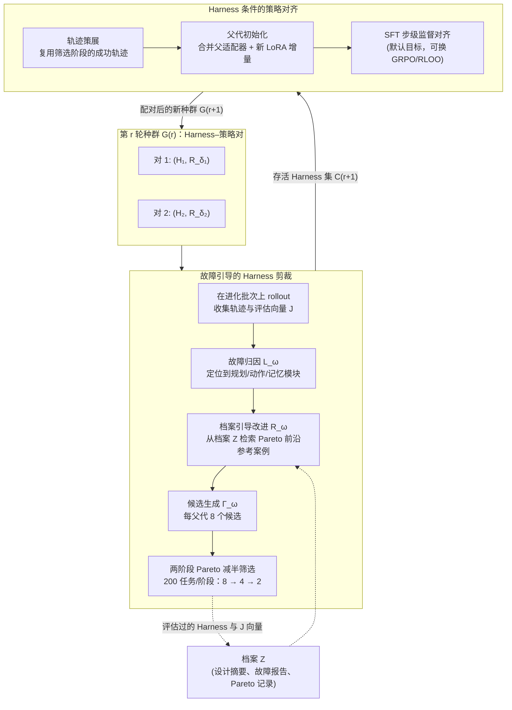

# HarnessForge：Harness 与策略的联合进化

HarnessForge 是北航与清华团队提出的元自适应（meta-adaptive）框架，把 [[What-Is-an-AI-Agent-Harness|LLM 智能体]]系统形式化为 **Harness–策略对（harness–policy pair）**，并让外部执行结构与内部推理策略在多轮进化中协同演化。与只搜 Harness 的 [[Meta-Harness|Meta-Harness]]、[[AutoHarness|AutoHarness]] 或只训策略的 [[Harness-R1|Harness-R1]] 不同，HarnessForge 主张：智能体系统适配的基本单位不是孤立的组件，而是**彼此兼容的 Harness 与策略这一对组合**。

> **核心论点**：表达能力更强的 Harness 未必带来收益——如果推理策略无法可靠执行其暴露的规划、动作与记忆接口，Harness 再精巧也会失败；反之亦然。系统级适配必须联合优化两者之间的"可执行兼容性"（executable compatibility）。

---

## 问题与动机

LLM 智能体面临的任务形态高度异质：多步工具调用、重检索推理、网页交互、有状态多轮任务，各自对执行结构提出不同要求。单一固定的智能体系统不可能在所有任务形态上都是最优的，因此系统需要**元自适应**能力。

现有工作分成两条互不往来的路线（参见 [[Agent-System-Harness-Design-Survey|智能体系统 Harness 设计综述]]）：

- **搜索式方法**（ADAS、AFlow、AgentSquare、MaAS、MermaidFlow 等）：只优化外部执行结构——工作流、工具调用过程、角色分配、[[Memory-Systems|记忆管理]]——把模型当作冻结的黑盒；
- **训练式方法**（SFT、GRPO、RLOO 及各类智能体强化学习）：只优化模型侧策略，默认外部交互循环固定不变。

HarnessForge 指出两条路线共同忽略了**兼容性鸿沟**：Harness 暴露的规划、动作、记忆结构需要策略"接得住"，而更强的策略也会被不合适的 Harness 束缚。在资源受限场景（小参数骨干模型）中，这种耦合尤为关键——Harness 要为有限的模型能力提供结构支撑，策略则必须学会执行 Harness 所规定的执行范式。

---

## 方法设计

### 智能体系统的形式化

HarnessForge 把智能体系统 $\mathcal{G}$ 定义为外部 Harness 与适配后推理器的耦合：

$$\mathcal{G}=(\mathcal{H},\mathcal{R}_{\delta}),\quad \mathcal{H}=(\mathcal{P},\mathcal{A},\mathcal{M}),\quad \mathcal{R}_{\delta}=\mathcal{R}_{\theta_{0}+\delta}$$

其中 Harness $\mathcal{H}$ 分解为三个执行层组件：

| 组件 | 职责 | 可编辑字段 |
|------|------|-----------|
| 规划 $\mathcal{P}$ | 任务分解、重规划、终止条件 | 分解模板、重规划触发器、验证步骤、控制器顺序 |
| 动作 $\mathcal{A}$ | 工具接口、角色分配、编排规则 | 工具描述、参数模式、路由规则、有效性守卫、重试策略 |
| 记忆 $\mathcal{M}$ | 写入、检索、摘要、暴露给后续决策（参见 [[Memory-Systems|记忆系统]]） | 状态键、写入条件、检索规则、摘要格式、暴露字段 |

$\delta$ 是挂在冻结基础推理器 $\mathcal{R}_{\theta_0}$ 上的轻量 LoRA 适配器。评估采用多目标适应度向量 $\mathbf{J}(\mathcal{G};B)$，包含任务性能、负 Token 成本、负延迟三个维度，用于 Pareto 选择。

### 联合进化循环

每一轮进化交替执行两个互相强化的过程：更好的 Harness 诱导出更结构化、更有信息量的轨迹；更强的策略则更忠实地执行 Harness 协议。这是 [[Harness-Evolution-Loop|Harness 进化循环]] 的一种联合变体。

### 故障引导的 Harness 剪裁

Harness 进化的核心难题是**定位失败源自 Harness 的哪个部分**。HarnessForge 用"定位—精修"机制取代盲目变异，剪裁算子 $T_\psi=(\mathbb{L}_\omega,\mathbb{R}_\omega,\Gamma_\omega)$ 由 GPT-5.5 充当元智能体，分四个阶段执行：

1. **故障归因**：元智能体联合检查当前 Harness 设计与代表性失败轨迹，区分规划失败、动作失败与记忆失败，给出附带轨迹证据的故障报告，并要求区分"可迁移的 Harness 弱点"与"基准特定噪声"——这种从失败轨迹反推结构缺陷的做法与 [[Harness-R1|Harness-R1]] 的失败驱动编辑一脉相承；
2. **档案引导改进**：从历史 Harness 档案 $\mathcal{Z}$ 中按**故障相关性 + Pareto 前沿质量**双重条件检索参考案例，把故障报告转化为改进简报（指明修哪个模块、复用或避免哪些历史设计、保留约束是什么）；
3. **候选生成与冒烟测试**：每个存活 Harness 生成 $K_{\mathrm{gen}}=8$ 个候选，只允许编辑执行层组件；候选必须通过接口校验（必填字段、工具模式可解析、动作名映射、记忆键已定义），失败候选进入最多 3 次的有界重试修复；
4. **预算化 Pareto 减半筛选**：不对全量 1.2K 进化批次逐一评估候选，而是在逐步扩大的任务子集上做两阶段减半筛选（每阶段 200 个任务，8 → 4 → 2），按多目标向量 $\mathbf{J}$ 的 Pareto 支配关系排序、以任务性能为平局裁决项。

分阶段设计的意义在于**噪声隔离**：每个阶段消费紧凑的中间产物而非全量长上下文证据，减少上下文漂移，避免生成阶段被无关轨迹细节主导。

### Harness 条件的策略对齐

存活 Harness 需要配一个能可靠执行其接口的执行器。策略侧的设计决策有三处值得注意：

- **父代初始化**：子代策略从父代谱系初始化，$\delta_k^{(r+1)}=\mathrm{Merge}(\delta_k^{(r)})\oplus\Delta\delta_k^{(r+1)}$——把父适配器折叠进子代初始化，再训练一个 Harness 专属的新 LoRA 增量（rank 8、alpha 16、dropout 0.05、学习率 $2\times10^{-6}$、1 个 epoch）。同一父代的多个存活子 Harness 各自拿到独立的策略副本，兄弟分支之间不共享可训练参数；
- **轨迹策展零额外成本**：不单独采集训练数据，直接复用 Harness 筛选阶段已经跑过的 rollout 池，只保留任务成功指标为正的轨迹，使默认 SFT 实例化在 rollout 预算上是中性的；
- **目标函数无关**：对齐算子在框架层面定义，SFT（默认）、偏好优化、RL 均可实例化。SFT 把成功轨迹分解为步级决策对 $(z_t,y_t)$——输入打包任务指令、活跃 Harness 接口、观测历史、记忆状态、可用动作，目标是下一步行为——本质是教师强制式地让执行器模仿 Harness 条件下的成功决策，学习动作格式、工具纪律、记忆使用、验证习惯与终止控制，与 [[Harness-Engineering-Self-Improvement|Harness 工程自我改进]] 中"从轨迹内化执行规范"的思路相通。

需要强调：策略进化的目标**不是训练一个普遍更强的推理器**，而是把继承来的策略对齐到特定 Harness 诱导的执行约定上。产物是配对的 $(\mathcal{H}_k^{(r+1)},\mathcal{R}_{\delta_k}^{(r+1)})$，而非通用的模型升级。

---

## 实验结果

### 设置

- **骨干模型**：Qwen3-4B 与 Qwen3-8B（冻结，仅训 LoRA 适配器）；**元智能体**：GPT-5.5
- **基准**：五个数据集组成四个基准族——ToolHop（多跳工具调用，195 题）、SearchQA（HotpotQA + 2WikiMultiHopQA 重检索问答）、RestBench-TMDB（100 题）、API-Bank（114 题）
- **进化配置**：3 轮进化、每轮 8 个候选、两阶段减半筛选、每轮保留 $|C|=2$ 个存活 Harness
- **训练池**：3.8K 任务（EnvScaler-RL 2.0K + ToolHop 0.8K + NQ/HotpotQA/2Wiki 离线检索 1.0K），与所有留出测试集严格不相交
- **公平协议**：训练式基线使用相同的固定脚手架与相同的 3.8K 轨迹池；搜索式基线使用相同的 GPT-5.5 元智能体后端；TMDB 与 API-Bank 只作迁移评估（从 ToolHop 进化的 Harness 出发替换工具接口，不用其测试样本做进化）。预算口径遵循 [[Agentic-Harness-Engineering|智能体 Harness 工程]] 惯例：rollout 预算只计可执行环境/模型交互，元智能体生成成本视为实现开销不计入

### 主结果

下表为跨五个基准的完整主结果（加粗为每组最优）：

| 方法 | ToolHop Ans. | ToolHop Path | Hotpot | 2Wiki | SearchQA 总 | TMDB Succ. | TMDB Path | API-Bank Succ. | API-Bank Path | API-Bank API. |
|------|------|------|------|------|------|------|------|------|------|------|
| **Qwen3-4B** | | | | | | | | | | |
| ADAS | 40.00 | 44.99 | 28.67 | 28.00 | 28.33 | 45.00 | 57.43 | 51.75 | 57.31 | 60.99 |
| AgentSquare | 29.23 | 39.46 | 29.33 | 30.00 | 29.67 | 35.00 | 49.83 | 39.47 | 47.82 | 46.10 |
| AFlow | 31.28 | 43.81 | 30.67 | 29.33 | 30.00 | 32.00 | 47.64 | 37.72 | 45.72 | 41.13 |
| MaAS | 42.05 | 51.80 | 30.67 | 30.00 | 30.33 | 37.00 | 46.57 | 52.63 | 62.74 | 63.83 |
| MermaidFlow | 44.62 | 58.74 | 31.33 | 28.00 | 29.67 | 39.00 | 51.95 | 54.39 | 64.33 | 60.28 |
| SFT | 45.13 | 63.90 | 36.67 | 38.67 | 37.67 | 61.00 | 75.70 | 69.30 | 75.10 | 73.76 |
| RLOO | 46.15 | 64.87 | 35.33 | 40.00 | 37.67 | 61.00 | 77.42 | 72.81 | 78.82 | 76.60 |
| GRPO | 49.74 | 66.41 | 36.00 | 43.33 | 39.67 | 64.00 | 76.67 | 71.93 | 76.46 | 75.18 |
| **HarnessForge** | **52.82** | **68.10** | **42.00** | 42.00 | **42.00** | **76.00** | **85.10** | **77.19** | **80.07** | **82.27** |
| **Qwen3-8B** | | | | | | | | | | |
| ADAS | 42.05 | 61.32 | 31.33 | 32.00 | 31.67 | 51.00 | 60.41 | 54.39 | 60.14 | 59.57 |
| AgentSquare | 30.77 | 41.22 | 29.33 | 30.00 | 29.50 | 38.00 | 53.83 | 45.61 | 54.37 | 53.90 |
| AFlow | 32.82 | 54.12 | 31.33 | 32.67 | 32.00 | 39.00 | 51.28 | 43.86 | 49.74 | 47.52 |
| MaAS | 44.62 | 51.80 | 32.00 | 32.00 | 32.00 | 43.00 | 54.78 | 57.89 | 66.72 | 60.28 |
| MermaidFlow | 47.39 | 59.31 | 32.67 | 30.67 | 31.67 | 47.00 | 58.67 | 57.02 | 67.46 | 62.41 |
| SFT | 48.72 | 72.20 | 40.67 | 41.33 | 41.00 | 69.00 | 82.92 | 68.42 | 73.80 | 73.05 |
| RLOO | 50.77 | 72.75 | 40.00 | 39.33 | 39.67 | 74.00 | 84.25 | 66.67 | 73.76 | 71.63 |
| GRPO | 51.28 | 75.62 | **41.33** | 42.00 | 41.67 | 70.00 | 83.20 | 69.30 | 74.71 | 73.76 |
| **HarnessForge** | **54.87** | **74.05** | **41.33** | **44.33** | **42.83** | **80.00** | **88.75** | **74.56** | **78.22** | **78.01** |

关键数字：

- 相对各指标最强基线**平均提升 +3.56%，最高 +12.0%**（TMDB 成功率，Qwen3-4B 上 76.00 vs GRPO/SFT 的 64.00/61.00）
- 训练式基线 RLOO 与 GRPO 消耗**更大的 rollout 预算**仍在多数指标上落后
- API-Bank 的 API 准确率跨骨干平均提升 4.96%；ToolHop 答案准确率跨骨干平均提升 3.34%；SearchQA 总分最高 42.83%
- TMDB 与 API-Bank 是**纯迁移评估**（Harness 在 ToolHop 上进化、换工具接口后直接测试），提升说明进化出的是可迁移的执行模式而非基准特定补丁

### 消融实验

逐轮移除两个模块（Qwen3-4B，括号内为相对完整框架的降幅）：

| 轮次 | 变体 | ToolHop | SearchQA |
|------|------|---------|----------|
| Round0 | 原始系统 | 41.03 | 34.33 |
| Round1 | 完整 HarnessForge | 46.15 | 38.67 |
| | 去掉 Harness 进化 | 43.08（↓3.07） | 35.67（↓3.00） |
| | 去掉策略进化 | 44.62（↓1.53） | 36.33（↓2.34） |
| Round2 | 完整 HarnessForge | 50.77 | 40.33 |
| | 去掉 Harness 进化 | 44.62（↓6.15） | 36.33（↓4.00） |
| | 去掉策略进化 | 48.72（↓2.05） | 38.33（↓2.00） |
| Round3 | 完整 HarnessForge | 52.82 | 42.00 |
| | 去掉 Harness 进化 | 46.67（↓6.15） | 37.00（↓5.00） |
| | 去掉策略进化 | 50.26（↓2.56） | 39.00（↓3.00） |

两个结论：Harness 剪裁是主导因素，且其贡献随轮次扩大（Round 1 的 -3.07% 扩大到 Round 3 的 -6.15%）；策略对齐同样不可或缺，说明推理器必须适配进化后的执行接口。**收益来自共同进化本身，而非某一侧单独变强。**

### 框架分析

**存活 Harness 数量敏感性**：每轮只留 1 个 Harness 限制过死——从 $k=1$ 增至 $k=2$，末轮主指标在 ToolHop 上 +3.6%、SearchQA +0.7%、TMDB +6.0%、API-Bank +2.6%，平均 +3.2 个百分点；继续增至 $k=3$ 收益边际化，说明过度保留会稀释选择压力。小种群既保有多样性又维持选择强度。

**Rollout 预算效率**：HarnessForge 在四个基准族上始终位于或贴近 Pareto 前沿。训练式方法必须在固定接口下额外消耗 rollout 去探索更好行为，而 HarnessForge 把同一份 rollout 证据复用两次——先改 Harness、再对齐策略，结构性修订与 Harness 条件的执行模式得以跨轮累积。

**适配必要性（兼容性矩阵）**：在 API-Bank 上对所有进化出的 Harness × 策略适配器做交叉组合评估。匹配对角线上性能从基础对的 69.30% 提升到最终对的 77.19%；而最终 Harness 搭配早期策略平均只有 71.93%，最终策略搭配早期 Harness 平均只有 71.06%。交叉组合的落差直接证明 HarnessForge 进化出的是**配对专属的兼容性收益**，而非独立更强的组件——这正是"Harness 条件的策略特化"的实证。

**训练方法无关性**：把默认 SFT 换成 GRPO 或 RLOO 后框架仍然成立，部分指标还能再涨（Round 3 时 GRPO 把 ToolHop 答案准确率从 50.77% 推到 52.31%，RLOO 把 API-Bank 成功率从 71.05% 推到 72.80%），但代价是 rollout 预算从 12.0K 涨到 45.6K（约 3.8 倍）。SFT 是预算高效的默认项，RL 式目标是同一对齐步骤的高预算实例化。

### 案例研究：ToolHop 谱系

三轮进化呈现清晰的渐进叙事：

- **Round 1**：改进任务分解与记忆暴露（更细粒度子目标、更一致的上下文注入），Harness 剪裁 +2.14%，适配器对齐再 +1.57%
- **Round 2**：聚焦规划与动作可靠性，Harness 与适配器分别贡献 +2.51% 与 +2.10%
- **Round 3**：针对记忆检索（提升相关性、减少噪声访问），再获 +0.94% 与 +1.11%

附录的模块级修复统计显示修复压力有明显的领域分工：API 密集基准（API-Bank、TMDB）以动作侧信号为主（非法 API 格式、模式不匹配、缺失守卫、重复动作），检索密集基准（SearchQA）以规划侧为主（当前查询修复、检索与证据耦合），ToolHop 侧重多跳工具链保持；记忆修复多以"共修复"形式出现，充当稳定层而非独立修复目标。

---

## 讨论与局限

**局限**（论文自述）：

1. 仅在 Qwen3-4B/8B 上验证。小模型场景下 Harness–策略耦合最突出，但同等幅度的兼容性收益是否在前沿大模型上成立仍是开放问题；
2. 进化需要反复 rollout（画像、筛选、对齐），长周期环境下成本仍然可观，未来可用替代评估（surrogate evaluation）、自适应 rollout 分配或早停来降本；
3. 编辑算子受限于规划/动作/记忆组件的结构化协议——好处是可执行、可审计，代价是未能探索任意代码级重写、新工具抽象或可学习验证器等更大的设计空间（与 [[Meta-Harness|Meta-Harness]] 的自由代码空间搜索及 [[Code-as-Agent-Harness|代码即智能体 Harness]] 路线形成对照）。

**定位**：HarnessForge 把 [[Harness-Engineering|Harness 工程]] 从"优化外部结构"或"优化内部策略"的二元对立，推进到"以配对为基本单位的联合优化"，与 [[Harness-Evolution-Loop|Harness 进化循环]]、[[Self-Harness|Self-Harness]]、[[Harness-Continual-Learning|Harness 持续学习]] 同属 Harness 自动化研究的进化分支，其兼容性矩阵实验为"Harness 与模型能力必须匹配"提供了迄今最直接的定量证据。

---

## 相关研究

- [[Meta-Harness|Meta-Harness：模型 Harness 的端到端优化]] —— 只进化 Harness 代码、冻结模型，与 HarnessForge 的"Harness–策略对联合进化"形成鲜明对照，两者可视为搜索式路线的两个极端
- [[AutoHarness|AutoHarness：自动合成代码 Harness]] —— Google DeepMind 的 Harness 自动合成路线，同样只动外部结构
- [[Harness-R1|Harness-R1：从失败轨迹学习编辑可执行运行时 Harness]] —— 同样利用 rollout 失败信号驱动 Harness 编辑，但不含策略侧对齐
- [[Harness-Engineering|Harness 工程]] —— 上位概念与领域综述
