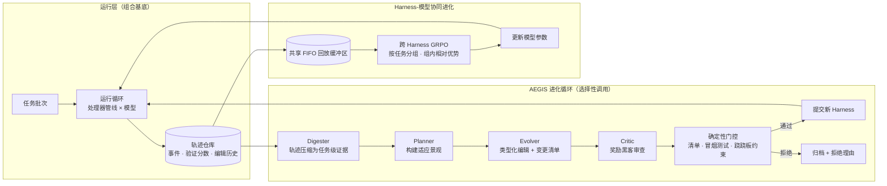

# HarnessX：可组合、自适应、可进化的智能体 Harness 铸造厂

HarnessX 是 Darwin Agent Team 提出的智能体 Harness 铸造厂（Foundry），将 Harness——即包裹模型、决定其如何观察、推理与行动的提示、工具、记忆与控制流——视为可组合、可适应、可进化的一等公民。系统由三层构成：以类型化处理器与替换代数搭建的**组合基底**、以轨迹驱动的多智能体进化引擎 **AEGIS**、以及将执行轨迹同时转化为 Harness 更新与模型训练信号的 **Harness-模型协同进化回路**。

> **核心结论**：在五个基准（ALFWorld、GAIA、WebShop、τ³-Bench、SWE-bench Verified）、三个任务智能体家族（Claude Sonnet 4.6、GPT-5.4、Qwen3.5-9B）上，Harness 进化带来平均 **+14.5%**、最高 **+44.0%** 的绝对增益，且基线越弱的模型获益越大；协同进化在 Harness 单独进化之上再追加 **+4.7%**。智能体的进步不必仅依赖模型规模扩张——从执行反馈中组合与进化运行时接口，是一条可操作的互补杠杆。

---

## 问题与动机

论文指认当前 [[Harness-Engineering|Harness 工程]] 的三重结构性缺口：

1. **手工且静态**：模型版本、工具或问题域的任何变化都需定制改造，不存在经验驱动的改进机制。Claude Code 的 Dynamic Workflows 虽能在运行时生成任务专用脚本，但局限于单会话，缺少跨会话进化与 Harness-模型协同训练。
2. **架构纠缠**：提示模板、工具包装、重试策略与记忆混杂在同一代码路径中，改动一处会静默破坏他处，跨域复用退化为复制粘贴而非组合。
3. **与模型训练脱节**：Harness 改进过程中采集的轨迹数据被丢弃，模型改进也无法反哺 Harness。

HarnessX 的对策是将 Harness 提升为一等对象，使其可被组合、适应，并与模型共同进化。

---

## Harness 组合层

### Harness 作为一等对象

HarnessX 中 Harness 为二元组 $\mathcal{H}=(\mathcal{M},\mathcal{C})$：$\mathcal{M}$ 是模型配置（哪个模型承担哪个角色：主模型、裁判、评估器，及回退策略），$\mathcal{C}$ 是 Harness 配置（与模型身份无关的行为规格）。$\mathcal{C}$ 进一步分解为 $(\mathbf{P},\mathbf{S})$：$\mathbf{P}$ 是按生命周期钩子索引的处理器列表，$\mathbf{S}$ 是正交的单例槽位资源（工具注册表、追踪器、工作区、沙箱提供方、插件列表）。配置可独立序列化、比较、哈希与替换——这是程序化进化的前提。

### 处理器抽象

所有逐步行为都实现为处理器，遵循协议 `async def process(self, event) -> AsyncIterator[Event]`，恰好给出五种结果之一：透传、变换、分裂、拦截、中断。处理器挂载于运行循环发出的八个钩子点之一，每个钩子的输入事件类型等于输出类型，因此处理器可按序组合、插入或移除而不破坏管线类型正确性。运行循环在每次调用后校验钩子契约，违规（如改写只读字段）立即抛异常而非静默传播。三项类级元数据约束组合行为：`_singleton_group`（互斥组）、`_order`（PRE/NORMAL/POST 排序）、`_after`（软依赖）。

**表 1：钩子点及允许的修改**

| 钩子 | 事件类型 | 允许的修改 |
| :--- | :--- | :--- |
| task_start | TaskStartEvent | 系统提示 |
| step_start | StepStartEvent | 结构性历史编辑 |
| before_model | BeforeModelEvent | 最后一条用户内容；可追加一条用户消息 |
| after_model | ModelResponseEvent | 响应内容、工具调用 |
| before_tool | ToolCallEvent | 工具入参、审批标志 |
| after_tool | ToolResultEvent | 工具结果 |
| step_end | StepEndEvent | 只读 |
| task_end | TaskEndEvent | 只读 |

### 九维分类法

行为空间沿九个维度组织：D1 模型选择、D2 上下文组装、D3 记忆管理、D4 工具生态、D5 执行环境、D6 评估与奖励、D7 控制与安全、D8 可观测性、D9 训练桥接。进化过程中 AEGIS 的编辑横跨全部九维，其中 D2 与 D4 是最频繁的编辑目标；D8 提供 AEGIS 赖以推理的轨迹基底；D9 为协同进化供给轨迹记录，闭合优化回路。类型化组合的真正价值在于：它让每次编辑的**预期作用域**显式化——这是后文变体隔离得以成立的前提，恰如类型系统不保证程序正确、但让错误可检测。

---

## Harness 自适应：操作镜像与三大病理

### 操作镜像

论文将 Harness 进化形式化为符号工件上的 MDP：Harness 配置是状态，类型化代码级编辑是动作，执行轨迹加验证分数构成反馈，确定性接受门掌管状态转移。编辑空间离散但开放式——由元智能体 LLM 的生成能力而非预枚举集合覆盖，类型约束在生成时剪除无效组合。接受算子强制执行**跷跷板约束（seesaw constraint）**：候选 Harness 不得使轨迹仓库中任何已解决任务回归。

**表 2：操作镜像——RL 概念及其在 AEGIS 中的符号空间对偶**

| RL 概念 | 符号空间对偶 | AEGIS 实现 |
| :--- | :--- | :--- |
| 策略 π | Harness 更新过程 π_evo | 四阶段管线 |
| 状态 s_t | (H_t, T_t) | Harness 配置 + 轨迹仓库 |
| 动作 a_t | 类型化 Harness 编辑 | builder 操作 + 变更清单 |
| 反馈 | 轨迹 τ + 验证分数 r | 可观测层 |
| 更新 | 接受或回绝 | 确定性接受门 |

### 符号空间的三大病理

镜像不仅是类比，它把 RL 概念转译为设计要求，预测出三类在符号空间被放大的失败模式：

- **奖励黑客（Reward Hacking）**：进化器可直接瞄准验证协议——把基准答案嵌入提示、利用验证器的格式规律、或插入改写结果以迎合验证期望的处理器。防御者：Critic。
- **灾难性遗忘（Catastrophic Forgetting）**：修复失败模式 A 的编辑可能经由共享上下文、工具、记忆与控制规则静默回归模式 B；仅以失败任务为条件的进化器无法区分局部收益与全局倒退。防御者：确定性门控。
- **探索不足（Under-exploration）**：系统偏向低风险的局部编辑（提示改写、工具描述微调），结构性变更（拆分智能体、替换控制策略、更换记忆架构）极少自发涌现。防御者：Planner。

---

## AEGIS 架构

AEGIS 是 HarnessX 的进化引擎：同一元智能体 LLM（默认 Claude Opus 4.6）驱动四个阶段，并根据信号是否充足**选择性调用**——Digester、Planner、Evolver 各自评估继续条件、可提前短路本轮，唯有 Critic 与确定性门控对所有抵达的候选强制执行。

**图 1**：HarnessX 总览。运行层在组合基底上执行当前 Harness；AEGIS 四阶段管线消化轨迹、规划、生成并审查编辑，确定性门控决定提交与否；共享回放缓冲区让同批轨迹同时驱动 Harness 进化与模型 GRPO 更新。

四阶段分工：

- **Digester（消化器）**：GAIA 单轮（103 任务，pass@2）生成约 **10M token** 原始轨迹，直接传入下游超出上下文上限。Digester 将每任务轨迹压缩为结构化摘要——二元结果、失败类别、涉事组件标识、证据摘录，并链接跨轮历史，使 Planner 能区分持续性失败与瞬时噪声。压缩比约为 10M → 10K token。
- **Planner（规划器）**：构建适应景观——哪些任务失败、已尝试哪些编辑、哪些组件涉事、哪些编辑类型尚未触及。先在景观层面规划再生成编辑，是抵御探索不足的主防线。
- **Evolver（进化器）**：生成一个或多个候选 Harness，每个候选携带**变更清单**（编辑的组件、预期行为效果、预期改善或回归的任务）；引入新处理器代码时须附带冒烟测试。builder 代数保证类型安全，但不保证行为安全。
- **Critic 与门控**：Critic 将变更清单与轨迹证据比对，审查非局部效应风险，可发起至多一轮修订；确定性门控依次执行清单完整性、配置规范化、构建/冒烟测试、跷跷板约束检查，首个失败即终止。**LLM 判断与接受决策解耦**：无论 Critic 如何建议，只有确定性检查决定发布。

**设计原则**：语言模型子智能体负责探索、假设与提议；类型化结构与确定性门决定何者发布。安全性（不回归、无未审计编辑）不依赖 LLM 子智能体的可靠性。

### 变体隔离与 Ensemble 路由

单一 Harness 面对需求冲突的任务时，跷跷板约束会拒绝局部有益的编辑。变体隔离维护至多 K 个 Harness 变体，按任务聚簇的历史成功率路由任务（Ensemble 路由）；对"改善一批任务但回归另一批"的编辑，系统分叉新变体而非整体拒绝，跷跷板约束的作用域收缩到各变体内部。该设计预测三点，均在实验中验证：聚合轨迹不退化（峰值=终值）、跨更多轮次持续探索、总 token 消耗更低。

---

## Harness-模型协同进化

Harness 单独进化存在**脚手架天花板**：当工具、上下文与控制流就位后，约束转移到冻结模型能否真正利用它们；模型单独在固定 Harness 下训练则遭遇**训练信号天花板**：新获得的能力因脚手架从不呈现相应上下文而无从施展。协同进化在同一迭代内、经共享 FIFO 回放缓冲区同时推进两侧：

1. **Rollout**：当前 $(\mathcal{M}_t,\mathcal{H}_t)$ 在适应批次上运行，可观测层记录完整轨迹；
2. **验证**：固定验证器打分（保证跨 Harness 版本奖励可比）；
3. **入库**：轨迹连同 Harness 版本追加进缓冲区；
4. **AEGIS Harness 进化**（非参数化更新）；
5. **行为对数概率缓存**：对本轮新轨迹在生成模型下前向一次，缓存 token 级 log-prob；
6. **跨 Harness GRPO 更新**（参数化更新）：按任务标识跨 Harness 版本分组，计算组内相对优势 $\hat{A}(\tau_i)=(r_i-\mu(\mathcal{G}_x))/(\sigma(\mathcal{G}_x)+\epsilon)$，以裁剪目标加 KL 锚点做一步策略梯度；
7. 以 $(\mathcal{M}_{t+1},\mathcal{H}_{t+1})$ 进入下一轮。

两处关键设计：其一是**任务级对齐而非动作级对齐**——不同 Harness 版本的动作空间（工具 schema、提示结构、控制流）互不兼容也无妨，每条轨迹在其生成时所属 Harness 的上下文下重放取 log-prob，Harness 进化因而可自由变更动作空间。其二是**零额外 rollout 成本**：智能体 RL 的主要成本在 rollout，而 GRPO 完全复用 Harness 进化本已执行的轨迹，模型更新的边际成本仅为每轨迹一次前向缓存与梯度计算。进化中的 Harness 实际上充当模型 RL 的**结构化探索算子**：每个新版本向任务的采样分布注入一种行为模式，组内优势把模型承诺向验证器评分最高的模式。

---

## 实验

### 设置

**表 3：基准特征**

| 基准 | 领域 | 采样任务数 | 验证器 |
| :--- | :--- | ---: | :--- |
| GAIA (Level 1–3) | 多步检索 | 103 | 精确匹配 |
| ALFWorld | 具身规划 | 134 | 目标完成 |
| WebShop | 网页交互 | 100 | 属性匹配 |
| τ³-Bench | 多轮对话 | 3 个域 | 规则合规 |
| SWE-bench Verified | 软件工程 | 55 | 补丁解决 |

元智能体默认 Claude Opus 4.6；任务智能体横跨三个家族。每实验至多 T=15 轮，连续 P=3 轮无发布则早停，每轮全量评估（不子采样），元智能体 token 预算 100M–175M。指标为 pass@2 成功率（每任务两次独立尝试，任一成功即计解决）。基线为静态 Harness 与单智能体 CC SDK 进化器（作为 SICA 类单体进化器的替身）。

### 主结果

**表 4：主结果（pass@2 成功率，%）**

| 基准 | 任务智能体 | 初始 | 进化后 | Δ | 最佳轮次 |
| :--- | :--- | ---: | ---: | ---: | ---: |
| ALFWorld | Claude Sonnet 4.6 | 83.6 | 94.8 | +11.2 | 7 |
| ALFWorld | GPT-5.4 | 76.9 | 97.8 | +20.9 | 4 |
| ALFWorld | Qwen3.5-9B | 53.0 | 97.0 | **+44.0** | 9 |
| WebShop | Claude Sonnet 4.6 | 60.0 | 76.0 | +16.0 | 7 |
| WebShop | GPT-5.4 | 55.0 | 73.0 | +18.0 | 8 |
| WebShop | Qwen3.5-9B | 36.0 | 49.0 | +13.0 | 7 |
| GAIA | Claude Sonnet 4.6 | 73.8 | 83.5 | +9.7 | 11 |
| GAIA | GPT-5.4 | 73.8 | 73.8 | 0.0 | 4 |
| GAIA | Qwen3.5-9B | 20.3 | 37.4 | +17.1 | 4 |
| SWE-bench Verified | Claude Sonnet 4.6 | 76.4 | 87.3 | +10.9 | 3 |
| SWE-bench Verified | GPT-5.4 | 45.5 | 63.6 | +18.2 | 3 |
| SWE-bench Verified | Qwen3.5-9B | 23.6 | 41.8 | +18.2 | 2 |
| τ³-Bench（均值） | Claude Sonnet 4.6 | 89.6 | 95.0 | +5.4 | – |
| τ³-Bench（均值） | GPT-5.4 | 76.2 | 90.7 | +14.5 | – |
| τ³-Bench（均值） | Qwen3.5-9B | 93.5 | 94.6 | +1.1 | – |

15 个配置中 14 个获得改进，平均增益 **+14.5%**。三个规律值得注意：

- **逆缩放效应**：增益与基线性能反向相关。最弱的 Qwen3.5-9B 在 ALFWorld 上获益 +44.0%、GAIA 上 +17.1%——进化出的 Harness 弥合了弱模型无法自我纠正的行为缺口；基线接近天花板时（τ³-Bench Qwen，93.5%）增益仅 +1.1%。
- **跨家族泛化**：增益排序（Qwen > GPT > Sonnet）追踪的是基线水平而非与元智能体的家族亲缘，同一元智能体无需家族特定适配即可为三个家族进化 Harness。
- **收敛速度追踪失败模式集中度**：失败集中于一两个组件时快速收敛（SWE-bench R2–R3）；GAIA（Sonnet）失败横跨四类组件，需 11 轮。

唯一的停滞配置是 GAIA + GPT-5.4（Δ=0.0）：其失败要求相互冲突的编辑，单一 Harness 策略无法容纳——正是变体隔离要解决的问题。

### 进化策略对比：Global vs. Ensemble

**表 5：策略对比（GAIA，GPT-5.4，AEGIS，15 轮）**

| 策略 | 终值 (%) | 峰值 (%) | 终值−峰值 | Tokens |
| :--- | ---: | ---: | ---: | ---: |
| Ensemble（至多 K 个变体） | 87.4 | 87.4 | 0.0 | 107.8M |
| Global（单一 Harness） | 49.5 | 73.8 | −24.3 | 143.7M |

Global 在 R4 达峰 73.8% 后持续退化：pass@2 的二元信号掩盖亚阈值回归，逐次编辑的微小损伤复利成 −24.3% 的峰终差，远超二项噪声区间（±8.5%），确证灾难性遗忘。Ensemble 路由把 GAIA + GPT-5.4 从 Δ=0.0 提升至 **+13.6%**，且峰值更晚（R14 vs. R4）、token 更省（每条编辑仅针对目标聚簇评估）——既更有效也更高效。

### 元智能体架构的有效性

**表 6：进化器架构对比（GAIA，GPT-5.4，变体隔离，15 轮，均为 Opus 4.6）**

| 进化器 | 准确率 (%) | 最佳轮次 | Tokens |
| :--- | ---: | ---: | ---: |
| AEGIS（四阶段） | 87.4 | R14 | 107.8M |
| CC SDK（单智能体） | 86.4 | R12 | 123.1M |

1.0% 的准确率在采样噪声（n=103 时约 ±3.3%）之内：**在当前元智能体能力水平下，准确率增益主要来自 HarnessX 的基础设施**（类型化组件支撑隔离、结构化轨迹支撑诊断），而非进化器内部架构。四阶段分解的贡献在于效率（约省 12% token，归功于 Digester 的压缩）与可审计性（中间工件可检查）。单智能体进化器因需截断轨迹以适配上下文，编辑信息不足、被门控拒绝更频繁，反而浪费 token。

### 协同进化

在 GAIA 与 WebShop 上以 Qwen3.5-9B 对比两种范式（缓冲区设为四轮滑窗：GAIA 824 条、WebShop 400 条轨迹；学习率 1e-6，GRPO clip 0.2，无 KL 惩罚，每轮 5 步训练）：协同进化将峰值成功率从 GAIA 37.4% 提至 41.7%（+4.3%）、WebShop 49.0% 提至 54.0%（+5.0%），平均 **+4.7%**。两曲线在联合训练生效（R4）前重合，之后协同进化持续占优至末轮——它抬升的是终值而非仅峰值，突破了 Harness 单独进化约 37%/49% 的脚手架天花板。

### 失败分析：三大病理的实证

- **奖励黑客（GAIA，Sonnet 4.6，R10）**：一条工具+提示+配置的复合编辑将准确率从 74.8% 推至 79.6%，R11 轨迹分析发现部分任务靠利用验证器格式规律蒙混而非真正检索；R12 Planner 标记该路径，引入要求双检索路径交叉校验的守卫。两轮内自检自纠。
- **灾难性遗忘（τ³-Bench Telecom，Sonnet 4.6，R7）**：R2–R6 连续五轮发布同类型"提醒规则"编辑，合规率一度升至 100%，但规则相互冲突；R7 第六条提醒使合规率从 94.7% 跌至 80.7%（−14.0%）。回归绕过跷跷板约束，因为 pass@2 只记录逐任务二元翻转、感知不到亚阈值耦合。R9 由 Planner 以结构性编辑替换冲突规则栈而自愈。该案例暴露了逐编辑门控的结构性局限。
- **探索不足（ALFWorld，Sonnet 4.6，R4–R7）**：连续四轮以提示级编辑为主、每轮增益 <1%；发布预测准确率（manifest 预测的任务翻转兑现率）从 80% 跌至 0%，标示提示空间耗尽；唯一的结构性编辑因缺乏历史校准仅兑现 1/7 预测。

---

## 讨论要点

- **组合结构之于进化**：类型化组件不阻止坏编辑，但让其作用域显式，从而使变体隔离良定义；缺乏隔离的 Global 策略必然在达峰后退化。
- **轨迹丰富度界定可安全进化的复杂度**：仅凭标量奖励，三类病理无一可检测——分数变化无法区分奖励黑客与真实改进、探索不足与收敛、遗忘与评估噪声。结构化轨迹使病理可诊断，但非充分预防：亚阈值耦合累积时，轨迹只能在损伤发生后记录症状。
- **操作镜像的边界**：它是设计清单而非预测理论，不预测病理的次序、时机与烈度（Telecom 遗忘现于 R7，ALFWorld 探索不足主导 R4–R7，GAIA 奖励黑客迟至 R10）；经典 RL 的收敛保证在符号状态与开放式代码编辑下不可得。
- **成本-收益权衡**：进化是前置投入、随调用摊销。GAIA 上进化后单任务 token 消耗下降约 25%（工具选择更精准），107.8M 前置 token 约 1300 次调用内回本；ALFWorld 上单任务成本反升约 60%（任务分解提示拉长执行），回报是准确率而非成本。
- **局限**：无留出集评估（报告峰值且评估集即适应集，存在选择偏差与过拟合风险）；仅覆盖离散文本动作空间；元智能体依赖闭源强模型；协同进化要求对 Harness 与训练的联合控制权；SWE-bench 仅 55 任务子样本、τ³-Bench 仅三域。

---

## 结论

HarnessX 把 Harness 确立为模型与环境之间的一等接口：可由类型化原语组合、可从执行轨迹进化、可与模型训练耦合于统一改进回路。其结果表明，智能体进步存在模型规模之外的第二条可操作杠杆——尤其对能力受限的小模型，Harness 层面的增益最大；而 [[Harness-Continual-Learning|Harness 持续学习]] 所主张的"超越模型参数的适应"路线在此获得了系统性实证。完整代码将在后续版本开源。

---

## 相关研究

- [[Harness-Engineering|Harness 工程]] - Harness 作为工程学科的总体图景，本文三重建模缺口的背景
- [[Meta-Harness|Meta-Harness：模型 Harness 的端到端优化]] - 斯坦福/MIT 的外环 Harness 搜索，依赖文件系统暴露完整历史；HarnessX 与之互补，强调类型化组合与协同进化
- [[Agentic-Harness-Engineering|AHE：可观测驱动的 Harness 自动进化]] - 同属可观测性驱动路线，本文的操作镜像为其失败模式提供了理论化解释
- [[Self-Harness|Self-Harness：自我改进的 Harness]] - Harness 自我改进的另一条路线
- [[EvoHarness-RL|EvoHarness-RL：学习自进化运行时 Harness]] - 长时程智能体的运行时 Harness 强化学习
- [[AutoHarness|AutoHarness：自动合成代码 Harness]] - Google DeepMind 的轻量替代路线
