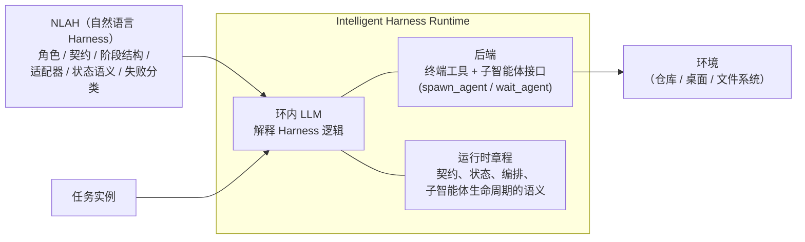

# Natural-Language Agent Harnesses：用自然语言编写可执行的 Harness

智能体的成败越来越取决于 [[Harness-Engineering|Harness 工程]]，但 Harness 设计通常埋在控制器代码与运行时特定约定里，难以迁移、难以公平比较、难以作为科学对象研究。本文提出的问题是：**[[What-Is-an-AI-Agent-Harness|智能体 Harness]] 的高层控制逻辑能否外化为一类可移植、可执行的制品？** 答案由两个组件构成——**Natural-Language Agent Harness（NLAH）**，用可编辑的自然语言表达 Harness 行为；以及 **Intelligent Harness Runtime（IHR）**，一个通过显式契约、持久制品与轻量适配器来执行这些 Harness 的共享运行时。

> **核心论点**：Harness 内部存在一个"设计模式层"（pattern layer），可以把它从运行时策略与底层执行钩子中剥离出来，变成显式的、可执行的自然语言对象。自然语言不取代代码——它承载可编辑、可检查的编排逻辑，确定性操作（测试、linter、校验器）仍由适配器与脚本承担。

---

## 问题与动机

大多数智能体系统中，实际生效的 Harness 散落在控制器代码、框架隐藏默认值、工具适配器、校验脚本与运行时假设之中。后果是三个"难"：

- **难迁移**：跨运行时的 Harness 移植几乎等于重写；
- **难比较**：两个名义上只差一个设计选择的系统，往往同时在 Prompt、工具中介、制品约定、验证门、状态语义上都不同，评估退化为"控制器捆绑包对比"而非模块级证据；
- **难消融**：无法干净地隔离单个模块的因果贡献。

AGENTS.md 与技能包（skill bundle，参见 [[Skill-Systems|Skill 系统]]）已经证明：可移植文本可以打包仓库级约定与可复用流程。但它们只确立了**可复用控制知识**的可行性，没有把 Harness 级契约、角色边界、状态语义、失败处理与运行时适配器变成一等的、可联合执行的对象。NLAH 正是把自然语言从"可复用流程的载体"提升为"显式的可执行 Harness 对象"。

---

## 方法设计

### Harness 与设计模式层

本文对 Harness 的定义：治理某个任务族的多次模型/智能体调用的编排层，包含三方面——**控制**（工作如何分解与调度）、**契约**（必须交付什么制品、满足什么门、何时停止）、**状态**（跨步骤、分支与委派工作者必须持久化的内容）。[[From-Weights-to-Context-to-Harness|Context 工程]]只关注单次调用的即时 Prompt 与检索上下文；Harness 涵盖它，同时管理多步结构、工具中介、验证与持久状态。

Harness 与运行时的边界是分析性的而非绝对的：通用服务（工具适配、沙箱、子智能体生命周期）可以住在运行时里，任务族策略（阶段、制品契约、校验器）住在 Harness 里。把这条边界显式化，是为了在共享运行时假设下比较、迁移与消融 Harness 的**模式逻辑**——这与 [[Harness-Runtime-Substrate|Harness 运行时基座]] 的分层视角一致。

### Intelligent Harness Runtime（IHR）

NLAH 用自然语言写成，执行它需要解释。IHR 因此把一个 LLM 放进运行时循环内部：每一步读取 Harness、当前状态与环境、运行时章程（runtime charter），再选择与契约和预算一致的下一动作。

一个关键概念升级是**从模型调用到智能体调用**：单次补全 $y=\mathrm{LM}_m(c)$ 被提升为受显式执行契约约束的智能体调用 $\mathrm{AgentCall}(T,\Omega_t^{in})=(A_t,\Delta\Omega_t,y_t)$，契约 $\kappa$ 规定必需交付物、预算、权限范围、完成条件与指定路径；返回结果 $y_t$ 是指向制品并声明成败的规范化响应。单次模型调用只是"禁止外部动作、一次性作答"的退化特例。

### NLAH 的核心组件

一份可执行的 NLAH 必须显式暴露六类成分：

1. **契约**：必需输入与交付物、格式约束、验证门、权限边界、重试与停止规则
2. **角色**：职责互不重叠的角色 Prompt（求解者、校验者、研究者、编排者）
3. **阶段结构**：显式的工作负载拓扑（如 plan → execute → verify → repair）
4. **适配器与脚本**：确定性动作的命名钩子（测试、校验器、检索、解析）
5. **状态语义**：跨步骤持久化的内容（制品、台账、子工作区）及其按路径重开的方式
6. **失败分类**：驱动恢复的命名失败模式（制品缺失、路径错误、校验器失败、工具错误、超时）

### 文件支持的显式状态模块

长周期自主运行的实际失败点常在关键状态隐式或易失，这也是 [[Long-Running-Harness-Design|长程 Harness 设计]] 反复强调的教训。论文研究了一个可选的**文件支持状态（file-backed state）**模块，强制三条性质：**外化**（状态写入制品而非仅留在瞬时 Context，参见 [[Externalization-in-LLM-Agents|LLM 智能体中的外部化]]）、**路径可寻址**（后续阶段按路径精确重开同一对象）、**抗压缩**（状态在截断、重启、委派后存活）。实验中使用规范化工作区：`TASK.md`（任务声明）、`harness-skill/SKILL.md`（任务族控制逻辑）、`state/task_history.jsonl`（仅追加的调用与状态晋升记录）、`children/<id>/`（子智能体本地任务包、暂存与制品）、`RESPONSE.md` 与 `artifacts/`（规范化结果与面向基准的交付物）。

运行时章程还编码了五条共享纪律：父级只做编排不做实质工作（单智能体 Harness 也被实现为"父运行时 + 一个任务子智能体"，即 [[Managed-Agents-Decoupling-Brain-from-Hands|大脑与手分离]] 的委派拓扑）；未加载 Harness 技能时构造最薄可运行基线；用 `fork_context=true/false` 显式控制子智能体是否继承父上下文，保持原 Harness 的模型调用边界；运行时状态与最终制品分离存放；完成以契约为先且必须留下可检查证据。

---

## 实验结果

**实验设置**：Codex CLI 0.114.0 + GPT-5.4（reasoning effort xhigh）作为后端（Codex 侧的 Harness 工程实践见 [[OpenAI-Codex-Harness-Engineering|OpenAI Codex Harness 工程]]）；全部运行在 Docker 容器内（每任务 32 vCPU / 84 GiB 内存 / 40 GiB 存储）。受预算限制，结果为固定种子单次抽样的子集：125 个 SWE-bench Verified 样本与 36 个 OSWorld 样本。

### RQ1：行为效应

在固定预算下，共享运行时章程（RTS）与基准特定 Harness 逻辑（HS）是否实质改变智能体行为与结果？

| 基准 | Harness | 设置 | 性能 | Prompt Token | Completion Token | 工具调用 | LLM 调用 | 运行时（分） |
|------|---------|------|------|------|------|------|------|------|
| SWE Verified | TRAE | 完整 IHR | 74.4 | 16.3M | 211k | 642.6 | 414.3 | 32.5 |
| | | 去掉 RTS | 76.0 | 11.1M | 137k | 451.9 | 260.5 | 16.6 |
| | | 去掉 HS | 75.2 | 1.2M | 13.6k | 51.1 | 34.0 | 6.7 |
| SWE Verified | Live-SWE | 完整 IHR | 72.8 | 1.4M | 17.0k | 58.4 | 41.4 | 7.6 |
| | | 去掉 RTS | 76.0 | 1.1M | 11.7k | 41.0 | 28.2 | 5.5 |
| | | 去掉 HS | 75.2 | 1.2M | 13.6k | 51.1 | 34.0 | 6.7 |

配对翻转计数（125 个拼接样本，F=仅完整 IHR 解出，A=仅消融版解出，S=两者一致）：

| Harness | vs 去掉 RTS：F | A | S | vs 去掉 HS：F | A | S |
|---------|------|------|------|------|------|------|
| TRAE | 4 | 6 | 115 | 7 | 8 | 110 |
| Live-SWE | 4 | 8 | 113 | 4 | 7 | 114 |

三层发现：

1. **过程指标的变化远大于解决率**。性能只在窄带内波动，但 Token、调用次数、运行时长差异可达一个数量级——运行时章程与 Harness 逻辑是真实的行为控制量，而非 Prompt 装饰；
2. **多数实例不翻转**。125 个样本中超过 110 个在各设置间一致，差异集中在少数组件敏感的边界案例上。完整 IHR 更像"已解集合的替换者"而非"均匀的前沿扩张者"：它赢得一些只有它能解的案例，也丢掉一些轻量设置能直达的修复；
3. **最有信息量的失败是对齐失败而非随机失手**。例如 TRAE 在 matplotlib-24570 上展开大规模候选搜索、多轮选择与复验，最终给出局部合理却不符合官方评估器的补丁——Harness 能重塑局部成功信号，使其偏离基准的验收对象。

TRAE NLAH 的用量分布进一步显示机制所在：约 90% 的 Prompt Token（91.5%）、Completion Token（91.9%）、工具调用（90.2%）与 LLM 调用（90.6%）发生在委派的子智能体中，运行时父线程只占约 9%——增加的预算对应多阶段探索、候选比较、制品交接与额外验证。

### RQ2：Harness 模式消融

模式显式化之后能否像模块一样组合与消融？从基准特定的 Basic 起点出发，每次加一个模块：

| 基准 | Basic | 文件支持状态 | 证据支持作答 | 校验器 | 自进化 | 多候选搜索 | 动态编排 |
|------|------|------|------|------|------|------|------|
| SWE Verified | 75.2 | 76.8（+1.6） | 76.8（+1.6） | 74.4（-0.8） | **80.0（+4.8）** | 72.8（-2.4） | 75.2（0.0） |
| OSWorld | 41.7 | **47.2（+5.5）** | 41.7（0.0） | 33.3（-8.4） | 44.4（+2.7） | 36.1（-5.6） | 44.4（+2.7） |

三个模式：

- **模块效应集中在小的已解前沿上**，而非均匀平移整个基准。多数任务要么被所有条件稳健解出、要么所有条件都解不出，信息都在翻转的边界案例里；
- **模块分成两个性质不同的家族**。自进化是唯一明显改善求解回路本身的模块——其收益不来自开放式反思，而来自纪律化的"验收门控尝试循环"：在失败信号出现之前保持搜索狭窄（如 scikit-learn-25747 在首次尝试即收敛）。文件支持状态与证据支持作答主要改善过程结构（留下任务历史、清单、分析旁车等持久签名），提升的是可审计性与交接纪律而非语义修复能力；
- **更显式不等于更好**。校验器（django-11734 这类中心主张可被窄而独立地核查时有用）与多候选搜索在当前预算下开销过重；动态编排改变了已解集合但不扩张前沿。反例 sympy-23950 很说明问题：校验器运行最终回复明确声称"独立校验器报告已解决"，官方评估器却判定失败——局部验收层与基准最终验收对象发生了偏离。

附录的成本视角（按 GPT-5.4 公开定价估算 API 成本）让分工更清晰：自进化是唯一"分数上移而成本不大右移"的模块；文件状态与证据作答温和右移、收益温和；校验器与多候选搜索在分数–成本平面上被支配。

### RQ3：代码到文本的 Harness 迁移

同一 Harness 以两种实现配对评估：原生代码 vs 重建的 NLAH，目标是任务级等价（可比的外露逻辑、契约与面向基准的制品），而非内部轨迹一致。

| 基准 | Harness | 实现 | 性能 | Prompt Token | Completion Token | 智能体调用 | 工具调用 | LLM 调用 | 运行时（分） |
|------|---------|------|------|------|------|------|------|------|------|
| OSWorld | OS-Symphony | 代码 | 30.4 | 11.4M | 147.2k | 99 | 651 | 1.2k | 361.5 |
| OSWorld | OS-Symphony | NLAH | **47.2** | 15.7M | 228.5k | 72 | 683 | 34 | 140.8 |

迁移版不仅性能更高，行为形态也发生了系统性迁移：原生 OS-Symphony 把控制外化为"截图驱动的修复循环"（验证上一步、看屏幕、选下一个 GUI 动作、局部重试）；NLAH 版则以文件支持状态与制品支持的验证为中心——任务文件、台账、显式制品被实体化，遇到脆弱的 GUI 修复时更主动地切换到文件、shell 或包级操作。具体案例：系统配置任务中，原生版困在 GUI 焦点修复里，NLAH 版转到 shell 侧配置并以显式 sshd 验证关闭任务；演示文稿任务中，NLAH 版直接编辑 .pptx 包并验证生成的幻灯片制品。

轨迹存档佐证了这种"可靠性机制的重定位"：原生侧暴露 36 条主轨迹加 7 条短的嵌套 search_1 轨迹（桌面控制循环 + 偶尔的教程绕行）；迁移侧是契约优先的运行时流，状态住在任务文件与台账里。验证方式迁移最明显：原生轨迹常在"屏幕看似合理"处停止，迁移轨迹更多以路径可寻址证据（写好的文件、重开的文档、包级对象、系统查询）收口。迁移轨迹更密（平均 18.2 个独立命令 vs 原生 18.1 步，但总事件 58.5 条），额外密度应理解为可观测性与恢复脚手架，而非原始动作倍增。

---

## 讨论与局限

**为什么不自然语言取代代码**：本文主张的是"比较单位"的变化——把 Harness 模式逻辑外化为共享运行时语义下可读、可执行的对象。代码继续负责确定性操作、工具接口与沙箱强制执行（代码化路线的代表见 [[Code-as-Agent-Harness|代码即智能体 Harness]]）。

**更强模型会削弱自然语言控制的价值吗**：复杂 Prompt 工程的收益确实在衰减，但本文结果支持另一种解读——自然语言在承载 **Harness 级控制**（角色、契约、验证门、持久状态语义、委派边界）时仍然重要，这与 Context 工程与 [[Long-Running-Harness-Design|长程 Harness 设计]] 的工程实践叙述一致，也呼应 [[Importance-of-Agent-Harness|智能体 Harness 的重要性]] 的论点。

**Harness 表征成为搜索空间**：一旦 Harness 成为显式对象，就可以被检索、迁移、重组、系统性消融，乃至由 [[Meta-Harness|Meta-Harness]]、[[AutoHarness|AutoHarness]]、[[HarnessForge|HarnessForge]] 这类方法自动搜索——Harness 工程由此有机会成为更可控的科学对象，即"Harness 表征科学"。

**局限**（论文自述）：自然语言精度不如代码，依赖隐藏服务侧状态、专有调度器或训练诱导行为的机制无法从文本忠实复原；**运行时污染**是真风险——强大的共享运行时章程可能吸收本应归因于 Harness 文本的行为；模块级消融不是严格因果识别，文本表征会引入指令显著性、Prompt 长度等混杂因素。此外还有预算限制下的子集评估（125 个 SWE 样本、36 个 OSWorld 样本）。

---

## 相关研究

- [[Harness-Engineering|Harness 工程]] —— 本文的外化主张正是对该领域"Harness 难以迁移与比较"痛点的直接回应
- [[Meta-Harness|Meta-Harness：模型 Harness 的端到端优化]] —— 把 Harness 当作可搜索的代码对象；NLAH 则把 Harness 当作可执行的文本对象，两者共同指向"Harness 表征科学"
- [[Harness-Runtime-Substrate|AI Harness 工程：基础模型智能体的运行时基座]] —— 运行时基座视角与 IHR 的"运行时章程 + Harness 逻辑"分离相互呼应
- [[Skill-Systems|Skill 系统]] —— 技能包是可复用流程的文本载体，NLAH 把它提升为 Harness 级的可执行控制对象
