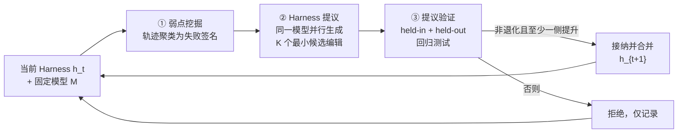

# Self-Harness：自我改进的 Harness

Self-Harness 是上海人工智能实验室提出的新范式：让 LLM 智能体改进**自己所运行的** [[Harness-Engineering|Harness]]，不依赖人类工程师，也不借助更强的外部智能体。论文将其实例化为一个 propose–evaluate–accept 迭代循环——从执行轨迹中挖掘模型特有的失败模式，据此提议有界且最小的 Harness 修改，再通过回归测试门禁决定是否接纳。

> **核心结果**：在 Terminal-Bench-2.0 上，从同一个极简 DeepAgent 初始 Harness 出发，Self-Harness 让三个不同家族的模型一致提升——held-out 通过率 MiniMax M2.5 从 40.5% 升至 61.9%，Qwen3.5-35B-A3B 从 23.8% 升至 38.1%，GLM-5 从 42.9% 升至 57.1%；绝对增益最高 21.4 个百分点，相对增益最高 138%。

与 [[Meta-Harness|Meta-Harness]] 由更强的外部智能体优化弱模型的 Harness 不同，Self-Harness 把改进回路内化到目标智能体自身：同一个固定模型既是被评估者，也是提议者。论文将三种范式并置——人工 Harness 工程、Meta-Harness（外部强者引导）、Self-Harness（自我改进），构成一条自主性递进的光谱。

---

## 动机：Harness 本质上是模型相关的

智能体的表现由基础模型与 Harness 共同塑造。Harness 涵盖系统提示、工具、记忆与状态管理、验证规则、权限策略、编排逻辑与失败恢复机制；同一个模型在不同 Harness 下表现差异显著。问题在于：不同模型有不同的行为模式、工具使用习惯、错误类型与提示敏感性，为甲模型调优的 Harness 对乙模型往往次优。随着新模型高速涌现，逐模型人工重设计 Harness 的范式在成本上不可持续。

论文同时指出一个常被忽视的事实：许多重要的智能体失败是 **Harness 层的失败**，而非单次模型回复的失败——未检查工件就宣称成功、反复重试无效动作、长上下文中丢失事实源、缺少恢复动作。这些行为从指令、观测、工具与运行时控制的交互中涌现，改进它们需要改动的不只是提示文本。

---

## 方法：三阶段迭代循环

### 形式化设定

固定模型 $M$ 与评估器 $\mathcal{E}$，Harness $h$ 是唯一被改进的对象。Self-Harness 操作的是一条 Harness 谱系 $h_0, h_1, \ldots$，每次转移对应一次对执行协议的**有界编辑**，而非模型权重更新。任务划分在优化前固定：held-in 集 $D_{\mathrm{in}}$ 提供轨迹与失败证据，held-out 集 $D_{\mathrm{ho}}$ 从不向提议者暴露，只用于自动晋升门禁。

### 循环总览

### 阶段一：弱点挖掘（Weakness Mining）

在 $D_{\mathrm{in}}$ 上运行当前 Harness，收集带验证器结果的执行轨迹。关键设计是不把失败当作孤立轶事：系统为每条失败轨迹归因出**失败签名** $\phi(r_i) = (c_i, q_i, m_i)$——$c_i$ 为验证器层面的终态原因，$q_i$ 为相关智能体行为的因果地位，$m_i$ 为轨迹暴露的抽象行为机制。只有签名完全一致（验证器拒绝了什么、智能体行为如何促成、涉及哪种可复用机制三者皆同）的失败才被聚为一类。聚类因此是确定性、验证器锚定的，目标是聚合「 plausible 地接受同一种 Harness 干预」的失败，而非挖掘轨迹间的语义相似性。

各簇按支持度与可干预性排序，汇成证据包 $B_t$。$B_t$ 只描述失败模式、不开处方，保持评估器与优化器职责分离。

### 阶段二：Harness 提议（Harness Proposal）

**同一个固定模型**在当前 Harness 下被调用为提议者，获得有界的提议上下文：当前 Harness 的可编辑面、失败模式、应保持不变的通过行为、历史已尝试编辑的摘要。提议者并行生成 $K$ 个互不相同的候选编辑 $\{(\Delta_j, a_j)\}$，每个编辑附带审计记录（目标失败模式、编辑面、预期行为效果、回归风险）。

约束是「分支间多样、分支内最小」：候选之间必须实质不同（不同机制、不同编辑面或不同假设），而单个编辑只许修改应对其目标机制所需的面，不得大范围重写控制架构。并非每个失败簇都值得修补——反映任务固有难度或模型能力上限的簇会被排除，只有具体、复发、且可由窄改动缓解的机制才被选为目标。

### 阶段三：提议验证（Proposal Validation）

候选编辑不会提议即生效。每个候选 Harness 与当前 Harness 在同一协议下同时于 $D_{\mathrm{in}}$ 与 $D_{\mathrm{ho}}$ 上评估，接纳规则为保守的非退化准则：

$$\Delta_{\mathrm{in}}^{(j)} \geq 0,\quad \Delta_{\mathrm{ho}}^{(j)} \geq 0,\quad \max(\Delta_{\mathrm{in}}^{(j)}, \Delta_{\mathrm{ho}}^{(j)}) > 0$$

只在两个划分间做权衡的提议一律拒绝，即便总通过数上升。评估有随机性时重复多次并对聚合通过数应用同一规则。同轮多个兼容候选可合并进下一版 Harness；被拒绝者只留日志。每次转移记录变更面、分侧结果、评估重复次数与接纳决策，整条 Harness 谱系因此完全可审计。

---

## 实验

### 设置

- **基准**：Terminal-Bench-2.0，89 个容器化终端任务中剔除依赖不稳定外部资源与多模态输入者，固定 **64 个**任务子集，分为 held-in / held-out 两个划分
- **模型**：MiniMax M2.5、Qwen3.5-35B-A3B、GLM-5，全程固定；同一模型兼任提议者，所有比较均为模型内比较
- **初始 Harness**：刻意极简的 DeepAgent 配置——一段简短的基准向系统提示、默认文件系统与 shell 工具，Self-Harness 只能修改声明过的配置点（指令、工具、验证指引等）
- **指标**：Pass (%)，每个候选 Harness 重复两次尝试取均值，由任务验证器对最终容器状态判定

### 主结果（Pass %）

| 模型 | held-in 初 → 终 | held-in 相对增益 | held-out 初 → 终 | held-out 相对增益 |
|---|---|---|---|---|
| MiniMax M2.5 | 43.0 → 50.0 | +16% | 40.5 → **61.9** | +53% |
| Qwen3.5-35B-A3B | 15.1 → 36.0 | **+138%** | 23.8 → 38.1 | +60% |
| GLM-5 | 47.7 → 57.0 | +20% | 42.9 → 57.1 | +33% |

三个后端在 held-out 上全部提升且无任何一侧退化，说明编辑瞄准的是可复用的执行机制而非对观测失败的过拟合，回归门禁也切实阻止了「拆东墙补西墙」式晋升。

### 演化轨迹与保留编辑

| 模型 | 演化轨迹（整体 Pass） | 保留编辑主题 |
|---|---|---|
| MiniMax M2.5 | 42.2% → 53.9% | 尽早创建必需工件、谨慎处理结构化工具内容、长工具循环后重定向 |
| Qwen3.5 | 20.3% → 36.7% | 依赖预检、工件检查与丢失恢复、重试纪律、工具错误触发的中间件 |
| GLM-5 | 46.1% → 57.0% | 跨 shell 会话保持环境变更、从探索转向实现与测试 |

三个模型共享一条主线——**工件可靠性**（「尽早创建」「工件中间件」「从探索转入实现」），但具体编辑高度模型相关：M2.5 聚焦内容标签格式与长工具调用后的重定向，Qwen3.5 引入依赖预检与精确命令重试的抑制，GLM-5 解决环境状态跨会话持久化。这印证了论文的中心论点：同一初始 Harness 对不同模型暴露不同的执行病理，Self-Harness 能据各自的失败机制选出针对性编辑。

### 轨迹级案例

- **M2.5（count-dataset-tokens）**：初始 Harness 下智能体找到相关元数据配置后仍继续探索数据集直至超时，未写答案工件；编辑后的 Harness 将 bootstrap 指令改为「识别必需工件并尽早创建初版」，并启用工具消息总数上限，智能体随即转入「识别子集 → 计算 → 写 `/app/answer.txt` → 读回验证」的具体工作流
- **Qwen3.5（extract-elf）**：初始 Harness 下智能体在反复的覆写与编辑失败后于停止前删除了 `/app/extract.js`，验证器因工件缺失判负；编辑后由工具错误触发的系统提示把智能体重定向回丢失的工件——重建提取器、修复解析逻辑、写出文件并做针对性 JSON 校验
- **GLM-5（build-pov-ray）**：初始 Harness 把大量预算耗在冗长的外部下载上，且在健全性检查反复非零时仍强行收尾；编辑后改为有界分阶段操作、先验证外部归档证据再投入，并先修复失败的渲染检查再定稿

值得注意的是，Self-Harness 还引入过超出局部修复的结构性机制——基于子智能体的任务分解与中间件创建——尽管 Qwen3.5 运行中子智能体与技能分支因无进一步增益而被门禁丢弃。

---

## 定位与局限

在 [[Harness-Engineering|Harness 工程]] 的版图里，Self-Harness 占据「人工工程」与「外部优化器」之间的中间地带：与 [[Meta-Harness|Meta-Harness]] 同样做 Harness 级优化，但改进是**被评估模型在当前 Harness 下提出的有界编辑**，而非外部搜索过程；与 Reflexion、agentic 上下文工程、STOP 等自我改进路线相比，被适应的对象不是回复策略、记忆或上下文，而是**显式声明的 Harness 状态**；与 [[AutoHarness|AutoHarness]] 相比，AutoHarness 在环境反馈闭环中由基础模型重写自己的约束代码，Self-Harness 则强调证据包驱动、回归测试门禁与完整可审计的谱系。[[Agentic-Harness-Engineering|智能体 Harness 工程]] 的可观测性驱动演化与之互补：前者依赖外部演化回路，Self-Harness 把回路内化。从 [[Harness-Continual-Learning|Harness 持续学习]] 的视角看，Self-Harness 正是「超越模型参数的持续适应」的一种受控实例。

论文的核心教益：**Harness 改进应被当作经验性的状态转移**——一次有用的编辑必须指明它要改变的行为、修改的面、 motivating 它的证据，以及证明晋升正当的评估结果。

局限同样明确：研究的是固定基准下的有界编辑，而非开放式自我改进；被接纳的编辑仍可能反映基准特有的失败模式；协议依赖验证器结果与轨迹记录的质量；高风险 Harness 变更需要比通过率非退化更强的接纳门禁。

---

## 相关研究

- [[Meta-Harness|Meta-Harness：模型 Harness 的端到端优化]] - 由更强外部智能体优化 Harness 的外环范式，Self-Harness 的直接对照
- [[AutoHarness|AutoHarness：自动合成代码 Harness]] - 基础模型在环境闭环中为自己合成约束代码
- [[Agentic-Harness-Engineering|智能体 Harness 工程：可观测性驱动的自动演化]] - 编码智能体 Harness 的外部演化回路
- [[Harness-Continual-Learning|Harness 持续学习]] - 超越模型参数的持续适应框架
- [[Harness-Engineering|Harness 工程]] - Harness 的统一分析框架
