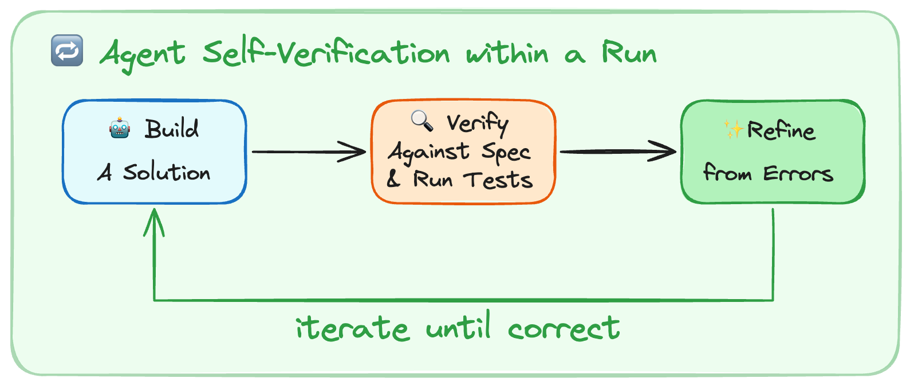
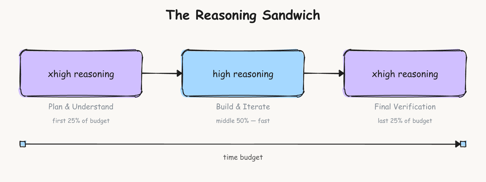

# 自我验证

**自我验证**（Self-Verification）是[[Harness-Engineering|Harness 工程]]中的关键技术，使智能体能够通过运行中的反馈自我改进。当今的模型是卓越的自我改进机器，但它们没有自然地倾向于进入这种**构建-验证循环**。

## 核心概念

### 最常见的失败模式

LangChain 团队观察到的最常见失败模式是：智能体编写解决方案、重读自己的代码、确认看起来没问题，然后停止。

测试是自主智能体编码的关键部分。它有助于测试整体正确性，同时为智能体提供信号来进行爬山优化。

## 构建-验证循环

LangChain 向系统提示中添加了关于如何解决问题的指导：

### 阶段 1：规划与发现
阅读任务、扫描代码库，并基于任务规格和如何验证解决方案构建初始计划。

### 阶段 2：构建
在考虑验证的情况下实现计划。如果测试不存在则构建测试，并测试愉快路径和边缘情况。

### 阶段 3：验证
运行测试、阅读完整输出、与要求的内容进行比较（而不是与你自己的代码）。

### 阶段 4：修复
分析任何错误、重新访问原始规格，并修复问题。

## LangChain 的实现

### PreCompletionChecklistMiddleware

除了提示外，确定性上下文注入有助于智能体验证它们的工作。LangChain 使用 `PreCompletionChecklistMiddleware` 在智能体退出前拦截它，并提醒它对任务规格运行验证通过。

这类似于 [Ralph Wiggum Loop|Ralph Wiggum 循环]]，其中一个钩子在智能体退出时强制其继续执行，用于验证。

### 强调测试

LangChain 真正专注于测试，因为它在每次迭代中推动变化。他们发现，测试必须是智能体工作流程的核心部分，而不是事后想法。

## 环境上下文工程

Harness 工程的一部分是**为上下文工程构建良好的交付机制。** Terminal Bench 任务带有目录结构、内置工具和严格的超时。

### 1. 目录上下文与工具
`LocalContextMiddleware` 在智能体启动时运行，映射 `cwd` 和其他父+子目录。运行 `bash` 命令来查找工具如 `Python` 安装。上下文发现和搜索容易出错，因此注入上下文减少了这个错误表面并帮助**将智能体引导到其环境中。**

### 2. 教导智能体编写可测试的代码
智能体不知道它们的代码需要如何可测试。添加提示说它们的工作将根据程序化测试来衡量，类似于提交代码时。例如，提及文件路径的任务规格应该被精确遵循，以便解决方案在自动化评分步骤中工作。强调边缘情况的提示有助于智能体避免仅检查"愉快路径"情况。强制模型符合测试标准是避免随着时间推移"烂泥堆积"的强大策略。

### 3. 时间预算
注入时间预算警告以推动智能体完成工作并转向验证。智能体在时间估计方面是出了名的糟糕，因此这种启发式在这种环境中有所帮助。现实世界编码通常没有严格的时间限制，但如果不添加任何约束知识，智能体就不会在时间范围内工作。

## 循环检测

智能体一旦决定了一个计划就可能变得短视，导致"末日循环"，对同一破碎方法进行小幅变异（在某些轨迹中超过 10 次以上）。

LangChain 使用 `LoopDetectionMiddleware`，通过工具调用钩子跟踪每个文件的编辑次数。它在对同一文件进行 `N` 次编辑后添加上下文如"……考虑重新考虑你的方法"。这可以帮助智能体从末日循环中恢复，尽管如果模型认为正确的话它可以继续沿着相同的路径前进。

重要提示：这是一种设计启发式，围绕当今感知的模型问题进行工程设计。随着模型改进，这些护栏可能会变得不必要，但今天帮助智能体正确和自主地执行。

## 推理三明治

推理模型可以自主运行数小时，因此必须决定在每个子任务上花费多少计算。你可以在每个任务上使用最大推理预算，但大多数工作可以从优化推理计算支出中受益。

Terminal Bench 超时限制创造了一个权衡。更多推理有助于智能体评估每个步骤，但可以燃烧超过 2 倍以上的 token/时间。`gpt-5.2-codex` 有 4 种推理模式，`low`、`medium`、`high` 和 `xhigh`。

LangChain 发现推理有助于规划以充分理解问题，一些 Terminal Bench 任务非常困难。一个好的计划有助于更快地得到可行的解决方案。

后期验证也从更多推理中受益，以捕获错误并提交解决方案。作为一种启发式，选择 xhigh-high-xhigh"**推理三明治**"作为基线。

**在规划和验证上花费更多的推理计算**

仅在 `xhigh` 运行由于智能体超时而得分较差，为 `53.9%`，相比之下在 `high` 为 `63.6%`。在推理预算分割的试验运行中没有大的差异，因此坚持使用他们的方法，将分数推到 `66.5%`。

## Harness 工程师的目的

**Harness 工程师的目的：准备和交付上下文，使智能体能够自主完成工作。**

智能体对其环境、约束和评估标准了解得越多，它们就能越好地自主自我指导工作。

## 相关概念

- [[Build-Verify Loop|构建-验证循环]]
- [[Reasoning Sandwich|推理三明治]]
- [[Doom Loop|末日循环]]
- [[Loop Detection|循环检测]]
- [[LangChain Harness Engineering|LangChain Harness 工程]]

## 参考来源

1. LangChain - Improving Deep Agents with harness engineering
2. Anthropic - Harness design for long-running application development

---

*最后更新：2026-04-07*  
*本文档由 [[WikiLLM]] 编译自多个来源*
