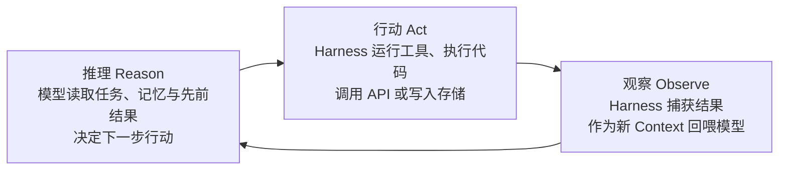

# 什么是 AI 智能体 Harness：Databricks 的概念解析

**AI 智能体 Harness** 是包裹在大语言模型外围的软件基础设施，它把模型的推理能力转化为可靠的行动：模型负责读 Context、判断下一步该做什么，Harness 负责把决策接通到工具、记忆、执行环境与护栏，让行动真正落地。用一句话概括：

> **Agent = Model + Harness（智能体 = 模型 + Harness）**

模型是"大脑"，负责推理与决策；Harness 是大脑之外让智能体安全可靠运转的一切，包括工具（API、代码执行、搜索、数据库）、记忆（历史 Context、用户偏好、工作流记录）、工作区（文件、数据与环境）以及护栏（权限、策略、审批与监控）。没有 Harness，模型可以回答问题，却无法可靠地运行代码、调用 API、读写文件、记住先前工作或独立完成多步骤任务。这一公式与 [[What-Is-Harness-Engineering|Harness 工程的定义性指南]] 及 [[Harness-Engineering|Harness 工程总论]] 中的表述一脉相承。

## 为什么智能体需要模型与 Harness 两层

现代智能体系统围绕"推理"与"执行"的分离来构建：模型（GPT、Claude、Llama 等）读取 Context 并决定下一步行动，Harness 把决定落实为对工具、记忆与外部系统的真实调用。两层互补，才能让智能体在真实工作流中稳定完成任务。这种"大脑与双手"的分工在 [[Managed-Agents-Decoupling-Brain-from-Hands|Managed Agents：将大脑与手分离]] 中被进一步推向平台化设计。

### 推理—行动—观察循环

多数智能体的核心是一个不断重复的循环，即 **ReAct 循环**（Reasoning + Acting，由 Shunyu Yao 等人 2022 年的论文提出）：

以修复 bug 的编码智能体为例：模型提出代码修改方案，Harness 在隔离沙箱中运行代码、捕获测试结果并回喂给模型；测试失败时，模型分析原因并重试。Harness 管理着与底层系统的全部交互，模型只需专注解题。对编码场景下循环细节的剖析可参见 [[Anatomy-of-an-Agent-Harness|智能体 Harness 的解剖]] 与 [[Harness-Engineering-Coding-Agents-Guide|编码智能体 Harness 工程指南]]。

## 智能体、模型与 Harness 的边界

三个术语常被混用，但指向系统的不同部分。厘清边界，团队才知道自己究竟在构建、调试或改进什么：

| 组件 | 职责 | 通俗类比 |
| :--- | :--- | :--- |
| 模型（Model） | 推理、预测、生成文本等内容 | 系统的"大脑" |
| Harness | 执行行动、管理记忆、运行工具、落实规则 | 大脑周围的"身体"与工作间 |
| 智能体（Agent） | 二者结合而成的完整工作系统 | 一个能思考也能动手的工人 |

## 生产级 Harness 的八大构件

可投入运营的 Harness 大多由同一批基础组件拼装而成，每个组件针对原始模型的一项局限：

1. **系统提示词（System Prompt）**：每次运行时发给模型的常驻指令，定义身份、目标与规则。写得不好的系统提示词是行为不一致最常见的根因。
2. **工具（Tools）**：模型可调用的预置函数——搜索网页、查询数据库、发邮件、跑代码。模型决定用哪个、何时用，Harness 负责真正执行并返回结果。值得注意的趋势是：开发者正从"大量窄定义工具"转向给智能体"编写并执行代码"的通用能力，让模型动态搭建工作流，而非依赖固定动作集（详见 [[Code-as-Agent-Harness|代码即智能体 Harness]]）。
3. **沙箱（Sandbox）**：隔离的工作区，智能体在其中运行代码而不影响外部环境。沙箱让智能体安全试错，也让团队能监控、重置或干净地关停环境，并支撑大规模并行运行。
4. **文件系统（Filesystem）**：为智能体提供跨会话持久的读写空间——代码、笔记、计划与中间产物。持久存储使智能体能在长任务中累积进度，并通过共享文件（而非仅聊天消息）与人或其他智能体协作。
5. **记忆与 Context 管理**：基础模型的记忆不超出当前 Context 窗口，Harness 在任务内与跨会话两个层面管理记忆：会话变长时决定保留什么、压缩什么（即 **Context 压缩**，context compaction），跨会话时存储并检索相关历史。深入讨论见 [[Memory-Systems|记忆系统]]。
6. **反馈循环与自验证**：优秀的 Harness 不只放行模型行动，还会检查成果——每步之后跑测试、检查结果、或要求模型自审后再继续。正是这些反馈循环让智能体可靠地完成长而复杂的任务：反复尝试、校验、纠错、自动调整方向。
7. **护栏与人在环（Human-in-the-loop）**：护栏是内建于 Harness 的规则，拦截不安全或未获批准的行动，例如删除文件、给客户发消息、下单付款前必须经人批准。在企业环境中，这类审批节点往往是强制要求。
8. **可观测性（Observability）**：通过日志、trace 与仪表盘看清智能体做了什么、为何如此决策、在哪里出错。对开发者它是调试手段；对受监管行业它是合规刚需——审计轨迹必须精确记录智能体以谁的授权做了什么。规模化之后，可观测性还反哺评估基础设施：在成千上万次运行（而非演示）中持续衡量智能体是否正确履职。

## Harness 质量如何决定同一模型的表现

随着模型原始能力趋同，Harness 日益成为性能的决定变量：记忆、工具编排、反馈循环与护栏共同驱动可靠性。公开基准上，同一模型仅因 Harness 构建方式不同，名次可能大幅起落；对工作流密集型任务，"中等模型 + 强 Harness"经常胜过"强模型 + 弱 Harness"。

影响是可量化的。Databricks 将 GPT-5.5 接入面向复杂多段企业文档任务的 **OfficeQA Pro Agent Harness** 后，得分从 GPT-5.4 的 36.10% 升至 **52.63%**，错误近乎减半——模型在进步，但真正把进步转化为生产可靠性的，是 Harness。[[Importance-of-Agent-Harness|Philipp Schmid 的短评]] 从基准评测的角度得出了相同结论：榜单差距无法反映长程任务中的耐久性，Harness 才是弥合基准宣传与真实体验的桥梁。

## Prompt 工程、Context 工程与 Harness 工程的分野

Harness 工程是开发者与 AI 系统协作方式演进的最新阶段：随着模型能力增强，工程重心不断外移——从写好提示词，到控制模型看见什么信息，再到设计模型周围的整个系统。

| 学科 | 关注点 | 主要工件 | 典型应用 |
| :--- | :--- | :--- | :--- |
| Prompt 工程 | 措辞以获得更好的回答 | 精心撰写的 Prompt | 早期 LLM 应用 |
| Context 工程 | 策划模型在何时看见何种信息 | 检索管道、记忆设计 | RAG 时代的应用 |
| Harness 工程 | 设计模型周围的完整系统——工具、沙箱、循环、护栏 | Harness 本身 | 智能体系统与自治工作流 |

三者的关系是包含而非并列：Prompt 与 Context 工程都活在 Harness 工程之内，是 Harness 系统的两个部件。关于这一演进脉络的历史梳理，参见 [[From-Weights-to-Context-to-Harness|从权重到 Context 再到 Harness]]。

## 生产环境中的典型失效模式

Harness 威力大，却极易做错。多数运营中的智能体故障源自 Harness 而非模型本身，常见问题包括：

- **Context 腐烂（Context rot）**：对话历史膨胀导致推理质量退化，缺乏修剪或摘要策略时，长任务必然崩溃。
- **工具过载（Tool overload）**：一次性给模型太多工具，开工之前就增加混淆、拖慢决策。
- **脆弱的工具接线（Brittle tool wiring）**：工具描述或调用方式的细微改动会让模型误用工具，造成难以诊断的静默失败。
- **延迟**：多步骤、多工具调用的智能体响应可能超过 10 秒，体验糟糕。
- **无关检索**：Harness 从记忆或搜索系统取回错误信息，模型便会自信地给出错误答案。
- **验证薄弱**：缺少测试循环或自检时，智能体会过早收工，或在半成品上宣布成功。
- **护栏缺失**：智能体在缺乏监督与人工批准的情况下执行不可逆操作——发消息、删数据、下单。

## Harness 与企业 AI 战略

多数企业并非构建单个智能体，而是在不同团队、工作流与底层模型之上构建数十个。若缺乏统一的 Harness 设计方法，很快形成 **智能体蔓延（agent sprawl）**：彼此孤立的智能体没有任何一个团队能可靠地治理、评估或改进。

应对之道是把 Harness 当作**共享基础设施**来建设：集中管控智能体可访问什么、可执行何种行动、结果如何评估，同时获得可审计性、可观测性，以及更换底层模型而不重建外围系统的灵活性。Databricks 自家的 Agent Bricks 即按此控制面思路设计——治理由 Unity Catalog 落实，可观测性与评估由 MLflow 承担，并支持跨 OpenAI、Anthropic、Google 及开源生态的模型。平台化路径的更多讨论见 [[Agent-Harness-Platform-Playbook|智能体 Harness 平台手册]]。

## 模型变强之后，Harness 会怎样

模型在规划、多步推理与纠错上持续变强，今天由 Harness 承担的部分工作未来会向模型一侧迁移。但 Harness 工程不会消失：执行环境、工具编排、护栏、可观测性与反馈循环仍然决定模型能否在真实系统中可靠运转——更好的工具、更干净的工作区与更强的防护，对任何水平的模型都是增益。两个正在浮现的方向值得留意：

- **一次性 Harness（Disposable harnesses）**：为单个工作流临时构建、用完即弃的轻量 Harness，随执行环境 provisioning 变快变便宜而日益可行。
- **自然语言智能体 Harness（NLAH）**：工程师用自然语言描述智能体应有的行为，由共享运行时解释执行，大幅降低构建与复用 Harness 的门槛（详见 [[Natural-Language-Agent-Harnesses|自然语言智能体 Harness]]）。

模型承载智能，Harness 把智能变成可靠的工作——只要这一点成立，Harness 设计就始终重要。

## 相关研究

- [[Importance-of-Agent-Harness|Harness 的重要性：Philipp Schmid 的 2026 年观察]]——从基准失效与"苦涩教训"角度论证 Harness 的必要性
- [[What-Is-Harness-Engineering|什么是 Harness 工程：2026 定义性指南]]——Atlan 对同一概念的产业化定义，强调 guides/sensors 与数据层
- [[Harness-Engineering-Self-Improvement|Harness 工程与自我改进：Lilian Weng 的框架]]——把 Harness 从部署基础设施提升为递归自我改进的研究对象
- [[Harness-Runtime-Substrate|Harness 运行时基座]]——从运行时 substrate 视角对 Harness 八构件的系统化重述
