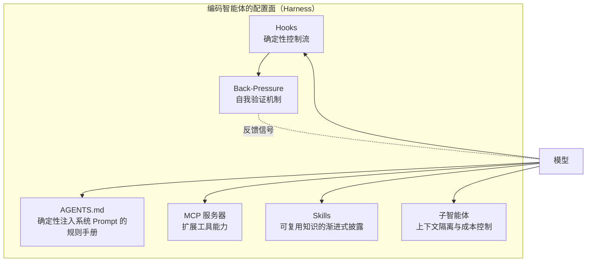

# 编码智能体的 Harness 配置实战：HumanLayer 的五大配置面

本文编译自 HumanLayer 工程博客（作者 Kyle，2026 年 3 月），是一篇基于数十个项目、数百次智能体会话沉淀下来的 [[Harness-Engineering|Harness 工程]]实战指南。标题中的 "Skill Issue" 一语双关：当编码智能体表现不佳时，问题往往不在模型，而在配置——也就是「使用者水平问题」。文章系统梳理了五个最有杠杆的配置面：**AGENTS.md、MCP 服务器、Skills、子智能体、Hooks**，外加 Back-Pressure 验证机制，与 [[Anatomy-of-an-Agent-Harness|LangChain 的 Harness 解剖学]]的组件推导互为表里。

## 问题背景：不是模型问题，是配置问题

HumanLayer 团队花了一年时间观察编码智能体以各种方式失败：无视指令、未经提示就执行危险命令、在简单任务上原地打转。每次失败后的本能反应都一样——「等 GPT-6 就好了」「等指令遵循能力更强就好了」「等训练数据覆盖到我用的库就好了」。

但在数十个项目之后，团队反复抵达同一个结论：**这不是模型问题，而是配置问题**。模型确实会变聪明，部分既有失败模式会消失；但正因为模型更聪明，人们会把更大更难的任务交给它，它仍会以意想不到的方式失败。对非确定性系统而言，意外失败模式是本质问题，不会因模型升级而根除。

真正值得回答的问题是：**如何把今天的模型榨出最大价值？**行业共识公式在此再次登场：

```
coding agent = AI model(s) + harness
```

Skills、MCP 服务器、子智能体、记忆、AGENTS.md——这些概念彼此独立，但都属于编码智能体的「配置面」，合起来就是智能体的 [[What-Is-an-AI-Agent-Harness|Harness]]：模型借以与环境交互的运行时与外设。

## Harness 工程是 Context 工程的子集

HumanLayer 将 Harness 工程视为 Context 工程（其联创 Dex Horthy 在 [12-factor agents](https://github.com/humanlayer/12-factor-agents) 中提出）的子集：Context 工程是 Prompt 工程的超集，而 Harness 工程是其中**专门利用 Harness 配置点来精细管理编码智能体上下文窗口**的那部分。它回答的问题包括：

- 如何赋予编码智能体新能力？
- 如何教会它训练数据中没有的代码库知识？
- 如何在系统消息里写 `CRITICAL: always do XYZ` 之外引入确定性？
- 如何防止上下文窗口膨胀过快、或被劣质 Context 污染？

各家视角略有差异：Viv Trivedy 提出四大定制杠杆（系统 Prompt、工具/MCP、Context、子智能体，详见 [[Anatomy-of-an-Agent-Harness|Harness 解剖学]]），HumanLayer 补上两根杠杆——**Hooks**（自动化集成与确定性控制流）和 **Skills**（知识的渐进式披露，Dex 称之为 "Instruction Modules"）。[[OpenAI-Codex-Harness-Engineering|OpenAI 的 Harness 实践]]则更聚焦 Back-Pressure 与验证机制。

### 子智能体是「上下文防火墙」

在企业级棕地代码库中解决难题数月之后，HumanLayer 发现子智能体是格外强力的杠杆：当一个问题需要消耗许多个上下文窗口才能解决时，**子智能体是跨会话维持连贯性的关键**。它充当「上下文防火墙」，让离散任务在隔离的上下文窗口中运行，中间噪声不会累积到负责编排的父线程中。

### 后训练耦合之争：模型会过拟合自己的 Harness

一种常见论调是：前沿编码模型都在自家 Harness 上做过后训练（Claude 配 Claude Code、GPT-5 Codex 配 Codex），所以最好的 Harness 就是模型训练时用的那一套。佐证是 Codex 模型与 `apply_patch` 工具耦合极深，开源替代品 OpenCode 不得不专门为 GPT/Codex 模型实现 `apply_patch` 工具来模拟 Codex Harness。

但这件事是双向的：**模型可能对自己的 Harness 过拟合**。关键数据点来自 Terminal Bench 2.0 排行榜：Opus 4.6 在 Claude Code 中排名第 33 位，换到一个后训练中从未见过的 Harness 后升至第 5 位（±4 名浮动）。LangChain 团队的 [[LangChain-Harness-Engineering|完整实验]]记录了这一跃迁，[[Meta-Harness]] 的自动搜索结果也印证了「同一模型换 Harness 可有数倍性能差」。

## 五大配置面详解



### 1. CLAUDE.md / AGENTS.md：先从这里开始

在动任何其他配置点之前，通常值得先打磨仓库根目录的 CLAUDE.md / AGENTS.md——Harness 会将其内容确定性地注入系统 Prompt。

**ETH Zurich 研究**是绕不开的数据点：苏黎世联邦理工学院测试了 138 个 agentfile，结论乍看令人沮丧——

- LLM 自动生成的 agentfile **反而损害性能**，同时成本高出 20% 以上
- 人工撰写的也只带来约 4% 的提升
- 智能体处理上下文文件指令要多花 14–22% 的推理 Token，步骤更多、工具调用更多，解决率却没有提升
- 代码库概览和目录清单完全无用——智能体自己就能摸清仓库结构

但细读会发现，研究结论恰好验证了 HumanLayer 此前提出的原则：不要自动生成、指令越少越好、无关内容用渐进式披露、保持简洁且普遍适用（条件规则过多正是人工撰写文件收益微薄的原因）。HumanLayer 自己的 CLAUDE.md **不到 60 行**。关于正反两面经验的更多讨论见 [[Harness-Engineering-for-Coding-Agent-Users|面向编码智能体用户的 Harness 工程]]。

### 2. MCP 服务器是工具入口

MCP 服务器的本职是为编码智能体接入超越文件读写和 Bash 的工具能力。规范里还有 resources、prompts、elicitations 等特性，但 MCP 客户端与编码智能体 Harness 普遍支持不佳。

接入一个 MCP 服务器后，其工具列表、描述与参数会被**注入智能体的系统 Prompt**——由此引出两条铁律：

- **安全警告**：工具描述是进入系统 Prompt 的可信文本，绝不连接不可信的 MCP 服务器，那是 Prompt 注入的危险通道；本地 STDIO 服务器（npx/uvx）还能直接在你机器上执行代码。
- **工具过多有害**：插太多 MCP 工具，上下文窗口很快被工具描述塞满，智能体更早跌进「变笨区」（dumb zone）。指令预算（instruction budget）同样吃紧——每条无关工具描述都是智能体必须白处理的指令。Anthropic 甚至为此发布了实验性的 MCP 工具搜索功能，在工具过多时渐进披露。原则很简单：**不在用的服务器就关掉**。

另一个经验法则：如果 MCP 服务器重复了训练数据中已有充分语料的 CLI 功能，直接提示智能体用 CLI 效果更好。GitHub、Docker、常见数据库都有成熟 CLI，模型早已会用，还能与 `grep`、`jq` 组合出更高的上下文效率。

**Linear 实战案例**：HumanLayer 曾使用 Linear 的 MCP 服务器，后来发现只用到了其中一小撮工具，于是自研了一个封装 Linear API 的小型 CLI，返回结果高度精简，并在 CLAUDE.md 里写了 6 条用法示例（查工单、列工单、加评论、加链接、改状态、取分支名）。此举从系统 Prompt 省下了 MCP 工具定义的数千 Token，又从冗长的服务器响应里省下更多。

### 3. Skills 承载可复用知识（和工具）

Skills 由 Anthropic 为 Claude Code 首创，现已成为 Codex、OpenCode 等 Harness 支持的开放标准。结构细节见 [[Skill-Systems|技能系统]]，这里关注的是它为什么有用。

**安全前置**：技能仓库已被发现分发数百个恶意 skill。对待 skill 要像对待 `npm install 来路不明的包`——安装前先读代码，ClawHub、skills.sh 这类注册表都能在你机器上执行任意代码。

**渐进式披露（Progressive Disclosure）**：早期 HumanLayer 把每条指令、每个工具都塞进系统 Prompt，结果智能体越变越差——还没开始干活，指令预算已经烧完。Skills 的解法是让智能体只在判定需要时才获得特定指令、知识或工具。

**激活机制**：skill 激活时，其目录下的 `SKILL.md` 以用户消息形式载入上下文窗口，智能体同时获知该文件所在目录。`SKILL.md` 可以声明随包携带的其他资产：

```
example-skill/
├── SKILL.md
├── response_template.md
└── CLIs/
    ├── linear-cli
    └── tunnel-cli
```

每个 skill 独占一个目录，渐进式披露可以做得更细：包内放多份面向不同功能的 markdown，主 `SKILL.md` 负责说明各文件内容与读取时机。

**用 Skills 分发工具**：skill 无法直接打包 MCP 服务器或自定义工具，但可以把工具写成可执行文件、CLI 或 NPM 包随 skill 分发（或在 skill 文件中指导智能体安装）。例如不必配置 Playwright MCP 服务器，直接给智能体一个使用 BrowserBase agent browser skills 或 Vercel agent-browser CLI 的网页浏览 skill。

### 4. 子智能体负责上下文控制

子智能体是被误解最深的配置点。HumanLayer 试过「前端工程师」「后端工程师」「数据分析师」式的角色分工——不管用。管用的用法是**上下文控制**：把一整个编码会话的工作量封装起来，派发方只看到写给子智能体的 Prompt 和它的最终结论，中间所有工具调用、工具结果、消息都不会进入父智能体的上下文窗口。把工作拆成离散任务委派给子智能体，是让主线程留在「聪明区」的核心手段。

**Context Rot 的实证**：Chroma 的 context rot 研究测试了 18 个模型的 needle-in-a-haystack 任务，发现性能随上下文变长而下降——即使简单任务也不例外；当问题与上下文中相关信息的语义相似度低时，衰减更陡，且干扰效应在长上下文中复利累积。这与实践经验完全吻合：父会话里每一次无关的工具调用、grep 结果、文件读取都是潜在干扰源。

**对长上下文模型的质疑**：扩展上下文版本通常不是「更大的模型配更大的指令预算」，而是同一个模型加上 YaRN 之类的位置编码外推技巧。大海捞针问题里，更大的上下文窗口并不会让模型更会找针——只是把草垛堆得更高。如果你觉得需要更长上下文，真正需要的可能是更好的上下文隔离：子智能体从结构上解决——每个子智能体获得全新、小巧、高相关的上下文窗口和新的指令预算，只有浓缩后的结论回流父线程，相当于为一个问题缝合多个上下文窗口。

**适用场景**：定位代码库中的定义或实现、分析某类工作的既有模式、跨服务边界追踪请求链路、通用代码/文档/网络研究。这类任务问题直接、答案简单，但中间工具调用繁多，不该污染父会话。子智能体应返回高度浓缩且遵循渐进式披露原则的结论：给出答案的同时以 `filepath:line` 或 URL 形式注明出处，父智能体需要细节时可自行回溯。Claude Code 还内置了任务特化的子智能体，如代码库探索用的 `Explore`、执行冗长 Bash 命令并提炼结果的 `Bash`。

**成本控制**：父会话用昂贵的 Opus 承担规划与编排等重思考任务，子智能体用更便宜更快的 Sonnet 或 Haiku——子任务小而离散，不需要为一次代码库 grep 燃烧 Opus Token。

**Harness 不支持子智能体怎么办**：可以写一个 MCP 服务器，提供一个「启动新智能体会话」的工具——接收父智能体的 Prompt、以之作为用户消息启动新会话、把最终回复返回父方。注意两点：在原生支持子智能体的 Harness 上叠加此模式会造成「子智能体再派生子智能体」的传话游戏；多数 Harness 有 MCP 工具调用超时限制，需要调大。编写子智能体系统 Prompt 时务必明确：角色边界（该做什么，更该明确**不**做什么）、返回什么信息以及以何种格式返回、配哪些工具。

### 5. Hooks 负责控制流

Claude Code 的 hooks 是在智能体生命周期特定事件点自动执行的用户自定义命令或脚本；OpenCode 的 plugins 是同类机制（Codex 目前尚无等价物）。概念上类似 git hooks，但更灵活：新增功能、对接外部服务、自动化例行操作、修改权限、配置默认行为皆可。

一个 hook 通常能：事件发生时静默执行；在工具调用时运行并向智能体返回补充 Context；在智能体收尾前把构建/类型错误抛给它，迫使它修完再收工。常见用法：

- **通知**：任务完成或审批悬置过久时播放提示音
- **审批**：按输入值与更丰富的规则自动批准或拒绝工具调用——例如自动拒绝任何试图跑数据库迁移的 `Bash()` 调用，并提示改为请用户手动执行
- **集成**：完成时发 Slack 消息、创建 GitHub PR、拉起预览环境
- **验证**：若类型检查或构建能在几秒内跑完，就在智能体每次停下时运行，把错误暴露给它

**示例 hook**：HumanLayer 仓库在 Claude 停下时运行 biome 格式化与 TypeScript 类型检查。脚本先跑 prebuild（生成类型、构建内部 SDK 包、`bun install`），随后并行执行 biome 与 typecheck。有个细节：biome `--write` 只要做了修改就以退出码 1 结束（即使全部修复成功），所以连跑两遍并用 `||` 衔接。成功时 hook 完全静默，什么都不进上下文；失败时只暴露错误，退出码 2 通知 Harness 重新激活智能体修错。这正是「成功静默、失败啰嗦」原则的实现，与 [[Agent-Harness-Engineering-Osmani|Osmani 综述]]中的 enforcement layer 论述一致。

## Back-Pressure 提升成功率

HumanLayer 的核心洞察：**用编码智能体成功解题的概率，与智能体验证自身工作的能力强相关**。建设测试与其他 Back-Pressure 机制是他们投入回报最高的事项之一，[[Harness-Engineering-Coding-Agents-Guide|Faros 的实践指南]]同样把验证回路列为生产级 Harness 的核心层。可落地的验证机制包括：

- 类型检查与构建步骤（最好用强类型语言）
- 单元测试与集成测试
- 代码覆盖率报告（HumanLayer 有一个 `Stop` hook，覆盖率下降时提示智能体补测）
- UI 交互与测试集成（Playwright、agent-browser 等）

关键要求是**上下文效率**：早期他们让智能体每次改动后跑全量测试，4000 行通过日志瞬间淹没上下文窗口，智能体随后迷失任务、开始对着刚读过的测试文件幻觉。现在的做法是吞噬成功输出、只暴露失败——构建同理，成功静默，失败才啰嗦。所有机制的用法都以简洁指令写进 CLAUDE.md，部分打包进 skills 做渐进式披露。

## 可操作的采纳建议

完全可能在「优化智能体配置」上花的时间比真正用智能体交付代码还多——HumanLayer 自己也踩过。他们的原则是**向交付倾斜**：只在确实能更快交付更高质量代码时才投入 Harness 配置；智能体失败时花时间设计机制杜绝同类失败，但不提前臆造问题。

| 无效做法 | 有效做法 |
| :--- | :--- |
| 在遭遇真实失败前就设计理想配置 | 从简起步，只在智能体真的失败时加配置 |
| 「以防万一」安装几十个 skills 和 MCP 服务器 | 设计、测试、迭代，没用的果断丢弃（被扔掉的 hook 远比在用的多） |
| 每次会话结束跑 5 分钟以上的全量测试 | 改跑子集，保持反馈回路紧凑 |
| 微操哪个子智能体能访问哪些工具（导致工具抖动，结果更差） | 通过仓库级配置把验证过的配置分发给全团队 |
| 追求「一次做对」 | 优化迭代速度而非一击命中率 |
| 一次性暴露全部能力 | 先给能力（如 Linear），摸清所需后再精细裁剪暴露面 |

下次编码智能体表现不符预期，先别怪模型，检查 Harness：agentfile、MCP 服务器、skills、子智能体、hooks、Back-Pressure——杠杆大多在这里。模型多半没问题，那只是个 skill issue。

## 相关研究

- [[Anatomy-of-an-Agent-Harness|智能体 Harness 解剖学]] - LangChain 从模型能力边界推导各组件存在原因的概念框架，与本文的实战配置面互为印证
- [[Agent-Harness-Engineering-Osmani|智能体 Harness 工程（Osmani 综述）]] - 把本文的「skill issue」重构、棘轮原则与各家观点串成的综合论述
- [[Harness-Engineering-Coding-Agents-Guide|Harness 工程实践指南]] - Faros 的五层生产级 Harness 架构与度量体系，本文的 Back-Pressure 对应其验证回路层
- [[Skill-Systems|技能系统]] - Skills 与渐进式披露机制的概念页
- [[LangChain-Harness-Engineering|LangChain Harness 工程实践]] - Terminal Bench 2.0 排名跃迁的完整实验记录
