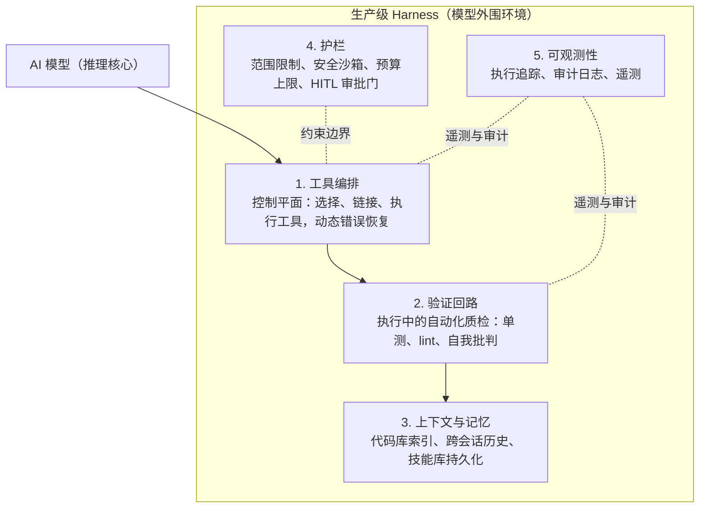

# Harness 工程实践指南：构建更可靠的 AI 编码智能体

本文编译自 Faros AI 工程博客（作者 Neely Dunlap，2026 年 5 月发布、7 月更新），核心论点是行业共识公式：**智能体 = 模型 + Harness**。模型负责构建原始推理能力，Harness 负责将推理转化为可靠、可落地的行动。Harness 工程是继 Prompt 工程、Context 工程之后 AI 工程成熟度的第三阶段，也是 2026 年工程投入的主战场。

## AI 工程成熟度的三阶段演进

AI 工程的关注点经历了从「语言」到「信息」再到「环境」的迁移：

| 阶段 | 时期 | 核心学科 | 关注焦点 | 软件工程重心 | 主要交付物 |
| :--- | :--- | :--- | :--- | :--- | :--- |
| 1 | 2022–2023 | Prompt 工程 | 如何与模型对话 | 语法与措辞：打磨自然语言指令以获得更好的逻辑 | 代码片段：自动补全与样板代码 |
| 2 | 2024–2025 | Context 工程 | 模型知道什么 | 相关性与记忆：为上下文窗口筛选恰当的数据与规则 | 特性逻辑：具备上下文感知的文件与系统级修改 |
| 3 | 2026 | [[Harness-Engineering]] | 模型被允许如何行动与自我纠错 | 自主与控制：为智能体搭建反馈回路与安全护栏 | 自主任务：端到端的任务执行与验证 |

第三阶段的核心信条由 Mitchell Hashimoto 提出：「每当发现智能体犯错，就花时间设计一套机制，让同类错误永不复发。」多数情况下，这套机制就是一次 Harness 改进。

## 为什么编码智能体倒逼 Harness 工程

Faros 的《AI Engineering Report 2026》发现：AI 普及使代码变更规模更大、复杂度更高、爆炸半径更宽；同时 AI 生成代码表面质量极佳，读起来像资深工程师的手笔，评审者需要在其中搜寻细微错误，认知负担极重——评审疲劳积累、错误漏网，未审代码以更高的速率进入生产，Faros 称之为「资深工程师税」。

投喂更好的 Context 有帮助，但无法根治问题。真正需要的是一个围绕智能体的框架：强制验证、限制范围、跨任务维持问责。Anthropic 的研究指出了若干模型固有、但可在 Harness 层解决的失败模式：

- **宣布胜利偏差**：智能体常在未验证结果的情况下标记任务完成
- **上下文焦虑**：上下文窗口接近饱和时模型会「恐慌」，偷工减料赶进度
- **一次性蛮干**：智能体试图一次解决整个问题，留下一团缺乏文档的变更

Harness 价值的实证：2026 年 3 月，[[LangChain-Harness-Engineering|LangChain 团队]]在不更换底层模型的前提下，仅靠优化 Harness 将编码智能体在 Terminal Bench 2.0 上从第 30 名提升至第 5 名。

## Harness 的「均衡器效应」：开源模型的竞技场

Faros 用自研的 AI 模型路由评估框架跑了 211 个真实工程任务，对比开放权重模型与前沿模型。结论颇具冲击力：搭配高度优化的 Harness 后，GLM-5.2 与 Kimi K2.6 等开源模型跻身最高质量档，在真实编码任务上追平甚至超越 Opus 4.8、GPT-5.5 等昂贵的前沿路由。工程师从不孤立使用裸模型——他们总是通过决定上下文加载方式、工具调用方式、失败处理方式的 Harness 来使用模型——因此 Harness 成为终极均衡器：投资生产级 Harness，就不必为前沿模型的智力支付溢价。

## 预置 Harness 与定制 Harness

多数 AI 编码工具自带默认 Harness。以 Claude Code 为例，开箱即具备文件读写工具、终端命令执行、多步执行循环以及危险动作前的人工审批控制。默认 Harness 让它成为智能体而非聊天机器人，但只是起点而非成品。

一家中型金融科技公司的典型场景：默认 Harness 允许智能体读写文件、运行测试，但团队还有默认 Harness 未覆盖的要求——凡触及支付逻辑的 PR 必须先通过自研合规检查器；智能体未经人工签核不得修改数据库迁移文件；全部智能体活动须写入内部审计系统以满足监管审查。这些都不在默认 Harness 内，团队只能自行搭建：在智能体与代码库之间加一层定制层，在每次运行中强制执行上述规则。模型没变，默认 Harness 没变，变化的是团队围绕其构建的脚手架。

扩展机制包括：通过 MCP 服务器接入内部 API、专有数据库、工单系统与合规检查；仓库中的 CLAUDE.md 自动向每个会话注入团队专属指令，充当轻量而持久的 Harness 定制；更成熟的团队会搭建完整编排流水线，把 Claude Code 当作更大工作流中的一环——一个智能体分诊工单，Claude Code 撰写修复，第二个智能体在 PR 开启前评审。关于用户侧实践可参考 [[Harness-Engineering-for-Coding-Agent-Users|面向编码智能体用户的 Harness 工程]]。

关键区分：**预置 Harness 赋予智能体通用可靠性，定制 Harness 赋予组织级问责。两者皆不可或缺，互不替代。**

## 生产级 Harness 的五层架构

现代化的生产级 Harness 是一个由编排、验证、记忆、护栏、可观测性组成的分层系统：

| Harness 组件 | 内涵 | 价值 |
| :--- | :--- | :--- |
| 工具编排 | 决定智能体如何选择、链接、执行工具（API、Shell）并动态从错误中恢复的控制平面 | 将脆弱脚本转化为韧性自主工作流，能驾驭不可预测的真实环境 |
| 验证回路 | 在执行过程中（而非仅在结束时）评估中间成果的自动化质检（单测、自我批判） | 快速失败，阻止错误复利累积，节省算力成本并提升准确率 |
| 上下文与记忆 | 索引特定代码库、跨会话保留对话历史与定制技能的系统 | 消除重复铺垫 Prompt 的开销，确保智能体严守企业专有设计模式 |
| 护栏 | 硬编码的边界限制、安全沙箱、预算上限与人机协同（HITL）审批门 | 防止成本失控、未授权数据访问与破坏性基础设施操作，化解企业风险 |
| 可观测性 | 捕获智能体精确输入、行为结果与状态的完整遥测、执行追踪与审计日志 | 打开 AI 决策黑盒，支撑失败调试、回归检测与可靠性举证 |

各层要点：

- **工具编排与验证**：编排是中枢神经系统，把模型从被动文本生成器变为能执行多步工作流的自主行动者；关键在动态错误处理——识别异常、调整策略、无需人工介入即可恢复。验证回路则是自动化质保层，在每个步骤后即刻运行单测、linter 与自我批判，捕捉幻觉与逻辑缺陷，避免早期小错复利成不可挽回的大败局。
- **上下文与记忆**：赋予智能体连续性，使其从通用助手进化为团队的专属延伸；持久记忆让智能体遵循既有设计模式、复用技能库，更快解决重复性问题。
- **护栏**：定义自主智能体的安全运行边界，敏感或不可逆操作（如修改生产数据库）必须通过 HITL 审批门，最终裁决权留在工程师手中。
- **可观测性**：通过执行追踪与审计日志，工程师可回放失败运行中任意时刻的工具输入与环境状态；同时为系统性评估与回归检测供能，把坊间传闻式的智能体行为转化为可量化的指标。[[OpenAI-Codex-Harness-Engineering|OpenAI Codex 的 Harness 实践]]同样将可观测性视为迭代核心。

## 工程领导者的度量指标体系

度量应按数据可得性分阶段推进，先用现有系统能拉取的指标建立基线，再随基础设施成熟逐层解锁。

**统一口径**：「任务」指一项以可评审交付物（通常是 PR 或关闭的工单）收尾的工程工作；与智能体的单次对话、单次工具调用只是原材料，任务才是交付单位。全团队统一任务定义，成功率与失败率才具可比性。

**三阶段推进**：

1. **阶段 1（现在就能测）**：利用现有数据——PR 周期、AI 供应商账单、人数、git 历史——建立成本与流水线影响的基线
2. **阶段 2（会话-PR 链路打通后）**：这是最难也最有价值的基础设施——把每个智能体会话关联到其创建的 PR，按工程师意图（构建、探索、提问）标注会话，把缺陷与事故回溯到具体的智能体辅助 PR
3. **阶段 3（能分类任务或做调研后）**：需要任务复杂度分类体系或定期工程师问卷；问卷类指标当作文化信号解读；智能体密集团队的工程师留存率也值得跟踪，但属于需要一年以上才显现规律的慢信号

| 指标 | 回答的问题 | 计算方式 | 所需数据（阶段） |
| :--- | :--- | :--- | :--- |
| 每个合并 PR 的美元成本 | 每个交付 PR 的 AI 费用 | AI 总支出 ÷ 窗口内合并 PR 数 | AI 账单 + PR 数据（阶段 1） |
| 每位活跃开发者的算力支出 | 人均 AI 成本 | AI 总支出 ÷ 活跃开发者数 | AI 账单 + HR 数据（阶段 1） |
| 智能体辅助 PR 的合并时长 | 智能体相关工作交付耗时 | AI 触及 PR 从开启到合并的时长 | 带 AI 标记的 PR 数据（阶段 1） |
| 智能体辅助 PR 的规模 | 智能体 PR 与人类 PR 的体量对比 | AI 触及 PR 与人写 PR 的平均变更行数对比 | 带 AI 标记的 PR 数据（阶段 1） |
| 智能体代码的 churn 率 | 智能体代码多快被重写 | 两周内被删除或重写的智能体新增行数 | 带 AI 标记的 git 历史（阶段 1） |
| 相对 PR 规模的评审速度 | 评审者能否跟上体量 | 评审时长 ÷ 变更行数，按 AI/人类 PR 分组 | PR 评审数据（阶段 1） |
| 首次通过率 | 智能体一次做对真实实现任务的频率 | 一次成功的会话数 ÷ 全部实现意图会话数 | 会话-PR 链路 + 意图标注（阶段 2） |
| 智能体 PR 存活率 | 一个月后智能体代码留存比例 | 合并 30 天后仍在主线的智能体代码行 ÷ 原始智能体代码行 | 会话-PR 链路 + git 历史（阶段 2） |
| 智能体变更的缺陷逃逸率 | 缺陷追溯到智能体工作的频率 | 关联智能体 PR 的事故数 ÷ 智能体 PR 总数 | 会话-PR 链路 + 事故跟踪（阶段 2） |
| 各职级任务复杂度分布 | 智能体工作是否改变各职级承担的任务 | 按工程师职级分解的任务复杂度随时间变化 | 任务复杂度评分 + 职级数据（阶段 3） |
| 评审者疲劳度与信任度 | 评审者的疲惫或信任程度 | 季度简短问卷，跨期追踪 | 每季度工程师问卷（阶段 3） |

**会话-PR 链路是度量地基**：它是度量基础设施中最难建也最有价值的部分，投入智能体度量的领导者应优先建成链路，指标随后自然跟上。

**指标报警时先看 Harness**，三种常见模式：

- 任务失败 → 多为 Harness 问题：上下文给得不全、跳过了验证步骤、或工具连接损坏
- AI 成本攀升 → 多为 token 浪费：冗余工具调用、重复上下文查找、每次变更都重跑评估；供应商调价也需排查
- 开发者对智能体工作失去信心 → 多为 Harness 未呈现变更背后的推理过程，评审者只能自行揣摩意图

调整决策应放眼整个系统——模型、Harness 以及人与两者的协作方式。[[Long-Running-Harness-Design|长时运行 Harness 设计]]对此提供了更深的设计参照。

## 本季度的落地优先级

Harness 工程负责将原始模型能力转化为生产级工程成果；围绕智能体构建的编排、验证、记忆、护栏与可观测性，决定其成果能否安全、规模化地抵达生产。本季度的务实动作：从阶段 1 指标起步——每个合并 PR 的美元成本、智能体辅助 PR 的合并时长、相对 PR 规模的评审速度、每位活跃开发者的算力支出——这些都不需要新增埋点。拿到基线后，数据自会指明五层架构中哪一层值得下一轮工程投资。Harness 工程是 Faros 提出的 AI 工程八大支柱之一，2026 年起应当作一门有意识的、可度量的学科来经营。

## 相关研究

- [[Harness-Engineering|Harness 工程]] - Harness 工程的核心概念与定义
- [[LangChain-Harness-Engineering|LangChain Harness 工程实践]] - 仅靠 Harness 优化将 Terminal Bench 排名从 30 提升至 5 的实证
- [[What-Is-Harness-Engineering|什么是 Harness 工程]] - 2026 年权威定义指南
- [[State-of-AI-Harness-Engineering-2026|AI Harness 工程现状 2026]] - 行业全景与趋势
- [[Agent-Harness-Platform-Playbook|智能体 Harness 平台行动手册]] - 平台化落地的实践框架
